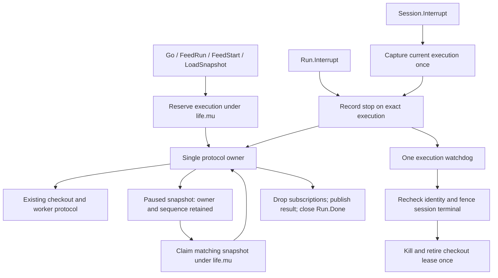

# Target architecture: execution ownership and the v0.2.0 API

Date: 2026-09-15.
Status: approved target. The user approved a breaking v0.2.0 API cleanup and
ErrSessionBusy for overlapping executions, and force termination after grace
even during an uncooperative Go callback.
Evidence: [brainstorm and reproductions](20260915-second-stage-api-feedback.md).
Baseline: `08b27a0`. Implementation evidence is recorded in
[`docs/reports/20260915-v0.2.0-implementation.md`](../reports/20260915-v0.2.0-implementation.md).

## 1. Initial request and scope

> Process second-stage feedback to improve montygo API. The previous feedback
> refactor is the latest commit on the current branch. Analyze the review and
> ../montygo-test, find weak points again, and propose the target architecture.

Input: `../montygo-test/docs/reports/20260915-montygo-v0.1.0-api-review.md`.

This proposal corrects the lifecycle shared by automatic feeds, manual
snapshots, interruption, and session termination. It also specifies future
cleanup, checkout retirement, host stub corrections, and API guidance.
The worker protocol, interpreter behavior, server routes, storage, and backend
selection remain at their current versions.

The governing problem is ownership: every accepted execution, suspension,
interrupt request, callback context, and pending future subscription MUST have
one stable execution identity. A reused session is not that identity.

## 2. Decisions

| ID | Decision | Alternative and reason |
|---|---|---|
| D1 | Breaking API cleanup in v0.2.0; user approved | Additive `InterruptWithOptions` leaves two APIs to teach. |
| D2 | One live execution per session; reject overlap with ErrSessionBusy; user approved | A FIFO needs capacity limits, queued cancellation, and extra session-stop rules. |
| D3 | Go reserves synchronously and returns its existing `*Run` shape | Changing Go to return two values is unnecessary: admission failures can be completed Runs, visible to Wait. |
| D4 | Run targets a durable execution pointer; Session.Interrupt captures the current execution once | Forwarding to mutable session state permits stale-handle interference. |
| D5 | One short lifecycle lock; protocol ownership transferred explicitly | Calling Abort concurrently with a turn violates the alternating wire protocol. |
| D6 | Explicit outcome plus driver-completion and terminal-session information | Four outcome values cannot express caller timeout, natural completion races, or a killed worker with a stuck Go callback. |
| D7 | Per-call grace covers uncooperative callbacks too; user approved force after grace. First reason wins; later requests may shorten the deadline | Independent timers and last-reason-wins make repeated stops unsafe. |
| D8 | Caller context bounds the wait; accepted interruption continues independently | Returning on caller cancellation must not remove the only escalation timer. |
| D9 | Snapshot chain owns its execution; each snapshot owns a suspension sequence | Session-wide aborted state can be consumed or cleared by unrelated work. |
| D10 | Future subscriptions are per execution and call ID | A map keyed by Future pointer leaks across runs and undercounts repeated values. |
| D11 | Force termination fences the session before invoking backend Kill | Checking identity and then killing outside the lock still allows a new feed in between. |
| D12 | Retire each checkout lease once, independently of driver progress | Kill alone leaks active capacity when there is no next turn to discover death. |
| D13 | ErrSessionClosed means local deliberate close; it does not match ErrSessionLost | General unusability is `Session.Err()!=nil`; transport failure and caller intent remain distinct. |
| D14 | Explicit per-object ConvertValue recipe | Tagged fields alone do not authorize converting every containing struct. |
| D15 | Optional Host.Func labels; stubs mark fixed arguments positional-only | Parameter labels must not imply unsupported keyword binding. |
| D16 | Keep version fallback truthful; document build-time stamping | Main binary VCS settings do not identify a replaced dependency. |
| D17 | O(1) Host entry lookup; register before checkout | A lookup should not copy an entire registry. Hot mutation is a separate feature. |

## 3. High-level design



The existing protocol mutex in `internal/pool.Checkout` remains useful as a
defensive guard. Public session operations MUST obtain explicit ownership
before entering it. The old long-held `Session.mu` and the session-wide
`inFeed`, `hostBusy`, `interrupt`, `feedEnd`, and `aborted` slots are removed.

### 3.1 Invariants

1. `Go` returns only after its execution is registered or its admission failure
   has been published on an already-completed Run.
2. A Run's execution identity never changes. A completed Run cannot cancel,
   abort, or kill a later execution, even when it still references the session.
3. `life.mu` protects only short state transitions. No protocol I/O, host code,
   printing, future conversion, backend wait, or completion wait runs under it.
4. Exactly one task can issue a protocol turn for a session at a time. Paused
   snapshot abort and resume compete for ownership under the same lock.
5. Every transition to a terminal session is recorded before the corresponding
   kill or retirement action is performed. No new execution can enter the gap.
6. Terminal execution results are immutable. Run.Done closes after the driver
   has returned from its synchronous host call and released protocol ownership.
7. Run.Done does not join arbitrary asynchronous work launched by host code.
   AsyncContext requests cancellation; the application owns any required join.
8. Session.Done signals that the session is terminal, not that every host task
   has stopped. Session.Err reports the canonical terminal cause.
9. A terminal transition releases execution-owned subscriptions and timers.
   Pausing a snapshot is not a terminal transition.
10. A retired checkout leaves Active exactly once and stays Retiring until
    worker exit is observed. User callback progress cannot retain Active capacity.

## 4. Public contract

### 4.1 Run and interruption: `run.go` UPDATED, `interrupt.go` CREATED

```go
type Run struct {
    s *Session
    exec *execution
}

func (s *Session) Go(ctx context.Context, code string, opts *FeedOptions) *Run
func (r *Run) Done() <-chan struct{}
func (r *Run) Wait() (any, error)
func (r *Run) WaitContext(ctx context.Context) (any, error) // CREATED
func (r *Run) Interrupt(ctx context.Context, opts InterruptOptions) (InterruptResult, error)
func (s *Session) Interrupt(ctx context.Context, opts InterruptOptions) (InterruptResult, error)

type InterruptOptions struct {
    Reason error          // nil => KeyboardInterrupt
    Grace *time.Duration  // nil => checkout default; 0 => escalate immediately
}

type InterruptOutcome uint8
const (
    InterruptUnknown InterruptOutcome = iota // zero result: no action/result established
    InterruptPending                        // accepted; caller stopped waiting
    InterruptNotRunning                     // session had no execution
    InterruptAlreadyFinished                // target was terminal at request time
    InterruptBeforeStart                    // request prevented first Feed/Load
    InterruptAborted                        // AbortFeed acknowledged with Error
    InterruptKilled                         // this execution's stop fenced/killed session
    InterruptFinished                       // execution ended normally/failed independently
)

type InterruptResult struct {
    Outcome InterruptOutcome
    RunDone bool       // driver completion observed when this result was read
    SessionErr error   // canonical session terminal cause then, or nil
}
```

An invalid option returns a zero result and `*OptionError`; no request is
registered. A context already cancelled on entry returns its error without
registering a new request. Concurrent cancellation during publication may lose
to publication: the returned Pending result means the request was accepted.

`Run.Interrupt` on a completed Run returns AlreadyFinished immediately and
never consults the session's new active execution. `Session.Interrupt` on an
idle session returns NotRunning, including its SessionErr when terminal.
AlreadyFinished and NotRunning have RunDone=true: no target driver remains.

Natural completion or an independent runtime/typing error racing a request
returns Finished. The execution's result still comes from Wait. Interruption
success is not inferred by matching an error message or exception name.

BeforeStart is reported only after the owner has acknowledged that no first
execution request was sent. Its Wait error is the normalized Python exception,
without a fabricated traceback. A request that loses the first-send boundary
remains accepted and stops at a suspension or through escalation.

Aborted is published after the matching AbortFeed Error has been processed,
print finalization attempted, and driver result committed. RunDone=true.
SessionErr is normally nil; a flush or transport failure can make it non-nil.
Never claim that an abort succeeded merely because a request was sent.

Killed is published after terminal fencing and dispatching backend Kill. It
means local session usability is ended; remote process exit is not acknowledged
by the existing protocol. RunDone may be false while a Go callback is blocked.
Callers requiring driver completion use WaitContext separately.

Pending is returned with `ctx.Err()` if the accepted action has not resolved by
the caller deadline. The watchdog continues. For a terminal stop action already
published, prefer its available result over a simultaneous context cancellation.

Unexpected abort failure returns its mapped error as the second return value
and a result containing the current outcome/session state. A successful abort
does not return the Python KeyboardInterrupt as this method's error; Wait does.

`WaitContext` cancellation affects only waiting. It MUST NOT interrupt the run.
If completion is already observable, return its stored value/error before
checking the waiting context. Otherwise select between Done and ctx.Done and
recheck Done once if cancellation wins.

### 4.2 Grace and cancellation

`CheckoutOptions.InterruptGrace` remains the default, with its current zero
meaning 100 ms. `InterruptOptions.Grace` provides an unambiguous per-call zero.
Negative per-call grace is invalid. Options are copied when submitted.

The first accepted request fixes the normalized exception. Every later request
joins that request and may move the absolute force deadline earlier:
`deadline = min(existingDeadline, now + requestedGrace)`. It cannot extend the
deadline or replace the reason. Exactly one watchdog services the deadline.

Grace bounds the opportunity to preserve the session, including callback return
and abort acknowledgement. Once grace expires, kill may win even during a host
callback or AbortFeed. The existing 5 s abort timeout remains a protocol ceiling;
it is additionally bounded by the current stop deadline. A later shorter grace
wakes the watchdog and can cancel/kill that abort turn.

An interrupt caller's context does not silently become a shared execution
deadline. For a stop that must force at once when a budget is exhausted, call
again with zero grace or call CloseNow if session-level termination is intended.

The original feed context keeps its established phase-dependent contract:
before first send, return its context error and keep the session fresh; while
Python is executing, cancelling the wire context kills/loses the worker; while
at a suspension or host callback, record a default-grace interrupt and attempt
AbortFeed. Every new suspension boundary checks cancellation before resuming.
This revision does not silently detach all protocol turns from caller deadlines.

### 4.3 Session APIs: `session.go` UPDATED

```go
func (s *Session) FeedRun(ctx context.Context, code string, opts *FeedOptions) (any, error)
func (s *Session) FeedStart(ctx context.Context, code string, opts *FeedOptions) (Snapshot, error)
func (s *Session) LoadSession(ctx context.Context, state []byte) error
func (s *Session) LoadSnapshot(ctx context.Context, state []byte, opts *LoadSnapshotOptions) (Snapshot, error)
func (s *Session) Dump(ctx context.Context) ([]byte, error)
func (s *Session) InstallDependencies(ctx context.Context, requirements []string) error
func (s *Session) Close(ctx context.Context) error
func (s *Session) CloseNow() error
func (s *Session) Done() <-chan struct{}
func (s *Session) Err() error
func (s *Session) Stats() SessionStats
```

Signature changes are confined to Interrupt; the others gain corrected ownership
semantics. Reject an overlapping new feed/load/install with ErrSessionBusy
before preparation or wire activity. Go records that error in a completed Run.
Do not poison the session for caller admission mistakes.

An active paused snapshot reserves the execution until completion/abort/close.
Session.Dump is allowed while idle or paused and reserves a control turn.
Dump while a turn or host callback is active returns ErrSessionBusy. Resume or
another Dump during this control turn also returns Busy without consuming the
snapshot. An interrupt during Dump records its request for that same execution;
the owner services it after Dump returns, or the watchdog fences the session.
An idle Dump/LoadSession/InstallDependencies is a control operation, not a
Run; Session.Interrupt returns NotRunning when no execution exists. Its caller
context and CloseNow are the controls for that operation.

Close is graceful. It marks admission closing, waits for the current active
operation through a channel with ctx, then performs Finish under that context.
A paused execution has no running turn to drain: claim its ownership, terminate
its handles with ErrSessionClosed, and Finish/reset the checkout. If ctx expires
while waiting, return ctx.Err and revert this close attempt's admission flag
unless another close/termination has superseded it. No hidden close task remains.
Concurrent Close callers join the same close attempt; each has its own bounded
wait. The initiating Close's cancelled attempt releases its claim and allows a
later caller to retry. No public call waits on a non-cancellable long mutex.

Close after CloseNow returns immediately, even when a callback is still running.
Neither Close nor CloseNow converts previously recorded transport failure into
deliberate closure. CloseNow is idempotent and initiates retirement itself.

Err is a terminal-cause query, not an admission reservation: nil does not imply
that a concurrent Go will be accepted. Admission during graceful closing returns
ErrSessionClosed; if that close attempt times out before performing Finish, the
session may become available again. Document this transient distinction.

### 4.4 Errors: `errors.go` UPDATED

```go
var ErrSessionBusy = errors.New("session already has an active operation")
var ErrSnapshotStale = errors.New("snapshot does not own the current suspension")

// ErrSessionClosed retains its identity/name/message; remove its Is(ErrSessionLost).
// ErrSnapshotResumed retains its existing meaning for a consumed snapshot.

type SessionKilledError struct { Reason error }
func (e *SessionKilledError) Error() string
func (e *SessionKilledError) Unwrap() error
func (e *SessionKilledError) Is(target error) bool // target == ErrSessionLost
```

SessionKilledError is the canonical cause when interruption forces a session
terminal. Its message is `session killed to interrupt execution`; Unwrap returns
the first accepted reason. It is not a fabricated transport crash or disconnect.
External transport failures retain CrashedError/DisconnectError/ShutdownError.

An aborted old snapshot's first resume returns its execution's saved terminal
error. A normally completed but unused stale snapshot returns ErrSnapshotStale.
Repeated resumes after successful consumption return ErrSnapshotResumed. None
of these validation errors reaches the worker or changes the new session state.

## 5. Internal data model and ownership

### 5.1 `lifecycle.go` CREATED

The following is the required logical structure. Internal names can be adjusted
during implementation, but ownership and transition semantics are obligations.

```go
type executionPhase uint8
const (
    executionStarting executionPhase = iota
    executionPreparing
    executionExecuting
    executionCallback
    executionPaused
    executionControl // e.g. Dump while this execution owns the snapshot
    executionAborting
    executionFinished
)

type executionKind uint8 // automatic feed, stepped feed, restored snapshot

type execution struct {
    id uint64
    kind executionKind
    phase executionPhase
    sent bool
    wireInFlight bool      // printing does not turn an in-flight turn into a suspension
    sequence uint64
    driverActive bool
    callbackCtx context.Context
    cancelCallbacks context.CancelFunc
    stopContextWatch func() bool
    stop *interruptRequest
    pending map[uint32]*Future
    done chan struct{}
    value any
    err error
    terminal bool          // sandbox execution ended or session fenced
    terminalCause error    // available before a blocked driver can finish
    operationDone chan struct{} // fresh channel per owner claim; nil after release
}

type interruptRequest struct {
    reason error
    deadline time.Time
    wake chan struct{}     // capacity 1; coalesced earlier-deadline notification
    resolved chan struct{}
    outcome InterruptOutcome
    err error              // control/abort failure, not the Python abort exception
    resolvedOnce bool
    forceClaimed bool      // force owns publication even if the driver finishes first
}

type closeAttempt struct {
    done chan struct{}
    err error
}

type lifecycle struct {
    mu sync.Mutex
    nextID uint64
    current *execution
    controlActive bool
    controlDone chan struct{}
    closeAttempt *closeAttempt
    terminal error
    done chan struct{}
}

type snapshotToken struct {
    exec *execution
    sequence uint64
    used bool              // guarded by Session.life.mu, not a separate claim first
}
```

All mutable execution/request fields are protected by `life.mu`, except immutable
results read after Done. Per-driver `answerer`/print state stays confined to its
protocol owner. Snapshot public descriptive fields are not authority to resume.

Each protocol/control owner claim creates a fresh operationDone channel. Releasing
that claim closes it once and sets the field to nil. publishPause releases the
step's owner channel while retaining execution ownership; a later Resume or
paused abort creates another channel. Closing Run.Done is a separate once-only
execution completion action, never a second close of a paused step's channel.

Execution IDs are monotonically increasing per session; pointer identity is the
authoritative in-memory check. On uint64 exhaustion, reject admission with a
local error rather than wrap to a live ID. IDs are not serialized into wire dumps.

Required methods/functions:

```go
func newSession(p *Pool, scriptName string, limits sessionLimits) *Session
func (s *Session) reserveExecution(ctx context.Context, kind executionKind) (*execution, error)
func (s *Session) beginExecution(e *execution) error
func (s *Session) beginSend(e *execution) error
func (s *Session) beginCallback(e *execution, cbCtx context.Context) (context.Context, error)
func (s *Session) endCallback(e *execution) error
func (s *Session) beforeResume(e *execution) error
func (s *Session) publishPause(e *execution) (snapshotToken, error)
func (s *Session) claimSnapshot(t *snapshotToken, ctx context.Context) error
func (s *Session) finishExecution(e *execution, value any, err error)
func (s *Session) terminateSession(err error) error // returns canonical stored cause
func (s *Session) reserveControl(ctx context.Context) (func(), error)
func (s *Session) addFuture(e *execution, callID uint32, f *Future) error
func (s *Session) removeFuture(e *execution, callID uint32)
func (s *Session) pendingCount() int
func copyFeedOptions(opts *FeedOptions) *FeedOptions
func (s *Session) releaseOperationLocked(e *execution)
func (s *Session) captureCurrentExecution() *execution
func (s *Session) claimCloseAttempt() (*closeAttempt, bool)
func (s *Session) markTerminalAndCollectCancels(err error) (error, []context.CancelFunc)
```

`finishExecution` cancels the callback context and context watcher, drops future
subscriptions, publishes result and resolves any completion-racing interrupt,
clears current if and only if it is the same execution, then closes Done.
Terminal fencing during a callback marks the execution terminal and drops its
subscriptions, but leaves driverActive and Done alone until the driver exits.
If forceClaimed is set, finishExecution MUST NOT resolve that request as Finished:
the force owner resolves Killed after termination has been dispatched. The
terminalCause is available immediately to invalidated snapshots and late driver
results, independently of the final immutable `value, err` pair.

### 5.2 `interrupt.go` CREATED

```go
func normalizeInterruptOptions(opts InterruptOptions, fallback time.Duration) (error, time.Duration, error)
func (s *Session) requestInterrupt(e *execution, opts InterruptOptions) (*interruptRequest, InterruptResult, error)
func (s *Session) waitInterrupt(ctx context.Context, e *execution, req *interruptRequest) (InterruptResult, error)
func (s *Session) watchInterrupt(e *execution, req *interruptRequest)
func (s *Session) forceExecution(e *execution, req *interruptRequest) bool
func (s *Session) abortPaused(e *execution, req *interruptRequest)
func (s *Session) abortExecution(ctx context.Context, e *execution, pt *printTarget) error
func (s *Session) resolveInterrupt(e *execution, outcome InterruptOutcome, err error)
```

Request publication handles the paused-to-aborting transition atomically and
starts at most one abort owner. Starting/preparing execution is signalled and
checked by its existing driver; it does not gain another driver.

The watchdog never reads `co.Pending`, waits for `s.mu`, or calls Abort directly.
It watches request resolution/deadline updates, rechecks execution identity, and
fences the whole session under life.mu before invoking backend Kill outside it.

### 5.3 Feed and snapshot integration: UPDATED files

`run.go` and `session.go`:

```go
func (s *Session) feedRun(ctx context.Context, e *execution, code string, opts *FeedOptions) (any, error)
func (s *Session) drive(ctx context.Context, e *execution, ev *wire.Event, err error, pt *printTarget, ans *answerer) (any, error)
func (s *Session) newAnswerer(e *execution, lookup map[string]any, os OSHandler, pt *printTarget) *answerer
func (s *Session) newDriver(e *execution, ctx context.Context, print PrintTarget, lookup map[string]any, os OSHandler) *snapshotDriver
func (s *Session) mapError(err error) error
func (s *Session) failedLoad(err error) error
func (s *Session) attach(co *pool.Checkout)
```

Admission precedes input preparation. Check interruption before preparation,
after preparation, and at the first-send linearization point. A blocked custom
attribute/conversion callback in preparation cannot be forcibly stopped; grace
may terminate the reserved session but Done waits for the driver to return.
Mark `driven` only once first Feed/Load is committed for sending. A validation
failure or BeforeStart stop does not make an untouched session non-fresh.

The first-send boundary is a logical commitment protected by life.mu, not a
claim of when bytes reach the socket. A stop ordered after it uses the normal
abort/kill path even if the transport has not transmitted yet.

`snapshot.go`:

```go
type snapshotDriver struct {
    s *Session
    exec *execution
    pt *printTarget
    ans *answerer
}
// FunctionSnapshot, NameLookupSnapshot, FutureSnapshot replace embedded
// singleUse with a token associated with their driver and suspension sequence.

func (d *snapshotDriver) advance(ev *wire.Event, err error) (Snapshot, error)
func (d *snapshotDriver) run(ctx context.Context, token *snapshotToken, fn func() (*wire.Event, error)) (Snapshot, error)
func (d *snapshotDriver) resume(ctx context.Context, token *snapshotToken, fn func(context.Context) (*wire.Event, error)) (Snapshot, error)
func (d *snapshotDriver) resumeAuto(ctx context.Context, token *snapshotToken, ev *wire.Event) (Snapshot, error)
func (d *snapshotDriver) dump(ctx context.Context, token *snapshotToken) ([]byte, error)
```

Public snapshot methods retain these signatures; each implementation is UPDATED:

```go
func (f *FunctionSnapshot) Resume(ctx context.Context, v any) (Snapshot, error)
func (f *FunctionSnapshot) ResumeAuto(ctx context.Context) (Snapshot, error)
func (f *FunctionSnapshot) ResumeError(ctx context.Context, err error) (Snapshot, error)
func (f *FunctionSnapshot) ResumeNotFound(ctx context.Context) (Snapshot, error)
func (f *FunctionSnapshot) ResumeFuture(ctx context.Context) (Snapshot, error)
func (f *FunctionSnapshot) ResumeNotHandled(ctx context.Context) (Snapshot, error)
func (f *FunctionSnapshot) Dump(ctx context.Context) ([]byte, error)
func (n *NameLookupSnapshot) ResumeUnresolved(ctx context.Context) (Snapshot, error)
func (n *NameLookupSnapshot) ResumeFunction(ctx context.Context, functionName string) (Snapshot, error)
func (n *NameLookupSnapshot) ResumeValue(ctx context.Context, v any) (Snapshot, error)
func (n *NameLookupSnapshot) ResumeAuto(ctx context.Context) (Snapshot, error)
func (n *NameLookupSnapshot) Dump(ctx context.Context) ([]byte, error)
func (f *FutureSnapshot) Resume(ctx context.Context, results []FutureResolution) (Snapshot, error)
func (f *FutureSnapshot) ResumeAuto(ctx context.Context) (Snapshot, error)
func (f *FutureSnapshot) Dump(ctx context.Context) ([]byte, error)
```

All MUST pass their token into the new helpers. Remove the independent early
`singleUse.claim()` calls: consumption and owner validation form one transition.

Cancelled entry context, invalid ResumeNotHandled usage, Busy during Dump, and
terminal-session checks before ownership acquisition do not consume a live
snapshot. Once a resume wins ownership, it consumes the snapshot even if later
value conversion or protocol work fails. Preserve existing conversion-error
policy after ownership is acquired; release/terminate ownership on every return.

LoadSnapshot reserves before Restore, services a pending interrupt before
publishing its first snapshot, and uses the same host-restorability validation
as LoadSession. No lifecycle-free restore window remains.

The callback context for a snapshot step uses that step's context for cancellation
and values. Ending the step does not automatically cancel still-pending futures
belonging to the paused execution. Keep an execution cancellation root plus a
step-context cancellation subscription; replace/remove the step subscription
when a new step begins, and cancel all on terminal execution. Document that a
cancelled step context may request interruption of the paused execution until
the next step replaces it. This is a correction to v0.1.0 endFeed cancellation
at every pause, which can prematurely cancel AsyncContext work.

### 5.4 Answerer, mounts, printing and futures

`answer.go` UPDATED:

```go
type answerer struct {
    s *Session
    exec *execution
    lookup map[string]any
    host *Host
    os OSHandler
    pt *printTarget
    // Remove the independently owned futures map; exec.pending is authoritative.
}
func (a *answerer) answer(ctx context.Context, ev *wire.Event) (*wire.Event, error)
func (a *answerer) callHost(ctx, cbCtx context.Context, run func(context.Context) (any, error)) (any, *wire.Event, error)
func (a *answerer) abort(ctx context.Context, reason error) (*wire.Event, error)
func (a *answerer) registerFuture(callID uint32, fut *Future) error
func (a *answerer) answerResolveFutures(ctx context.Context, ids []uint32) (*wire.Event, error)
func (a *answerer) answerOsCall(ctx, cbCtx context.Context, call *wire.OsCall) (*wire.Event, error)
func (a *answerer) resumeReturn(ctx context.Context, v any) (*wire.Event, error)
func (a *answerer) resumeError(ctx context.Context, excType, message string) (*wire.Event, error)
func (a *answerer) resumeOutcome(ctx, cbCtx context.Context, callID uint32, eager bool, result any) (*wire.Event, error)
```

Every suspension is an abort opportunity: FunctionCall, OsCall, NameLookup,
ResolveFutures. Check stop/terminal state before dispatch and immediately before
the next resume commitment, including automatic lookups and manually supplied
snapshot values. Normalize host results before committing Resume, then recheck
the stop request so interruption during conversion cannot be lost.

Mount handling currently combines host filesystem work and Resume inside
`Checkout.ResumeFromMounts`. Split that responsibility so the session can check
the interrupt between filesystem work and resumption:

```go
// internal/pool/checkout.go UPDATED
func (c *Checkout) HandlePendingMount(ctx context.Context) (handled bool, result wire.ExtResult, err error)
```

This method services the pending OS call without sending a Resume. The caller
owns the protocol turn, supplies the cancellable callback context, rechecks
interruption, then calls Resume. Preserve the existing pre-send conversion-error
fallback, OS NotHandled behavior, and path-security implementation.

Print frames are not suspension points. Do not send AbortFeed from onPrint.
Pass the execution callback cancellation context (with turn context values) to
ContextPrintTarget so cooperative output can unblock. Plain Print/Flush can
still block; worker termination and driver completion remain distinct. A Print
or Flush failure must be recorded without claiming successful driver completion
before the callback returns.
Keep wireInFlight=true during Print callbacks. The transport-end watcher cannot
treat such a callback like a paused FunctionCall and bypass an outstanding
response classification. A blocked Print may delay active-turn diagnostics;
CloseNow or the interrupt watchdog can still fence/retire the session. This
tradeoff preserves already-queued ShutdownDump/error details on ordinary turns.

Future subscriptions: validate unique call IDs, reject nil Future, enforce the
limit on call IDs before insertion, and validate all ResolveFutures IDs before
waiting. Two call IDs referencing the same Future consume two slots and can both
resolve from its one result. Duplicate IDs from an untrusted worker are a
protocol failure. Cancellation drops this execution's subscription only.
Do not mutate a Future shared with another run/session by calling its settle.

`future.go` UPDATED only where derived conversion work needs cancellation:

```go
func (f *Future) thenContext(ctx context.Context, convert func(any) (any, error)) *Future
```

Replace `then` use in ClassInstance.callMethod and ClassType.callMethod with
thenContext using their received callback context. Select source completion or
ctx cancellation; recover conversion panics into the derived Future error just
as Async does. A derived future must not retain its goroutine forever after the
execution stops. Cancelling it never settles the original Future.

### 5.5 Worker lease and retirement: `internal/pool/lease.go` CREATED

The checkout currently has a protocol mutex and a mutable slot. KillWorker can
kill without taking that mutex, but it does not release the slot. Replacing it
with a goroutine that calls Abandon is insufficient: a Print or mount callback
can still hold the protocol mutex forever. Separate the worker lease from
protocol state.

```go
type checkoutLease struct {
    mu sync.Mutex
    pool *Pool
    worker worker.Worker   // immutable worker identity for this checkout
    slot *slot             // non-nil while this lease owns active accounting
    terminal bool
    cause error
}

type retiredWorker struct {
    worker worker.Worker
    killed bool
    // Worker exit/accounting is independent of the checkout's observer lifetime.
}

func (l *checkoutLease) active() bool
func (l *checkoutLease) finish() (*slot, bool)
func (l *checkoutLease) terminate(cause error) (worker.Worker, bool)
```

`finish` atomically detaches the active slot for normal release after Reset/Finish
succeeds. `terminate` atomically fences and detaches it for forced retirement.
Only one can win. A forced action on an already-released lease MUST NOT call
Kill on that worker: it may belong to a different checkout by then.

Move c.slot ownership into this lease; do not leave a second independently
mutable slot field. Code that performs a turn uses immutable `c.worker` and
checks lease terminality. Served count and observer state stay confined to the
normal protocol owner; force retirement never reads/mutates them concurrently.
Do not pass the old mutable slot to a concurrent reaper. Pass a retiredWorker
containing the immutable worker identity instead.

Checkout signatures, `internal/pool/checkout.go` UPDATED:

```go
func (c *Checkout) Terminate(cause error, reason string) bool // CREATED
func (c *Checkout) Finish(ctx context.Context) error
func (c *Checkout) ensureReady() error
func (c *Checkout) discard(reason string)
func (c *Checkout) poison(doing string) error
func (c *Checkout) poisonTimeout(deadline time.Duration) error
func (c *Checkout) Abandon()
func (c *Checkout) WorkerErr() error
func (c *Checkout) Finished() bool
func (c *Checkout) PID() (int, bool)
```

Terminate acquires only the short lease lock, wins accounting ownership, kills
outside that lock, and schedules retirement once. It never acquires the checkout
protocol mutex. Abandon and every discard/poison/timeout path delegate to that
same once-only lease transition. Remove KillWorker once all call sites migrate;
keeping a kill-only primitive invites the same accounting defect.

WorkerErr reads the immutable worker reference without the protocol mutex, then
the worker's synchronized error. Finished checks the lease. PID retains its
nonblocking behavior and checks lease status as well as protocol ownership.

Pool methods, `internal/pool/pool.go` UPDATED:

```go
func (p *Pool) release(s *slot)
func (p *Pool) retireLease(w worker.Worker, reason string) // CREATED
func (p *Pool) retireLocked(job retiredWorker)
func (p *Pool) reap(queue <-chan retiredWorker)
```

RetireLease consumes already-transferred ownership, decrements Active once,
increments Retiring once, and enqueues a job. Its once guarantee comes from
the lease, not a best-effort call-site flag. Preserve MaxProcesses accounting
and the bounded reaper. Observe worker exit before decrementing Retiring;
a local wait timeout is not evidence of exit. Reapers can retry bounded waits
and remain cancellable/observable while retaining the capacity count.

On WebSocket, backend completion confirms local connection teardown; the
server owns eventual remote child termination. Do not advertise a remote child
exit guarantee the protocol cannot provide.

Observer finalization MUST occur once and after the last driver callback/turn
uses that observer. A forced retire can free worker capacity while the observer
remains attached to a blocked driver. Separate worker pool gauges from observer
close. Implement an observer-finalization once guard with a driver-activity
reference/lease: session close cannot close a non-thread-safe observer while a
turn is using it. Finalizing an idle checkout observer is immediate.

Required observer guard in `internal/pool/pool.go` (or a dedicated CREATED
`internal/pool/observer_lifecycle.go`):

```go
type observerLifetime struct {
    mu sync.Mutex
    observer *observer
    users int
    closing bool
    closed bool
}
func (o *observerLifetime) acquire() bool
func (o *observerLifetime) release()
func (o *observerLifetime) requestClose()
```

Acquire fails after closing is requested. Release/requestClose choose the one
transition with closing && users==0 && !closed, mark closed under the lock,
then invoke observer.close outside it. This guard wraps observer use for the
whole protocol owner operation, including its callbacks, rather than only
individual Sent/Received calls. This also prevents Close running between them.

Root wiring, `pool.go` UPDATED:

```go
func (p *Pool) Checkout(ctx context.Context, opts CheckoutOptions) (*Session, error)
func (p *Pool) track(s *Session)
func (p *Pool) untrack(s *Session)
func (p *Pool) closeAllSessions()
```

Session attachment receives the lease-backed checkout. A terminal session is
untracked only after retirement ownership has been handed off, not merely after
Kill. Checkout racing pool shutdown MUST not return an untracked live session:
track/check closed atomically under sessionsMu, then terminate a rejected
checkout. Failed host registration follows the same terminal/retirement path.
Pool.New, NewWebSocket, Options and WebSocketOptions signatures do not change.

### 5.6 Canonical terminal cause

Remove independent writes to `s.broken`, `s.closed`, and lifecycle.err. Their
authoritative replacement is the lifecycle terminal cause and admission state.
Derived convenience fields, if retained, cannot decide ownership independently.

The active protocol owner classifies transport errors from its actual event,
preserving ShutdownError.Dump, disconnect metadata, and crash details. An idle
worker watcher publishes loss only when no protocol operation can classify it.
During an active turn, it wakes/flags worker-ended and lets that owner classify.
During a blocked host callback, there is no outstanding wire response to decode;
the watcher may publish worker loss and retire immediately without joining the
callback. During preparation, treat worker loss as loss of the reserved session.

When a force action has already fenced the session, subsequent transport errors
return the canonical stored local-close/forced-interrupt cause. If an external
loss was already recorded, CloseNow and interrupt do not overwrite it. A runtime
exception from an otherwise usable execution is not a session terminal cause.

MapError and failedLoad MUST use terminateSession when the session cannot be
reused. First terminal cause wins; all terminal I/O errors from that point map
to the same cause. Driver completion and session termination remain separate
channels, so preserving diagnostic identity does not fake callback completion.

## 6. Host API improvements

### 6.1 Optional parameter labels: `host.go` UPDATED

```go
type HostFuncOptions struct {
    ParameterNames []string
}

func (h *Host) Func(name string, fn any, opts ...HostFuncOptions) error
func (h *Host) Stubs() string
func (h *Host) lookupEntry(name string) (any, bool) // CREATED
func validHostName(name string) error
func validateParameterNames(sig reflect.Type, names []string) error // CREATED
func writeFuncStub(b *strings.Builder, name string, sig reflect.Type, indent string, names []string)

type hostFunc struct {
    fn Function
    sig reflect.Type
    parameterNames []string
}
```

Accept zero or one options value; more is a ValueError. A nil ParameterNames
slice retains arg0/arg1. A non-nil slice must match the reflected parameters
visible to Python, excluding leading context and trailing Kwargs; include one
name for a variadic parameter. Copy it at registration. Reject duplicate names,
Python hard keywords, invalid identifiers, and collisions with generated
`kwargs`. For direct Function implementations without a reflected signature,
non-empty labels are rejected; retain `*args: Any, **kwargs: Any`.

Hard keywords (including True, False, None) are not valid registry names or
parameter names. Soft keywords such as match/case are not categorically banned.
Use a fixed documented hard-keyword set consistent with the pinned interpreter,
covered by stub parse/type-check tests. Also validate generated class names
before accepting a Host.Object registration; do not emit syntactically invalid
stubs from a validated registry.

All fixed reflected parameters are positional-only in emitted stubs because
function.go does not bind kwargs to fixed parameters. Example:

```go
host.Func("sleep", sleep, montygo.HostFuncOptions{
    ParameterNames: []string{"ms"},
})
```

```python
def sleep(ms: int, /) -> None: ...
def sum_values(first: int, /, *values: int) -> int: ...
def fetch(key: str, /, **kwargs: Any) -> Any: ...
```

Apply the positional-only correction to object methods too (receiver self
precedes `/` when fixed arguments exist). This feature changes stub labels,
not runtime keyword binding. Methods keep generated argument names in this
revision. Future structural schema/type stubs are deferred.

Host.lookupEntry locks, fetches one function/object, and unlocks. answerer uses
it after checking ExternalLookup. Do not allocate a merged registry for each
resolution. Host.register remains the checkout-time object registration pass.
Host registrations MUST be complete before checkout; concurrent post-checkout
mutation has no newly promised semantics. Document this rule explicitly.

### 6.2 Conversion recipe: documentation UPDATED, conversion default unchanged

Use an explicit switch so the converter does not intercept montygo.DateTime,
ClassInstance, or arbitrary internal struct values:

```go
func recordResult(_ string, v any) (any, error) {
    switch r := v.(type) {
    case Record:
        return montygo.AsNamedTuple(r)
    case *Record:
        if r == nil { return nil, nil }
        return montygo.AsNamedTuple(*r)
    default:
        return v, nil
    }
}

host.Object("records", table, montygo.ClassInstanceOptions{
    AllowedMethods: montygo.Expose[RecordsAPI](),
    Name: "Records",
    ConvertValue: recordResult,
})
```

Consumer methods can then return `(*Record, error)` for nullable reads and
`(Record, error)` for inserts. The explicit Record type remains a transport DTO;
storage rows and datetime conversion remain consumer responsibilities.
This recipe covers a top-level Record or *Record. Nested lists/maps of records
require an explicit converter for those result types; do not imply recursive
automatic struct conversion. Future-resolved method results continue through
the same converter, now with cancellable derived-future waiting.

### 6.3 Version information: `docs/architecture/versioning.md`, README UPDATED

No version.go signature or runtime discovery change is required.
For a directory replacement, derive the stamp from the montygo checkout at
build time and pass the existing linker variable. Run scripts/version.sh with
montygo as its working directory, not with the consumer repository as cwd.
The recipe MUST preserve a dirty-tree suffix and quote the resulting value.

`BindingVersion` stays stamped version → dependency module/replacement version
→ honest development/unknown value. Do not read the filesystem or invoke git at
runtime. Do not report the consumer's vcs.revision as montygo's revision.
Build metadata describes the main module separately from dependencies; see
[Go runtime/debug](https://go.dev/pkg/runtime/debug/?m=old#BuildInfo).

## 7. Storage, caches, configuration, and route schema

montygo has no application database, ORM, DB migrations, or DB table changes in
this revision. No new database is introduced for execution IDs or snapshots.
Execution identity is in-memory; opaque worker dumps remain wire-owned bytes.

The consumer's existing table is explicitly unchanged:

```sql
CREATE TABLE IF NOT EXISTS records (
    id         INTEGER PRIMARY KEY AUTOINCREMENT,
    value      INTEGER NOT NULL,
    created_at TEXT    NOT NULL
);
```

SQLite's `sqlite_sequence` bookkeeping for AUTOINCREMENT is also unchanged.
The consumer uses database/sql directly, not an ORM. Its existing model has no
ORM tags, indexes beyond the primary key, or new constraints:

```go
type Row struct {
    ID int64
    Value int64
    CreatedAt time.Time
}
```

Runtime ownership schemas:

| State | Key | Value | Lifetime/eviction |
|---|---|---|---|
| Session current execution | execution pointer plus uint64 ID | execution state | Until terminal driver completion; no TTL |
| Snapshot token | execution pointer plus sequence | consumed flag | As long as caller holds snapshot; no global history map |
| Pending subscriptions | wire uint32 CallID within execution | *Future | Delivered result or execution terminality; no TTL |
| Interrupt request | execution pointer | first reason, absolute deadline, shared result | Until resolved and execution references released |
| Checkout lease | checkout instance | worker identity and accounting claim | Released/retired exactly once |
| Existing instance store | object UUID | host wrapper | Existing session lifetime/MaxHostObjects policy |

These are ownership records, not caches. No new TTL cache is required. The
existing wasm compilation cache and reflection member cache are unchanged.

Configuration changes:

| Location | Field | Default/validation |
|---|---|---|
| InterruptOptions | Reason | nil => KeyboardInterrupt |
| InterruptOptions | Grace | nil => checkout default; >=0 accepted; negative rejected |
| CheckoutOptions | InterruptGrace | Existing 0 => 100 ms; now total preserve-session opportunity |
| HostFuncOptions | ParameterNames | nil => generated labels; exact validated count otherwise |

No new environment variables, server config, constructors, HTTP handlers, or
routes. `/`, `/health`, `/metrics`, `/info`, and the WebSocket upgrade retain
their current routing and wire schema. No protobuf changes or upstream pin bump.
No dependency injection framework is introduced: Session constructors allocate
lifecycle state, Pool.Checkout attaches a lease, answerers/drivers receive the
execution pointer, and Host.Func stores copied metadata.

## 8. Data flows

### 8.1 Normal automatic execution

1. Go reserves one execution synchronously; Busy/closed/cancelled admission
   produces a completed failed Run. FeedRun uses the same reservation path.
2. Owner checks interruption and prepares inputs/mounts/print target.
3. Owner commits first-send state and issues Feed under the original context.
4. At each suspension, check stop/terminal/context state before host dispatch.
5. Host callback uses execution cancellation plus turn context values. Process
   result, then check again before committing Resume.
6. On Complete/Error/TypingError, finalize output, release subscriptions and
   context watchers, and commit the immutable result. Clear current and close
   Done in the same state transition, so a later Go sees the released session.
7. Wait reads the result. A consumer watcher may perform its own later cleanup;
   Run.Done makes no promises about that application-owned step.

### 8.2 Immediate interrupt

1. Go returns with Starting already registered.
2. Interrupt attaches one request and watchdog to that execution.
3. Driver sees the request before first-send commitment, avoids Feed, and
   completes with the normalized exception and BeforeStart.
4. Session remains usable/fresh unless an independent failure or force deadline
   won while preparation was blocked. No request is cleared by beginExecution.

### 8.3 Interrupt while a host call is running

1. Record stop, cancel callback context outside life.mu, start/wake watchdog.
2. Cooperative callback returns. The driver discards its return value for wire
   resumption and owns AbortFeed for the pending suspension.
3. Matching Error acknowledgement establishes abort success. Flush output,
   publish the RuntimeError result, and resolve interruption as Aborted.
4. If callback or abort does not finish by grace, watchdog atomically fences
   session, retires lease, and resolves Killed. RunDone may still be false.
5. A late callback result is discarded locally; it cannot resume a killed or
   reassigned worker. Driver eventually publishes canonical terminal cause.

### 8.4 Interrupt while Python executes / concurrent natural completion

1. Record request; do not send a concurrent AbortFeed frame.
2. A later suspension transfers control to the existing driver, which aborts.
3. If Complete/Error wins, commit the result and resolve Finished.
4. If force wins, recheck the exact execution and unresolved request under
   life.mu, set terminal session state there, then kill outside the lock.
5. A stale timer cannot kill after another execution is admitted: a completion
   winner removes the old owner, and a force winner bars all new admission.

### 8.5 Paused snapshots, resume, and restore

1. FeedStart/LoadSnapshot reserve a durable stepped execution before wire work.
2. Each suspension produces a token for this execution and sequence. Keep
   subscription ownership across pauses.
3. Resume checks context, session terminality, execution identity, sequence,
   used state, and ownership availability together; only then consumes token.
4. Interrupt racing Resume either claims Paused→Aborting or observes the
   already-active owner and signals it. It cannot start a second turn.
5. After abort, old tokens refer to their saved execution error. A new feed
   cannot erase it. Resuming an old token never touches the new execution.
6. Restore with a stop before first-send sends no Load. Stop during Load waits
   for its returned suspension or forces termination. Validate host pinned IDs
   before Load for both snapshot and idle session restoration.

### 8.6 Future results, errors, and cancellation

1. Register returned futures by call ID, validate capacity/duplicates first.
2. ResolveFutures snapshots its referenced subscriptions under life.mu, then
   waits outside the lock on source completions and callback cancellation.
3. Collect all ready referenced call IDs, remove each delivered subscription,
   normalize results, check interrupt, and ResumeFutures.
4. On any execution-ending error or abort, clear all remaining subscriptions.
   A later feed begins with zero subscriptions regardless of old Future state.
5. Cancellation of a derived conversion wait settles that derived Future only.
   A source Future shared by another session retains its original semantics.

### 8.7 Close, idle death, startup failure, and shutdown

1. Close claims graceful closing; waits on owner-completion channels with ctx.
   It may reclaim a paused execution immediately because no turn is running.
2. Successful Finish transfers lease to normal release exactly once and publishes
   ErrSessionClosed. A pre-Finish waiting timeout releases the close claim.
3. CloseNow publishes terminal cause, signals callbacks, transfers lease to
   forced retirement, and returns. It does not join a blocked callback.
4. Idle worker death follows the same lease retirement path, untracks the
   session, and publishes the appropriately classified loss.
5. Failed host setup or restore cannot leave a killed/finished checkout Active.
   All terminal paths transfer accounting ownership without relying on reuse.
6. Pool.Shutdown retains its existing force-grace policy. Its closeAllSessions
   hook invokes the corrected CloseNow. Retirement progresses without any
   additional public Close call; observed exit decrements Retiring.

### 8.8 Host resolution and consumer writes

1. The application registers functions/objects/options before checkout.
2. ExternalLookup entry hit wins, including an explicitly present nil value.
3. On ExternalLookup miss, Host.lookupEntry performs one O(1) lookup. Host miss
   produces the existing NameError/undefined result. No cache hit/miss variants.
4. Table methods can return Record values and use the registered ConvertValue
   adapter. Errors retain the consumer's existing sanitized Python message.
5. A SQLite write that committed before interruption stays committed. The
   library cannot roll it back by aborting Python. The consumer must keep its
   transaction/idempotency rules; no retry or automatic script replay is added.

## 9. Failure-mode table

| Trigger | Public result | Session/ownership consequence |
|---|---|---|
| New execution overlaps existing execution/control | ErrSessionBusy, or completed failed Run | No wire action; current owner untouched |
| Invalid inputs before Feed | Existing conversion/value error | Release execution; no first-send freshness claim |
| Negative per-call grace / invalid labels | OptionError / ValueError | No request/registration mutation |
| Interrupt with already-cancelled caller context | ctx.Err | No new stop request |
| Accepted interrupt caller times out | Pending + ctx.Err | Stop/watchdog continue |
| Old completed Run interrupted | AlreadyFinished | Current execution untouched |
| Stop during preparation before first send | BeforeStart + Wait exception | No Feed/Load unless send commitment already won |
| Abort acknowledged | Aborted; Wait RuntimeError | Session reusable absent other failure |
| Worker killed for interrupt | Killed; SessionKilledError | Admission closed; lease retired; driver may still run |
| Callback ignores context | Killed with RunDone=false after grace | No false Done; eventual callback result discarded |
| Callback ignores context during Close | ctx.Err while waiting | Close attempt releases claim; caller can choose CloseNow |
| Close following CloseNow | nil immediately | No protocol lock or callback join |
| Worker ends unexpectedly while idle | Session.Err loss error | Lease retired even with no next method call |
| Abort replies with non-Error/malformed event | ProtocolError | Session terminal and lease retired |
| Duplicate/unknown future IDs | ProtocolError | Untrusted protocol rejected; no wrong subscription resolution |
| Two call IDs share a Future | Both count toward capacity | Both can resolve; terminal cleanup removes both |
| Resume old aborted snapshot after new feed | Saved abort error | No wire action, new feed untouched |
| Resume while snapshot Dump owns turn | ErrSessionBusy | Token remains unconsumed |
| Reuse already-consumed snapshot | ErrSnapshotResumed | No wire action |
| Print/Flush callback blocks | Driver waits; force can retire worker | Context-aware output receives cancellation |
| Host/print error races worker termination | Canonical terminal I/O cause; retain diagnostic where possible | One terminal session cause, one accounting handoff |
| Local replacement has no stamp | `(devel)` | No guessed dependency revision |

## 10. Consumer migration and decision guide

The following public usage MUST be exercised as an example without waiting for
host entry before requesting an interrupt:

```go
run := session.Go(runCtx, script, options)
stop, err := run.Interrupt(stopCtx, montygo.InterruptOptions{
    Grace: montygo.DurationPtr(250 * time.Millisecond),
})
if err != nil {
    // Accepted Pending means interruption continues; apply application policy.
    return err
}
if !stop.RunDone {
    // A worker can be terminal while a host callback remains active.
    // Wait only within the application's remaining shutdown budget.
    _, err = run.WaitContext(stopCtx)
}
```

Consumer Runner.Stop can remove interrupt retry constants, per-attempt goroutines,
and the exponential-backoff loop. It MUST still coordinate its own state with
Runner.watch. Options: retain `activeRun.finished`, or use one idempotent
`finishLocked(ar)` routine invoked by both Stop and watch. Do not promise a
15-line runner at the expense of application finalization ordering.

StopResult.Forced should mean Outcome==InterruptKilled, while SessionErr reports
independent loss. If the consumer wants “session unusable for any reason”, name
that separate fact instead of inferring forced termination from ErrSessionLost.
This proposal does not edit the consumer repository.

README decision guide:

| Need | Use | Completion guarantee |
|---|---|---|
| Execute and wait | FeedRun | Returns after its driver finishes |
| Execute in background | Go | Run registered before return; inspect Wait for admission errors |
| Stop a specific execution | Run.Interrupt | Outcome says whether abort/kill/completion occurred |
| Stop current session execution/snapshot | Session.Interrupt | Captures one current owner; idle reports NotRunning |
| Wait within a budget | Run.WaitContext | Waiting only; no implicit cancellation |
| Gracefully return a session | Session.Close | Context bounds waiting; paused handles invalidated |
| Make session unusable immediately | Session.CloseNow | Worker retirement initiated; callbacks may still run |
| End pool admission and idle workers | Pool.Close | Existing checked-out sessions keep their lifecycle |
| Drain pool and force sessions at deadline | Pool.Shutdown | Existing documented post-deadline force grace applies |
| Stable application host API | Host | Validate before checkout and generate matching stubs |
| Per-feed override/dynamic value | ExternalLookup | Entry presence overrides Host |
| Reuse a session | Session.Err()==nil plus successful admission | A concurrent owner may still cause ErrSessionBusy |

Remove the README example's `<-started` requirement before interrupt; keeping
such synchronization only in tests explicitly targeting a callback phase is
valid. Document that AbortFeed is uncatchable and host-side committed writes
survive interruption.

Documentation files UPDATED during implementation: README.md,
docs/architecture/session.md, pool.md, testing.md, versioning.md,
docs/parity/tests.md, and the release changelog for the chosen v0.2.0 tag.
Original brainstorm records stay historical; this target explicitly supersedes
their conflicting lifecycle/CloseNow claims. Regenerate testdata/public_api.golden
only after reviewing the intended public signature delta.

## 11. Acceptance and implementation boundaries

Use deterministic state barriers in package-internal tests to force transition
windows; do not use arbitrary sleeps to make a race disappear. Tests may inject
fake workers at the checkout layer; no public testing hooks are required.

Required lifecycle regressions:

1. Go→Interrupt immediately, at least 1000 iterations per backend under -race.
   Bound each run, force cleanup on failure, and assert session reuse where the
   stop was acknowledged BeforeStart/Aborted. Forced outcomes during genuine
   execution must match documented policy, never silently run forever.
2. Interrupt at reservation, preparation, first-send commitment, callback entry,
   callback return, value conversion, each suspension type, and final completion.
3. Old completed Run cannot affect a later run; expired old timer cannot kill
   after session reuse. Test completion and force claiming the lock in both orders.
4. Concurrent interrupts preserve first reason, shorten grace, resolve once,
   and never issue duplicate AbortFeed. Caller timeout does not cancel watchdog.
5. Old snapshot after abort then new Feed returns its old error without poisoning;
   old snapshot while a new snapshot is pending cannot answer the new call.
6. FeedStart/LoadSnapshot/Resume/Dump races with interrupt, including cancellation
   before claim, during restore, and while paused. Busy must not consume tokens.
7. Future counts return to zero on runtime error, typing error, abort, CloseNow,
   and force. Repeating failed gather does not exhaust the next feed's budget.
   Shared Future pointers count per call ID; another session's Future survives.
8. AsyncContext pending across snapshot steps survives successful pause and is
   cancelled at execution termination; derived conversion wait exits on cancel.
9. Uncooperative callback demonstrates Killed/RunDone=false, bounded WaitContext,
   immediate Close-after-CloseNow, and eventual driver completion after release.
10. Idle CloseNow with MaxProcesses=1 permits fresh checkout without any extra
    method on the old session. Repeat for idle death, failed host registration,
    failed restore, active Print callback, and concurrent normal release/force.
11. Pool counters never go negative or free capacity before exit; observer closes
    once after active usage. Shutdown/Checkout race cannot leak an untracked lease.
12. Terminal cause tests distinguish deliberate close, forced interrupt,
    independent disconnect, active ShutdownDump, cancellation, and idle crash.

Host/stub acceptance: labelled and default positional-only stubs type-check;
keyword invocation of fixed arguments is rejected by both stubs and runtime;
context/kwargs/variadic/direct-Function cases validate; names copied and keyword
names rejected; one registry lookup does not copy all entries. Compile the
ConvertValue example and cover nullable Record and future-returned Record.

Validation during implementation follows repository requirements, not just this
review's small diagnostic subset:

```sh
GOTOOLCHAIN=local go vet ./...
GOTOOLCHAIN=local go test -count=1 ./...
GOTOOLCHAIN=local go test -race -count=1 ./...
golangci-lint run ./...
make check-pins
make test-scripts
make examples
make server-check
make docker-build
make test-docker
make test-network
```

Run `GOTOOLCHAIN=local go mod tidy -diff` in root/examples/tests/network and
`GOTOOLCHAIN=local go vet ./...` in tests/network. The WebSocket stress test must
explicitly configure a server; a skipped backend is not evidence of a pass.
Use the required macOS SDK configuration from CLAUDE.md for relevant commands.

Suggested implementation sequence: lease/accounting primitives with tests;
execution admission and result publication; interruption state machine and
watchdog; snapshot/context/future integration; public errors and host metadata;
examples/documentation and full backend regression matrix. Each stage must
preserve a coherent single owner; avoid temporarily mixing old inFeed state
with new identity-based decisions.

## 12. NOT CONSIDERED & TODO

| Topic | Tag | Boundary/default |
|---|---|---|
| Execution queue | postponed | User chose ErrSessionBusy; no implicit queue |
| Catchable Python stop/finally behavior | postponed | Existing cooperative host function, not a worker protocol change |
| Arbitrary Go callback preemption | too-complex | No forced goroutine termination; report incomplete driver honestly |
| Automatic recursive tagged structs and structural stubs | potential-improvement | Explicit per-object conversion recipe |
| Hot Host mutation/freeze/versioned registry | postponed | Register before checkout; no hot-reload contract |
| Main/dependency VCS inference | postponed | Existing explicit linker stamp only |
| New Pool.Shutdown timeout policy | postponed | Preserve/document existing extra force grace |
| Full backend stress evidence | potential-improvement | Required implementation validation, not completed by this design review |

No runtime NotImplemented placeholders are needed for these topics: they are
API exclusions or documented existing behavior, not partially implemented routes.
The implementer must not add a queue, retry committed host writes, or pretend
that cancellation forcibly joins arbitrary Go work.

## 13. Key method pseudocode

These blocks specify decisions and ordering. Helpers named `locked` operate
under life.mu; all cancellation, protocol, and worker actions occur after unlock.
They are Go-flavoured pseudocode, not compilable replacement files.

### Session.reserveExecution

```go
func (s *Session) reserveExecution(ctx context.Context, kind executionKind) (*execution, error) {
    if err := ctx.Err(); err != nil { return nil, err }
    lock(s.life.mu)
    defer unlock(s.life.mu)
    if s.life.terminal != nil { return nil, s.life.terminal }
    if s.life.closeAttempt != nil { return nil, ErrSessionClosed }
    if s.life.current != nil || s.life.controlActive { return nil, ErrSessionBusy }
    if s.life.nextID == MaxUint64 { return nil, localIDExhaustionError }
    s.life.nextID++
    e := newExecution(s.life.nextID, kind, ctx)
    s.life.current = e
    return e, nil
}
```

### Session.Go

```go
func (s *Session) Go(ctx context.Context, code string, opts *FeedOptions) *Run {
    e, err := s.reserveExecution(ctx, automaticFeed)
    if err != nil { return completedRun(s, nil, err) }
    r := &Run{s: s, exec: e}
    // Copy the options struct and top-level maps. Values/wrappers retain their
    // existing ownership contract; no arbitrary deep-copy promise is introduced.
    captured := copyFeedOptions(opts)
    go func() {
        value, err := s.feedRun(ctx, e, code, captured)
        s.finishExecution(e, value, err)
    }()
    return r
}
```

### Run.WaitContext / Session.waitInterrupt

```go
func (r *Run) WaitContext(ctx context.Context) (any, error) {
    if closed(r.exec.done) { return r.exec.value, r.exec.err }
    select {
    case <-r.exec.done: return r.exec.value, r.exec.err
    case <-ctx.Done():
        if closed(r.exec.done) { return r.exec.value, r.exec.err }
        return nil, ctx.Err()
    }
}

func (s *Session) waitInterrupt(ctx context.Context, e *execution, req *interruptRequest) (InterruptResult, error) {
    if closed(req.resolved) { return readActionResultUnderLock(e, req) }
    select {
    case <-req.resolved: return readActionResultUnderLock(e, req)
    case <-ctx.Done():
        if closed(req.resolved) { return readActionResultUnderLock(e, req) }
        return InterruptResult{
            Outcome: InterruptPending,
            RunDone: closed(e.done),
            SessionErr: s.Err(),
        }, ctx.Err()
    }
}
```

### Session.feedRun / beginSend

```go
func (s *Session) feedRun(ctx context.Context, e *execution, code string, opts *FeedOptions) (any, error) {
    if err := s.beginExecution(e); err != nil { return nil, err }
    inputs, mounts, pt, ans, err := prepareFeed(e, opts)
    if err != nil { return nil, err }
    if err := ctx.Err(); err != nil { return nil, err }
    // beginSend atomically checks identity, terminality and stop; then commits
    // Executing/sent and freshness. An accepted stop is never cleared.
    if err := s.beginSend(e); err != nil { return nil, err }
    ev, err := s.co.Feed(ctx, code, inputs, mounts, /* existing options */, pt.onPrint)
    return s.drive(ctx, e, ev, err, pt, ans)
}
```

### Run.Interrupt / Session.Interrupt

```go
func (r *Run) Interrupt(ctx context.Context, opts InterruptOptions) (InterruptResult, error) {
    if err := ctx.Err(); err != nil { return InterruptResult{}, err }
    req, immediate, err := r.s.requestInterrupt(r.exec, opts)
    if err != nil || req == nil { return immediate, err }
    return r.s.waitInterrupt(ctx, r.exec, req)
}

func (s *Session) Interrupt(ctx context.Context, opts InterruptOptions) (InterruptResult, error) {
    if err := ctx.Err(); err != nil { return InterruptResult{}, err }
    // Validate options even when idle; capture owner once under life.mu.
    e := s.captureCurrentExecution()
    if e == nil { return s.notRunningResult(), validateOptions(opts) }
    return (&Run{s: s, exec: e}).Interrupt(ctx, opts)
}
```

### Session.requestInterrupt

```go
func (s *Session) requestInterrupt(e *execution, opts InterruptOptions) (...) {
    reason, grace, err := normalizeInterruptOptions(opts, s.limits.interruptGrace)
    if err != nil { return nil, zeroResult, err }
    lock(s.life.mu)
    if e.driverFinished() { result := alreadyFinished(e); unlock(); return nil, result, nil }
    if e.terminal { result := existingTerminalAction(e); unlock(); return nil, result, nil }
    if s.life.current != e { unlock(); return nil, staleExecutionResult, nil }
    created := e.stop == nil
    if created { e.stop = newRequest(reason, now().Add(grace)) }
    else { e.stop.deadline = minTime(e.stop.deadline, now().Add(grace)) }
    req := e.stop
    takePause := e.phase == executionPaused
    if takePause {
        e.phase = executionAborting
        e.driverActive = true
        e.operationDone = make(chan struct{})
    }
    cancel := e.cancelCallbacks
    unlock(s.life.mu)
    cancel()
    if created { go s.watchInterrupt(e, req) } else { notifyNonblocking(req.wake) }
    if takePause { go s.abortPaused(e, req) }
    return req, zeroResult, nil
}
```

### Session.watchInterrupt / forceExecution

```go
func (s *Session) watchInterrupt(e *execution, req *interruptRequest) {
    for {
        deadline, resolved := readRequestUnderLock(req)
        if resolved { return }
        timer := newTimerUntil(deadline)
        select {
        case <-req.resolved: stopAndDrain(timer); return
        case <-req.wake: stopAndDrain(timer); continue
        case <-timer.C:
            if s.forceExecution(e, req) { return }
            // A deadline update/completion may have won. Recheck; never spin
            // on an expired request whose owner has already gone.
            if requestOrExecutionFinished(e, req) { return }
        }
    }
}

func (s *Session) forceExecution(e *execution, req *interruptRequest) bool {
    lock(s.life.mu)
    if s.life.current != e || e.driverFinished() || req.resolvedOnce { unlock(); return false }
    if now().Before(req.deadline) { unlock(); return false }
    if s.life.terminal != nil { resolveFromTerminalLocked(e); unlock(); return false }
    cause := &SessionKilledError{Reason: req.reason}
    // Fence before unlocking. New Go/Resume cannot enter before Kill.
    publishTerminalLocked(cause)
    e.terminal = true
    e.terminalCause = cause
    req.forceClaimed = true
    req.outcome = InterruptKilled
    clear(e.pending)
    cancel := e.cancelCallbacks
    unlock(s.life.mu)
    cancel()
    s.co.Terminate(cause, "interrupted")
    s.pool.untrack(s)
    s.resolveInterrupt(e, InterruptKilled, nil)
    return true
}
```

### Session.abortPaused / abortExecution

```go
func (s *Session) abortPaused(e *execution, req *interruptRequest) {
    // Paused ownership was already claimed by requestInterrupt; no second lock
    // acquisition or Pending query is needed to decide whether this is our turn.
    err := s.abortExecution(e.callbackCtx, e, capturedPrintTarget(e))
    s.finishExecution(e, nil, err)
}

func (s *Session) abortExecution(ctx context.Context, e *execution, pt *printTarget) error {
    if terminal := canonicalTerminalCause(e); terminal != nil { return terminal }
    reason, deadline := recordedStop(e)
    actx, cancel := context.WithDeadline(context.WithoutCancel(ctx), minTime(deadline, now().Add(5*time.Second)))
    defer cancel()
    err := s.co.Abort(actx, exceptionFor(reason), pt.onPrint)
    if isExpectedAbortRuntimeError(err) {
        markAbortAcknowledged(e) // outcome resolves only when finalization commits
        return errorFromException(err.Exception)
    }
    // A force may have won while Abort was waiting; preserve its stored cause.
    return s.mapError(orProtocolErrorIfNil(err))
}
```

### answerer.callHost and before-resume boundary

```go
func (a *answerer) callHost(ctx, cbCtx context.Context, fn func(context.Context) (any, error)) (...) {
    cb, err := a.s.beginCallback(a.exec, cbCtx)
    if err != nil { return nil, nil, a.s.abortOrTerminal(a.exec, ctx, a.pt, err) }
    value, callErr := fn(cb) // existing panic-safe host adapters remain
    stopErr := a.s.endCallback(a.exec)
    if stopErr != nil || cb.Err() != nil {
        ensureDefaultStopForContextCancellation(a.exec)
        return nil, nil, a.s.abortOrTerminal(a.exec, ctx, a.pt, stopErr)
    }
    return value, nil, callErr
}

func (a *answerer) resumeReturn(ctx context.Context, value any) (*wire.Event, error) {
    result := a.sendable(value)
    if err := a.s.beforeResume(a.exec); err != nil {
        return nil, a.s.abortOrTerminal(a.exec, ctx, a.pt, err)
    }
    return a.s.co.Resume(ctx, result, a.pt.onPrint)
}
```

### Session.claimSnapshot / snapshotDriver.advance

```go
func (s *Session) claimSnapshot(t *snapshotToken, ctx context.Context) error {
    if err := ctx.Err(); err != nil { return err }
    lock(s.life.mu); defer unlock(s.life.mu)
    if t.used { return ErrSnapshotResumed }
    if t.exec.terminal {
        if t.exec.terminalCause != nil { return t.exec.terminalCause }
        if t.exec.err != nil { return t.exec.err }
        return ErrSnapshotStale
    }
    if s.life.terminal != nil { return s.life.terminal }
    if s.life.current != t.exec || t.sequence != t.exec.sequence { return ErrSnapshotStale }
    if t.exec.phase != executionPaused { return ErrSessionBusy }
    if s.life.closeAttempt != nil { return ErrSessionClosed }
    t.used = true
    t.exec.phase = executionExecuting
    t.exec.driverActive = true
    t.exec.operationDone = make(chan struct{})
    installStepContextLocked(t.exec, ctx)
    return nil
}

func (d *snapshotDriver) advance(ev *wire.Event, err error) (Snapshot, error) {
    if err != nil || ev.Kind == Complete {
        result, terminalErr := finalizeEventAndPrint(ev, err, d.pt)
        d.s.finishExecution(d.exec, result, terminalErr)
        return snapshotOrError(result, terminalErr)
    }
    if stopOrTerminalPending(d.exec) {
        err := d.s.abortOrTerminal(d.exec, currentStepContext(d.exec), d.pt, nil)
        d.s.finishExecution(d.exec, nil, err)
        return nil, err
    }
    token, err := d.s.publishPause(d.exec)
    if err != nil { return finishOrServiceRacingInterrupt(d, err) }
    return newTypedSnapshot(d, token, ev), nil
}
```

### Session.publishPause

```go
func (s *Session) publishPause(e *execution) (snapshotToken, error) {
    lock(s.life.mu); defer unlock(s.life.mu)
    if s.life.current != e { return snapshotToken{}, ErrSnapshotStale }
    if e.terminal { return snapshotToken{}, e.terminalCause }
    if e.stop != nil { return snapshotToken{}, stopMustBeServiced }
    if e.sequence == MaxUint64 { return snapshotToken{}, localSequenceExhaustionError }
    e.sequence++
    e.phase = executionPaused
    e.driverActive = false
    e.wireInFlight = false
    s.releaseOperationLocked(e)
    // Keep execution callback root, subscriptions and current owner alive.
    return snapshotToken{exec: e, sequence: e.sequence}, nil
}
```

### Session.finishExecution / future ownership

```go
func (s *Session) finishExecution(e *execution, value any, err error) {
    // Called only after the driver has returned from synchronous callbacks.
    cancel, stopWatch := e.contextCleanupHandles()
    cancel(); stopWatch()
    lock(s.life.mu)
    if e.driverFinished() { unlock(); return }
    clear(e.pending)
    if isTerminalIOError(err) && s.life.terminal != nil { err = s.life.terminal }
    e.value, e.err = value, err
    e.terminal, e.driverActive, e.phase = true, false, executionFinished
    if e.stop != nil && !e.stop.resolvedOnce && !e.stop.forceClaimed { resolveFromActualOutcomeLocked(e) }
    if s.life.current == e { s.life.current = nil }
    s.releaseOperationLocked(e) // closes only the currently owned non-nil channel
    close(e.done) // result publication happens-before Wait observes Done
    unlock(s.life.mu)
    finalizeObserverIfSessionTerminalAndNoOwner()
}

func (s *Session) addFuture(e *execution, callID uint32, f *Future) error {
    lock(s.life.mu); defer unlock(s.life.mu)
    if e.terminal { return terminalError(e) }
    if f == nil { return invalidFutureError }
    if _, exists := e.pending[callID]; exists { return duplicateCallIDProtocolError }
    if atCapacity(len(e.pending), s.limits.pendingFutures) { return pendingFutureResourceError }
    e.pending[callID] = f
    return nil
}
```

### Checkout.Terminate / normal Finish ownership

```go
func (c *Checkout) Terminate(cause error, reason string) bool {
    w, won := c.lease.terminate(cause)
    if !won { return false } // worker may already have another checkout; never kill it
    w.Kill()
    c.pool.retireLease(w, reason)
    requestObserverFinalizationAfterDriverRelease(c)
    return true
}

func (c *Checkout) Finish(ctx context.Context) error {
    // Session has already granted exclusive protocol ownership.
    lock(c.mu); defer unlock(c.mu)
    if !c.lease.active() { return nil }
    if err := existingResetOrSingleUseFinish(ctx); err != nil {
        c.Terminate(err, "finish_failed")
        return err
    }
    slot, won := c.lease.finish()
    if won { c.pool.release(slot) }
    return nil
}
```

### checkoutLease.terminate / finish

```go
func (l *checkoutLease) terminate(cause error) (worker.Worker, bool) {
    lock(l.mu); defer unlock(l.mu)
    if l.slot == nil { return nil, false }
    l.terminal, l.cause = true, cause
    l.slot = nil // sole active accounting claim transfers to forced retirement
    return l.worker, true
}

func (l *checkoutLease) finish() (*slot, bool) {
    lock(l.mu); defer unlock(l.mu)
    if l.slot == nil { return nil, false }
    slot := l.slot
    l.slot = nil // sole active accounting claim transfers to normal release
    return slot, true
}
```

### Session.CloseNow / Close

```go
func (s *Session) CloseNow() error {
    cause, cancels := s.markTerminalAndCollectCancels(ErrSessionClosed)
    // First cause wins; collect state under life.mu, invoke cancels after unlock.
    for _, cancel := range cancels { cancel() }
    s.co.Terminate(cause, "closed")
    s.pool.untrack(s)
    finishPausedExecutionIfNoDriver(s, cause)
    return nil
}

func (s *Session) Close(ctx context.Context) error {
    if s.isTerminal() { return nil }
    attempt, owner := s.claimCloseAttempt()
    if !owner { return waitCloseAttempt(ctx, attempt) }
    err := waitActiveOwnerOrClaimPause(ctx)
    if err != nil { releaseThisCloseAttempt(attempt, err); return err }
    if s.isTerminal() { finishThisCloseAttempt(attempt, nil); return nil }
    err = s.co.Finish(ctx)
    if err != nil { s.terminateSession(s.mapError(err)) }
    else { s.terminateSession(ErrSessionClosed) }
    finishPausedExecutionIfNoDriver(s, s.Err())
    s.pool.untrack(s)
    finishThisCloseAttempt(attempt, err)
    return err
}
```

### Future.thenContext / Host.Func

```go
func (f *Future) thenContext(ctx context.Context, convert func(any) (any, error)) *Future {
    derived, settle := NewFuture()
    go func() {
        defer recoverIntoFuture(settle)
        select {
        case <-ctx.Done(): settle(nil, ctx.Err()); return
        case <-f.Done():
        }
        if err := ctx.Err(); err != nil { settle(nil, err); return }
        if f.err != nil { settle(nil, f.err); return }
        // convert itself may block; cancellation cannot preempt arbitrary Go.
        settle(convert(f.value))
    }()
    return derived
}

func (h *Host) Func(name string, fn any, options ...HostFuncOptions) error {
    if len(options) > 1 { return tooManyOptionsError }
    validateHostIdentifierAndHardKeywords(name)
    adapted, sig := validateAndAdaptFunction(fn)
    labels := optionalLabels(options)
    validateParameterNames(sig, labels)
    copied := copyLabels(labels)
    lock(h.mu); defer unlock(h.mu)
    if h.taken(name) { return duplicateHostNameError }
    h.funcs[name] = hostFunc{fn: adapted, sig: sig, parameterNames: copied}
    return nil
}
```

BRAINSTORM DONE
