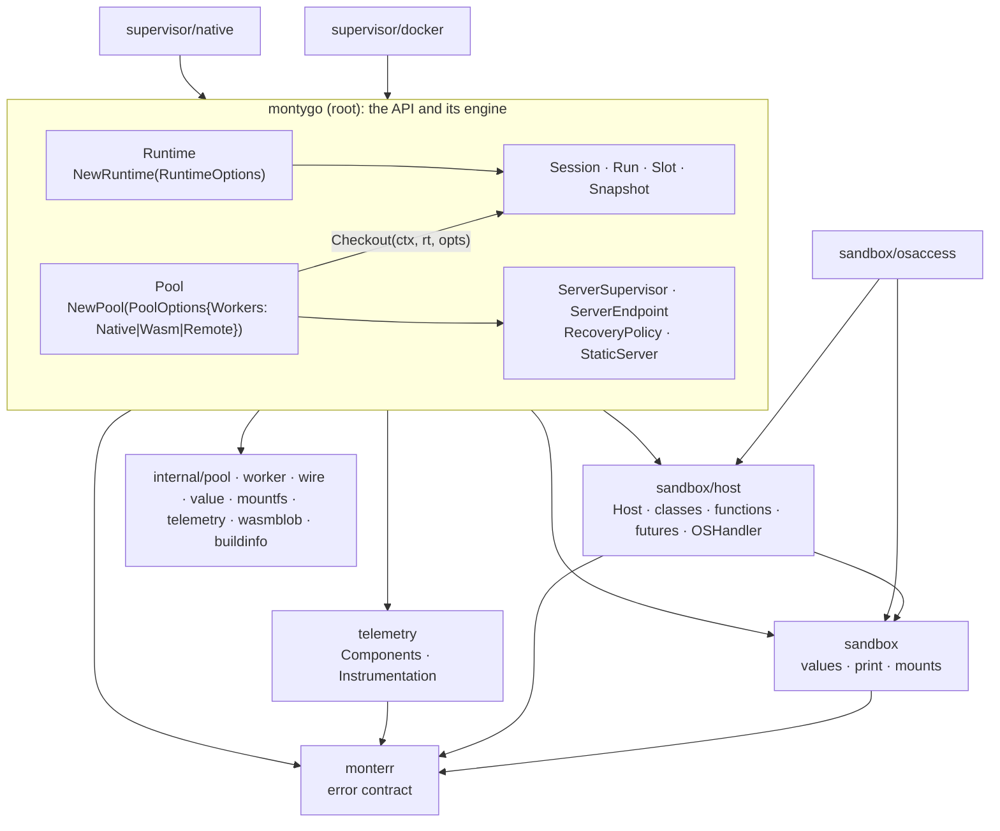

# Target architecture: the montygo API surface

Date: 2026-09-16. Brainstorm log: `docs/brainstorms/20260916-api-surface.md`.

## 1. Initial request

> The library looks absurd due to abusing of aliases instead of proper design of a surface of its API. Need to design the surface of this library, which can be in the root of it and import dependencies from child packages. When I use the library I expect: a runtime struct/interface which allows constructing a new runtime with my extensions (for instance a host file system, or my `sleep` method which is not available from `time.sleep` in Monty); telemetry without aliases; `runtime/errors` as an independent errors package so telemetry does not depend on the value model; `supervisor/supervisor.go` in the root instead of `alias_supervisor.go`; no `alias_docker.go`. Design the surface and eliminate the alias files; some test files can move back to the root if that improves the design.

Clarification given during the session: a **runtime** is configuration and extensions of the Monty sandbox; a **pool** manages supervisors and the workers behind them, busy and idle, within limits that have defaults the application may override. Managing several pools or runtimes is the application's job; the library MUST NOT rely on global values and is driven by parameters and contexts, so its entities stay isolated in memory.

## 2. High-level view



- Root declares every type a program composes and holds their implementation. It imports the leaves; nothing in it exists to rename something else.
- `monterr`, `sandbox`, `sandbox/host`, `sandbox/osaccess` and `telemetry` do not import root.
- `supervisor/docker` and `supervisor/native` import root. There is no `supervisor` package.
- No package-level mutable state anywhere in the public packages.

## 3. Decisions

| # | Topic | Decision |
|---|---|---|
| Q1 | engine home | root, as real types; the file budget of the previous task is dropped |
| Q2 | runtime vs pool | `Runtime` = sandbox configuration and extensions; `Pool` = worker resources within limits; no globals |
| Q3 | composition | `pool.Checkout(ctx, rt, opts)`; one pool serves any number of runtimes |
| Q4 | errors | `monterr`, the whole contract, including `ErrSessionLost` |
| Q5 | sandbox packages | `sandbox`, `sandbox/host`, `sandbox/osaccess` |
| Q6 | telemetry | parameters only; `Instrument`, `Flush`, `Global()` removed; `Instrumentation.Components()` |
| Q7 | worker source | `PoolOptions.Workers` = `Native(…)`, `Wasm(…)`, `Remote(sup, …)`; contract and recovery in root |
| Q8 | runtime contents | `Host`, `OS`, `Mounts`, `Print`, type checking, `Limits`; `CheckoutOptions` loses `Host`, `FeedOptions` loses `OS` |
| Q9 | tests | back to root as `montygo_test`; `conformance/` removed |
| Q10 | ownership | the application closes supervisors; no `OwnSupervisor` |
| V1 | sizing | `MinWorkers`, `MaxWorkers`; deviation from upstream `minProcesses`/`maxProcesses` recorded |
| V2 | one-shot and slots | `Pool.Run(ctx, rt, code, opts)`, `Pool.Slot(rt, opts)` |
| V3 | kind reporting | `Pool.Workers() WorkerKind` with names `native`, `wasm`, `websocket` |
| V4 | hooks | `internal/telemetryhooks` folds into root |
| V5 | pins | back in `montygo.go`; `internal/buildinfo` keeps only `Set`/`Version` for `telemetry` |
| V6 | transports | unchanged: backends implement `worker.Worker`; no transport branching outside failure classification |
| V7 | parity | new deviations listed: no global `instrument()`, `Runtime`, `Checkout` taking a runtime, sizing names |
| V9 | changelog | v0.3.0 notes rewritten for this API; nothing is released yet |

## 4. Persistent storage and caches

No database. No table, DDL, ORM model or cache is created or changed. The wazero compilation cache on disk (`WasmOptions.CacheDir`) is unchanged.

## 5. Package layout

```
montygo/                    root: API + engine (see §6.1)
montygo/monterr/            error contract
montygo/sandbox/            value model, conversion helpers, print targets, mounts
montygo/sandbox/host/       Host, ClassInstance, ClassType, ClassProxy, Function, Future, OSHandler, Kwargs
montygo/sandbox/osaccess/   in-memory OS helpers
montygo/telemetry/          Components, Instrumentation, InstrumentationConfig
montygo/supervisor/docker/  Supervisor, Options, New
montygo/supervisor/native/  Supervisor, Options, New
montygo/internal/…          pool, worker, wire, value, mountfs, telemetry, wasmblob, buildinfo
```

Removed: `runtime/`, `runtime/host/`, `runtime/osaccess/`, `supervisor/` (the package, not the directory), `internal/engine/`, `internal/telemetryhooks/`, `conformance/`, every `alias_*.go`.

Dependency order, bottom-up: `monterr` → `sandbox` → `sandbox/host` → `sandbox/osaccess`; `monterr` → `telemetry`; all of these plus `internal/*` → root → `supervisor/docker`, `supervisor/native`.

## 6. Components

### 6.1 Root package

The root package is the engine with a designed surface. Its files:

| File | State | Holds |
|---|---|---|
| `montygo.go` | UPDATED | package doc, `MontyVersion`, `UpstreamRev`, `ProtocolVersion`, `MaxValueDepth`, `Version` (deprecated) |
| `version.go` | UPDATED | `buildVersion` (ldflags), `BindingVersion`, `userAgent`, `init` publishing to `internal/buildinfo` |
| `runtime.go` | CREATED | `Runtime`, `RuntimeOptions`, `NewRuntime`, `ResourceLimits`, `TypeCheckFormat` and its constants, `Unlimited`, `UnlimitedDuration` |
| `pool.go` | UPDATED | `Pool`, `PoolOptions`, `NewPool`, `PoolStats`, `Checkout`, `Run`, `RunOptions`, `Shutdown`, `Close`, `Stats`, `Workers` |
| `workers.go` | CREATED | `WorkerSource`, `WorkerKind`, `Native`, `NativeOptions`, `Wasm`, `WasmOptions`, `Remote`, `RemoteOptions`, `NoRequestTimeout`, `UnlimitedPendingBytes`, `NoDurationLimitGrace` |
| `stop.go` | UPDATED | `StopPolicy`, `KillNow`, `StopKind`, `Stopped`, stop request machinery; no `DefaultStopPolicy` |
| `session.go`, `session_control.go`, `lifecycle.go`, `answer.go`, `snapshot.go`, `run.go`, `slot.go`, `rotation.go` | UPDATED | as in `internal/engine`, with a `*Runtime` on the session |
| `supervisor.go` | CREATED | `ServerEndpoint`, `ServerSupervisor`, `RecoveryPolicy`, `OrphanReaper`, `ErrSupervisorClosed` (re-declared in `monterr`, see §6.2), `StaticServer`, the recoverer |
| `serverinfo.go` | UPDATED | `ServerInfo`, `ServerLimits`, `FetchServerInfo`, `CheckServerHealth` |
| `binary.go` | UPDATED | `FindMontyBinary` |
| `telemetry_hooks.go` | CREATED | `resolveRecorder`, `poolMetrics`, `traceContextHeaders`, `Pool.observe` |
| `options.go` | UPDATED | `CheckoutOptions`, `FeedOptions`, `LoadSnapshotOptions`, `Uint32`, `DurationPtr` |
| `pool_unix.go`, `pool_other.go` | UPDATED | native spawner availability |

#### `Runtime`

```go
// RuntimeOptions configure the sandbox every session of the runtime runs in.
type RuntimeOptions struct {
	// Host exposes functions, objects and classes to sandbox code by name.
	// nil exposes nothing.
	Host *host.Host
	// OS answers OS calls that no mount covers. nil answers NotHandled.
	OS host.OSHandler
	// Mounts are visible to every feed; FeedOptions.Mount adds to them.
	Mounts []*sandbox.MountDir
	// Print receives output when a feed sets no target. nil writes to the process stdout and stderr.
	Print sandbox.PrintTarget
	// Limits apply to every session; CheckoutOptions.Limits overrides them per session.
	Limits *ResourceLimits
	TypeCheck       bool
	TypeCheckStubs  string
	TypeCheckFormat TypeCheckFormat
	TypeCheckColor  bool
	// AssertMessageAnnotations: nil keeps the default (120-byte operand reprs), 0 disables.
	AssertMessageAnnotations *uint32
	// PrintFlushInterval: nil keeps the 5ms default, 0 restores line buffering.
	PrintFlushInterval *time.Duration
	// MaxHostObjects bounds host objects a session keeps for identity: 0 means 10000, Unlimited disables.
	MaxHostObjects uint64
	// MaxPendingFutures bounds unresolved futures per feed: 0 means 1000, Unlimited disables.
	MaxPendingFutures uint64
}

// Runtime is an immutable sandbox configuration. Sessions of any pool inherit it.
type Runtime struct {
	opts   RuntimeOptions
	config wire.Configure // template without the script name and per-session limits
	mounts pool.MountTable
	first  string // virtual path of the first mount, the default working directory
}

func NewRuntime(opts RuntimeOptions) (*Runtime, error)
func (r *Runtime) Options() RuntimeOptions // a copy; slices are cloned
```

- `NewRuntime` validates once: `TypeCheckFormat` is known, `Limits` are representable, `PrintFlushInterval` is not negative, the host registry is `Restorable`-consistent and its stubs render, mounts build. Errors are `*monterr.OptionError` with today's messages.
- A runtime is safe for concurrent use and never mutated. `Options()` returns a copy so callers cannot reach in.
- The `sleep` extension is a host function: `h.Func("sleep", func(ctx context.Context, secs float64) error {…})`. The host file system is an `OSHandler`, for example `osaccess.New(files, environ).Handler()`.

#### `Pool` and worker sources

```go
// PoolOptions configure the worker pool. Workers is required.
type PoolOptions struct {
	Workers WorkerSource
	// MinWorkers prewarmed workers: 0 means 1, negative means none. Ignored for Remote.
	MinWorkers int
	// MaxWorkers caps live workers: 0 means runtime.NumCPU().
	MaxWorkers int
	// CheckoutTimeout bounds waiting for a free worker: 0 waits forever.
	CheckoutTimeout time.Duration
	// RequestTimeout is the per-turn deadline: 0 means none for local workers and 10s for remote ones; NoRequestTimeout disables it.
	RequestTimeout time.Duration
	// DurationLimitGrace pads the max-duration backstop: 0 means 1s; NoDurationLimitGrace disables it.
	DurationLimitGrace time.Duration
	// MaxCheckoutsPerWorker recycles a local worker after that many sessions: 0 means unlimited.
	MaxCheckoutsPerWorker int
	// MaxPendingBytes bounds worker output buffered per local worker: 0 means 64 MiB.
	MaxPendingBytes int64
	// WorkerStderr receives worker diagnostics: nil means os.Stderr.
	WorkerStderr io.Writer
	// Telemetry receives this pool's spans, logs and metrics. nil records nothing.
	Telemetry *telemetry.Components
	// Stop is the stop policy sessions inherit: zero fields mean Timeout 3s and Join 3s.
	Stop StopPolicy
}

// WorkerSource says where a pool's workers come from. Values come from Native, Wasm and Remote.
type WorkerSource interface{ kind() WorkerKind }

type WorkerKind int

const (
	WorkerNative WorkerKind = iota + 1 // `monty subprocess` children, unix only
	WorkerWasm                         // the embedded wasip1 worker under wazero
	WorkerRemote                       // one WebSocket connection per session to a supervised monty-server
)

func (k WorkerKind) String() string // "native", "wasm", "websocket"

type NativeOptions struct {
	// BinaryPath is the worker binary; "" resolves MONTY_BIN, PATH, then a cargo target directory.
	BinaryPath string
}

type WasmOptions struct {
	// CacheDir holds wazero's compilation cache: "" means the user cache dir.
	CacheDir string
	// DisableCache compiles in memory only.
	DisableCache bool
}

type RemoteOptions struct {
	// DialTimeout bounds DNS, TCP, TLS and the upgrade: 0 means 10s.
	DialTimeout time.Duration
	// TLSConfig configures wss:// dials; nil uses the system roots. It is cloned per dial.
	TLSConfig *tls.Config
	// DialContext opens TCP connections; nil uses a net.Dialer.
	DialContext func(ctx context.Context, network, addr string) (net.Conn, error)
	// Recovery bounds retries of a dial and allows a supervisor restart.
	Recovery RecoveryPolicy
	// RotateSessions moves a session to a fresh connection before the server's session timeout.
	RotateSessions bool
	// RotationMargin is the lead time of a rotation: 0 means 30s.
	RotationMargin time.Duration
}

func Native(opts NativeOptions) WorkerSource
func Wasm(opts WasmOptions) WorkerSource
func Remote(sup ServerSupervisor, opts RemoteOptions) WorkerSource

// Auto picks Native when a worker binary resolves and Wasm otherwise. It never dials.
func Auto() WorkerSource

func NewPool(ctx context.Context, opts PoolOptions) (*Pool, error)
func (p *Pool) Checkout(ctx context.Context, rt *Runtime, opts CheckoutOptions) (*Session, error)
func (p *Pool) Run(ctx context.Context, rt *Runtime, code string, opts *RunOptions) (any, error)
func (p *Pool) Slot(rt *Runtime, opts CheckoutOptions) *Slot
func (p *Pool) Shutdown(ctx context.Context, policy ...StopPolicy) error
func (p *Pool) Close(ctx context.Context) error
func (p *Pool) Stats() PoolStats
func (p *Pool) Workers() WorkerKind
func (p *Pool) BinaryPath() string // "" unless Native
```

- The three constructors return unexported types implementing the sealed interface. `Auto()` replaces `BackendAuto`; it is the default when `Workers` is nil.
- `Remote` never owns `sup`. `Shutdown` and `Close` touch workers and sessions only.
- `RequestTimeout` has one meaning for every kind: the per-turn deadline. The dial budget of a remote worker is `RemoteOptions.DialTimeout`.
- `Stop` replaces `DefaultStopPolicy`. Resolution order stays call → `CheckoutOptions.Stop` → `PoolOptions.Stop` → built-in `{Timeout: 3s, Join: 3s}`; the built-in is a constant, not a variable.
- `Telemetry: nil` records nothing. There is no process-wide installation to fall back to.

#### `CheckoutOptions`, `FeedOptions`, `RunOptions`

```go
type CheckoutOptions struct {
	// ScriptName names the script in tracebacks; defaults to main.py.
	ScriptName string
	// Limits override the runtime's limits for this session; nil inherits.
	Limits *ResourceLimits
	// Stop overrides the pool's stop policy for this session; zero fields inherit.
	Stop StopPolicy
}

type FeedOptions struct {
	Inputs map[string]any
	// ExternalLookup resolves undefined names for this feed only; it shadows the runtime's host.
	ExternalLookup map[string]any
	// Print receives output; nil uses the runtime's target, then the process stdout/stderr.
	Print sandbox.PrintTarget
	// Mount adds mounts for this feed after the runtime's mounts.
	Mount []*sandbox.MountDir
	Cwd           string
	SkipTypeCheck bool
}

type LoadSnapshotOptions struct {
	Print          sandbox.PrintTarget
	Mount          []*sandbox.MountDir
	ExternalLookup map[string]any
}

type RunOptions struct {
	CheckoutOptions
	FeedOptions
}
```

- `Host` and `OS` are gone from these structs: the runtime is their only source.
- A mount whose virtual path collides with a runtime mount is an `*monterr.OptionError` at feed time, with the message the mount table produces today for duplicate paths.

#### Session and friends

Unchanged in behaviour. The struct gains `rt *Runtime`; `newSession(p, rt, cfg, limits)` records it, `newAnswerer` reads `rt.opts.Host` and `rt.opts.OS`, `feedRun` merges mounts and print targets. Every public method keeps its signature: `FeedRun`, `FeedStart`, `Go`, `Stop`, `Close`, `Dump`, `LoadSession`, `LoadSnapshot`, `InstallDependencies`, `State`, `Stats`, `Err`, `Done`, `WorkerPID`, `ScriptName`, and the `Run`, `Slot` and snapshot types.

#### Supervisor contract

```go
type ServerEndpoint struct {
	URL       string
	Headers   map[string]string
	TLSConfig *tls.Config
}

type ServerSupervisor interface {
	Endpoint(ctx context.Context) (ServerEndpoint, error)
	Restart(ctx context.Context, failed ServerEndpoint) error
}

type RecoveryPolicy struct {
	Attempts       int           // 0 means 3
	AttemptTimeout time.Duration // 0 means 5s
	RestartServer  bool
}

type OrphanReaper interface {
	Reap(ctx context.Context) error
}

// StaticServer is the supervisor of a fixed URL: the endpoint never moves and Restart fails.
func StaticServer(url string, tlsConfig *tls.Config, headers func(ctx context.Context) (map[string]string, error)) ServerSupervisor

func FetchServerInfo(ctx context.Context, sup ServerSupervisor, opts RemoteOptions) (*ServerInfo, error)
func CheckServerHealth(ctx context.Context, sup ServerSupervisor, opts RemoteOptions) error
```

- `ErrSupervisorClosed` and `ErrNoServerInfo` are declared in `monterr` (§6.2); root uses them.
- The recoverer, single-flight restarts and `retryableDialError` move from `supervisor/supervisor.go` into `supervisor.go` in root, unexported.

### 6.2 `monterr`

CREATED from `runtime/errors.go`. Contents, unchanged in text and behaviour:

- interface `Error`; sandbox exceptions `RuntimeError`, `SyntaxError`, `TypingError`, `RaisedError`, `ConversionError`, `ValueError`, `ResourceError`; `ExceptionInfo`, `Frame`, `DisplayFormat` with `DisplayMsg`, `DisplayTypeMsg`, `DisplayTraceback`; `Raise`, `IsSubclass`, `KnownExceptionNames`;
- infrastructure failures `CrashedError`, `DisconnectError`, `ShutdownError`, `RotationError`, `SpawnError`, `ProtocolError` with `NewProtocolError`, `SessionKilledError`, `OptionError`;
- sentinels `ErrSessionLost`, `ErrSessionBusy`, `ErrSessionClosed`, `ErrPoolClosed`, `ErrCheckoutTimeout`, `ErrNotFresh`, `ErrNotOSCall`, `ErrDumpIsIdle`, `ErrDumpIsSuspended`, `ErrSnapshotStale`, `ErrSnapshotResumed`, `ErrTurnCancelled`, `ErrCallbackDetached`, `ErrSupervisorClosed`, `ErrNoServerInfo`, `ErrTelemetryPresent` is **removed** with the global installation;
- helpers `ExceptionParts`, `ErrorFromException`, `RuntimeError.MarkSessionLost`.

`monterr` imports only `internal/wire` and `internal/value`.

### 6.3 `sandbox`

CREATED from `runtime/values.go`, `print.go`, `mount.go`: `Dict`, `Set`, `FrozenSet`, `Tuple`, `NamedTuple`, `Pair`, `Path`, `Date`, `Time`, `DateTime`, `TimeDelta`, `TimeZone`, `FileHandle`, `Type`, `TypeOrigin`, `Ellipsis`, `NotImplemented`, `Cycle`, `Exception`, `BuiltinFunction`, `ExternalFunction`, `Repr`, `Equal`, the constructors; `PrintTarget`, `Stream`, `Stdout`, `Stderr`, `PrintFunc`, `Lines`, `CollectString`, `CollectStreams`, `ContextPrintTarget`, `FlushingPrintTarget`; `MountDir`, `MountDirOptions`, `MountMode`, `NewMountDir`, `BuildMounts`. Imports `monterr`, `internal/value`, `internal/mountfs`, `internal/pool`.

### 6.4 `sandbox/host`

MOVED from `runtime/host`, package `host`. Existing API kept: `NewHost`, `(*Host).Func(name, fn, opts...)`, `(*Host).Object(name, v, opts)`, `Names`, `Stubs`, `Restorable`; `Function`, `FunctionFunc`, `Func`, `MustFunc`, `Async`, `AsyncContext`, `Future`, `NewFuture`; `ClassInstance`, `ClassType`, `ClassProxy`, their options and constructors, `Expose`, `All`, `Names`; `OSHandler`, `NotHandled`; `Kwargs`, `AsNamedTuple`, `NewNamedTuple`. The engine-facing helpers (`PrepareValue`, `RestoreValue`, `KwargsRecord`, `InstanceStore`, `NewInstanceStore`, `Register`, `LookupEntry`, `CallWrapperMethod`, `WrapperLazyAttr`, `WrapperName`, `TypeName`, `BlockRegistration`) stay exported for root.

### 6.5 `sandbox/osaccess`

MOVED from `runtime/osaccess`; imports `sandbox` and `sandbox/host`. Unchanged API.

### 6.6 `telemetry`

UPDATED.

```go
type Components struct {
	Tracer trace.Tracer
	Meter  metric.Meter
	Logger log.Logger
}

type InstrumentationConfig struct { … unchanged … }

type Instrumentation struct { … }

func NewInstrumentation(cfg InstrumentationConfig) (*Instrumentation, error)
func (i *Instrumentation) SetTracerProvider(p trace.TracerProvider)
func (i *Instrumentation) SetMeterProvider(p metric.MeterProvider)
func (i *Instrumentation) SetLoggerProvider(p log.LoggerProvider)
func (i *Instrumentation) Config() InstrumentationConfig
func (i *Instrumentation) SetConfig(cfg InstrumentationConfig)
func (i *Instrumentation) Name() string
func (i *Instrumentation) Version() string
// Components builds the components from the providers set so far; nil when none is set.
func (i *Instrumentation) Components() *Components
```

- Removed: `Instrument`, `Flush`, `Instrumentation.Enable`, `Instrumentation.Disable`, `ForceFlush` (flushing belongs to the providers the application owns), and `internal/telemetry.Global`.
- `telemetry` imports `internal/telemetry`, `internal/buildinfo` (version) and nothing else of montygo.

### 6.7 `supervisor/docker` and `supervisor/native`

UPDATED. Both import root.

```go
// docker
type Options struct {
	Image, Version, Command string
	Env       map[string]string
	RunArgs   []string
	StartTimeout, StopTimeout time.Duration
	Reaper    montygo.OrphanReaper
	// MaxSessions sizes the server: 0 means 2 × runtime.NumCPU(). Pass 2 × PoolOptions.MaxWorkers.
	MaxSessions int
}
func New(ctx context.Context, opts Options) (*Supervisor, error)
func (s *Supervisor) Endpoint(ctx context.Context) (montygo.ServerEndpoint, error)
func (s *Supervisor) Restart(ctx context.Context, failed montygo.ServerEndpoint) error
func (s *Supervisor) Close(ctx context.Context) error
func (s *Supervisor) ServerInfo() *montygo.ServerInfo
func (s *Supervisor) Image() string
func (s *Supervisor) ContainerID() string

// native
type Options struct {
	Binary string
	Env    map[string]string
	Args   []string
	Stderr io.Writer
	StartTimeout, StopTimeout time.Duration
	MaxSessions int
}
func New(ctx context.Context, opts Options) (*Supervisor, error)
// Endpoint, Restart, Close, ServerInfo, PID
```

- The pool-shaped fields (`MaxProcesses`, `CheckoutTimeout`, `RequestTimeout`, `Recovery`, `RotationMargin`, `Telemetry`, `Stop`) leave both option structs; they belong to `PoolOptions` and `RemoteOptions`. `MaxSessions` replaces the `2 × MaxProcesses` derivation the supervisor made on the pool's behalf.
- `NewPool` is removed from both packages.
- `DefaultImage`, `ImageEnv`, `VersionEnv`, `BinaryEnv`, `DefaultBinary` stay.

### 6.8 `internal/buildinfo`

UPDATED: keeps `Set`, `Version`, `UnknownVersion`, `ModulePath`, `Resolve`; the pins move back to `montygo.go`. `scripts/check-pins.sh` and its test read `montygo.go` again; `docs/architecture/versioning.md` and CLAUDE.md follow.

## 7. Data flows

### 7.1 Building a runtime

1. `NewRuntime(opts)` copies `opts` (clones `Mounts`).
2. `TypeCheckFormat` is looked up; unknown → `OptionError` "unknown typeCheckFormat …".
3. `Limits`: negative `MaxDuration` → `OptionError`; `MaxRecursionDepth == Unlimited` → `OptionError`.
4. `PrintFlushInterval < 0` → `OptionError`.
5. `Host != nil` → `Host.Restorable()` is not required here (restore checks happen at `LoadSession`), but `Host.Stubs()` is rendered when `TypeCheck` is set and appended to `TypeCheckStubs`, as today's checkout does.
6. `sandbox.BuildMounts(opts.Mounts)` → the table and the first mount path; an error is returned as is.
7. The `wire.Configure` template is built once: type checking, stubs, format, colour, assert annotations, print flush interval, recursion and suspension limits, duration and memory limits when set.
8. Returns `*Runtime`.

### 7.2 Building a pool

1. `NewPool` requires `Workers`; nil means `Auto()`.
2. `MaxWorkers ≤ 0` → `runtime.NumCPU()`; `MinWorkers > MaxWorkers` for a local kind → `OptionError` "minProcesses cannot exceed maxProcesses" (message kept; parity doc notes the field rename).
3. `Stop` is resolved over the built-in default; invalid → `OptionError`.
4. The recorder is `resolveRecorder(opts.Telemetry)`: nil components → nil recorder → nothing recorded.
5. The source builds its spawner:
   - `Native`: `FindMontyBinary(BinaryPath)`; a `SubprocessSpawner` with `WorkerStderr`, `MaxPendingBytes`, the pending-bytes observer.
   - `Wasm`: the shared wazero runtime from `internal/wasmblob` with the cache settings.
   - `Auto`: `Native` when a binary resolves on a unix host, else `Wasm`.
   - `Remote`: a `WebSocketDialer` with `DialTimeout`, `userAgent()`, `TLSConfig`, `DialContext`; the pool is single-use; a recoverer over `sup` with `Recovery`; when `RotateSessions`, `FetchServerInfo(ctx, sup, opts)` once (`ErrNoServerInfo` leaves rotation off; another error fails `NewPool`).
6. `internal/pool.New` prewarms `MinWorkers` for local kinds.
7. Returns `*Pool`.

### 7.3 Checkout

1. `Checkout(ctx, rt, opts)`: `rt == nil` → `OptionError` "runtime is required"; a closed pool → `ErrPoolClosed`.
2. `cfg := rt.configure(opts.ScriptName, opts.Limits)`: the template plus the script name and the per-session limits, if any.
3. `limits := rt.sessionLimits(p.stop, opts.Stop)`: host object and future caps from the runtime, stop policy resolved over the pool's.
4. `s := newSession(p, rt, cfg, limits)`.
5. Dial: local kinds → `p.inner.Checkout`; `Remote` → reserve capacity, then the recoverer binds under the endpoint from `sup.Endpoint(ctx)` (§7.6).
6. `s.attach(co, dialStart)`; with rotation, the deadline and idle timer are armed.
7. `rt.opts.Host != nil` → `Host.Register(s.store)`; failure closes the session with `KillNow` and returns the error.
8. `p.track(s)`; returns `s`.

### 7.4 A feed

1. `FeedRun(ctx, code, opts)` → rotation check → execution admission.
2. Inputs are prepared through `host.PrepareValue` with the session store.
3. Mounts: `rt.mounts` plus `sandbox.BuildMounts(opts.Mount)`; a duplicate virtual path is an `OptionError`. The first mount path comes from the runtime, else from the feed's mounts, else `/`.
4. Print: `opts.Print`, else `rt.opts.Print`, else the process streams.
5. `ans := s.newAnswerer(e, opts.ExternalLookup, rt.opts.Host, rt.opts.OS, pt)`: a name resolves from `ExternalLookup` first, then the runtime host; an OS call goes to the mount table, then `rt.opts.OS`, then `NotHandled`.
6. The drive loop is unchanged.

### 7.5 One-shot and slots

- `Run(ctx, rt, code, opts)`: `Checkout(ctx, rt, opts.CheckoutOptions)`, `FeedRun` with `opts.FeedOptions`, `Close` under a context bounded by the session policy.
- `Slot(rt, opts)`: keeps `rt` and `opts`; every re-checkout uses them.

### 7.6 Remote dial with recovery

1. `p.inner.Reserve(ctx)` waits for capacity within `CheckoutTimeout`.
2. For `round` in {1, 2}: for `Attempts`: `ep := sup.Endpoint(ctx)`; bind under `context.WithTimeout(ctx, AttemptTimeout)` with `ep.URL`, `ep.TLSConfig`, `ep.Headers` and the trace headers; success → checkout.
3. After a failed round with `RestartServer`: one single-flight `sup.Restart(WithoutCancel(ctx), lastEndpoint)`, then round 2.
4. Exhaustion releases the reservation and returns `*monterr.SpawnError` (checkout) or `*monterr.RotationError` (rotation).

### 7.7 Shutdown and close

- `Shutdown(ctx, policy...)`: admission closed → every open session closed with the policy concurrently → `internal/pool.Shutdown(ctx)`. The supervisor is untouched.
- `Close(ctx)`: admission closed → idle workers retired. Sessions and the supervisor are untouched.
- The application closes its supervisor afterwards: `sup.Close(ctx)`.

### 7.8 Telemetry

- A pool's recorder comes only from `PoolOptions.Telemetry`. `Components` with every field nil is the same as nil.
- `Instrumentation.Components()` builds a tracer, meter and logger from the providers set so far, with the scope name `github.com/asalimonov/montygo` and `buildinfo.Version()`; nothing is installed anywhere.
- Span, log and metric names are unchanged.

### 7.9 Failure modes

| Failure | Where | Result |
|---|---|---|
| unknown `TypeCheckFormat`, negative duration, unlimited recursion, negative flush interval | `NewRuntime` | `*monterr.OptionError`, today's messages |
| mount table cannot be built | `NewRuntime`, feed | the mount error, unchanged |
| `Workers` cannot resolve a native binary | `NewPool` with `Native` | `*monterr.OptionError` "could not locate the monty binary …" |
| `Auto` with no binary | `NewPool` | wasm, silently |
| `MinWorkers > MaxWorkers` | `NewPool` | `*monterr.OptionError` |
| `Remote` with `RotateSessions` and `/info` fails other than 404 | `NewPool` | that error |
| `Checkout` with `rt == nil` | `Checkout`, `Run`, `Slot` | `*monterr.OptionError` "runtime is required" |
| host registration fails at checkout | `Checkout` | the host error; session killed |
| duplicate mount path between runtime and feed | feed | `*monterr.OptionError` |
| dial exhausted | `Checkout` | `*monterr.SpawnError` |
| rotation fails | operation or timer | `*monterr.RotationError` with the dump |
| supervisor closed while the pool dials | `Checkout` | retried, then `*monterr.SpawnError` wrapping `ErrSupervisorClosed` |
| `Telemetry` component panics | recording | the signal is disabled, as today |

## 8. Migration

| Before | After |
|---|---|
| `montygo.New(ctx, Options{Backend: BackendWasm})` | `montygo.NewPool(ctx, PoolOptions{Workers: montygo.Wasm(WasmOptions{})})` |
| `montygo.New(ctx, Options{})` | `montygo.NewPool(ctx, PoolOptions{})` — `Auto()` |
| `Options.BinaryPath` | `NativeOptions.BinaryPath` |
| `Options.MinProcesses`, `MaxProcesses` | `PoolOptions.MinWorkers`, `MaxWorkers` |
| `Options.WasmCacheDir`, `DisableWasmCache` | `WasmOptions.CacheDir`, `DisableCache` |
| `montygo.NewWebSocket(ctx, WebSocketOptions{URL: u})` | `NewPool(ctx, PoolOptions{Workers: Remote(StaticServer(u, nil, nil), RemoteOptions{})})` |
| `WebSocketOptions.Supervisor`, `Recovery`, `RotateSessions`, `RotationMargin`, `TLSConfig`, `DialContext` | `Remote(sup, RemoteOptions{…})` |
| `WebSocketOptions.RequestTimeout` (turn and dial) | `PoolOptions.RequestTimeout` (turn) and `RemoteOptions.DialTimeout` |
| `montygo.NewDocker(ctx, DockerOptions{…})` | `sup, _ := docker.New(ctx, docker.Options{…})`; `NewPool(ctx, PoolOptions{Workers: Remote(sup, RemoteOptions{RotateSessions: true})})`; `sup.Close` after `Shutdown` |
| `docker.NewPool`, `native.NewPool` | removed |
| `pool.Checkout(ctx, CheckoutOptions{Host: h})` | `rt, _ := NewRuntime(RuntimeOptions{Host: h})`; `pool.Checkout(ctx, rt, CheckoutOptions{})` |
| `FeedOptions.OS` | `RuntimeOptions.OS` |
| `pool.Run(ctx, code, opts)`, `pool.Slot(opts)` | `pool.Run(ctx, rt, code, opts)`, `pool.Slot(rt, opts)` |
| `montygo.DefaultStopPolicy = …` | `PoolOptions.Stop` |
| `montygo.Instrument(c)` | `PoolOptions.Telemetry: &c` |
| `montygo.Dict`, `Kwargs`, `Raise`, `RuntimeError`, `Lines`, … | `sandbox.Dict`, `host.Kwargs`, `monterr.Raise`, `monterr.RuntimeError`, `sandbox.Lines`, … |
| `montygo.ServerSupervisor`, `RecoveryPolicy`, `ServerEndpoint` | unchanged names, now declared in root |
| `pool.Backend()` | `pool.Workers()` |
| `CheckWebSocketHealth(ctx, opts)` | `CheckServerHealth(ctx, sup, RemoteOptions{})` |
| `github.com/asalimonov/montygo/runtime/osaccess` | `github.com/asalimonov/montygo/sandbox/osaccess` |

Consumers to update: `examples/` (every program: pool construction, `sandbox`/`host`/`monterr` imports, the service example's host → runtime), `../montygo-test` (`runner.go` host → runtime, `docker.go`, `main.go` pool construction), `tests/network` (pool construction through `Remote(StaticServer(…))`, the supervisor tests, `TestDockerSupervisor_*` using `docker.New` + `NewPool`).

## 9. Tests

- The 48 files of `conformance/` return to root as `package montygo_test`. `public_api_test.go` globs `*.go` again; `testmain_test.go` resolves `../monty` with one `..`.
- The harness: `openPool(ctx, name, opts)` maps `native`, `wasm`, `websocket`, `docker` to a `WorkerSource`; `remoteBackend(name)` keeps its role. A shared default runtime `testRuntime = montygo.NewRuntime(RuntimeOptions{})` serves tests that set no host; tests that used `CheckoutOptions{Host: h}` build a runtime.
- `MONTY_TEST_BACKENDS` keeps its names.
- `docker_image_test.go`, `docker_supervisor_test.go` stay in `supervisor/docker`; `recovery_test.go` moves to root with the recoverer; `lifecycle_state_test.go` and `version_test.go`-style internal tests return to root as `package montygo`.
- `telemetry_test.go` scenarios that used `Instrument` pass `Components` through `PoolOptions.Telemetry`.
- `make test-docker` runs `go test … .` again.

## 10. Documentation

| File | Change |
|---|---|
| `README.md` | the runtime/pool model, the package map, every snippet |
| `docs/architecture/overview.md` | public surface paragraph, artifacts table, process model |
| `docs/architecture/pool.md`, `session.md` | runtime on the session; `WorkerSource` |
| `docs/architecture/supervisor.md` | contract in root; application-owned supervisors; `MaxSessions` |
| `docs/architecture/websocket.md` | `Remote`, `RemoteOptions`, `StaticServer` |
| `docs/architecture/telemetry.md` | no global installation |
| `docs/architecture/versioning.md`, `CLAUDE.md` | pins in `montygo.go`; layout table; conventions gain "no package-level mutable state in public packages" |
| `docs/parity/api.md` | the deviations of V7 and V1; `Instrument` removed; `Runtime` |
| `docs/parity/tests.md` | file paths back in root |
| `changelogs/v0.3.0.md` | rewritten for this API |
| `docs/reports/20260916-package-layout.md` | a closing note that the alias facade was superseded |

## 11. NOT CONSIDERED & TODO

| # | Item | Tags |
|---|---|---|
| N1 | merging a per-checkout host over the runtime's host | postponed |
| N2 | default `FeedOptions` on a `Runtime` (inputs, external lookup) | potential-improvement |
| N3 | fluent host registration | already present (`Host.Func`, `Host.Object`); nothing to do |
| N4 | one runtime across pools whose worker builds differ in type-check stubs | too-complex |
| N5 | a pool metric attribute naming the runtime | potential-improvement |
| N6 | a shim for upstream's global `instrument()` | postponed; deviation recorded |
| N7 | removing `internal/buildinfo` by carrying the version in `telemetry.Components` | potential-improvement |
| N8 | `Auto()` preferring a remote supervisor found in the environment | potential-improvement |
| N9 | `RuntimeOptions.Host` validation against the worker's type-check stubs at `NewRuntime` rather than at the first type-checked feed | potential-improvement |

## 12. Pseudo-code

### `NewRuntime`

```go
func NewRuntime(opts RuntimeOptions) (*Runtime, error) {
	opts.Mounts = slices.Clone(opts.Mounts)
	code, ok := typeCheckFormats[formatOr(opts.TypeCheckFormat, FormatFull)]
	if !ok {
		return nil, &monterr.OptionError{Message: "unknown typeCheckFormat '" + string(opts.TypeCheckFormat) + "', expected one of: …"}
	}
	if opts.PrintFlushInterval != nil && *opts.PrintFlushInterval < 0 {
		return nil, &monterr.OptionError{Message: "invalid printFlushInterval: …"}
	}
	limits, err := wireLimits(opts.Limits) // negative duration, unlimited recursion -> OptionError
	if err != nil {
		return nil, err
	}
	stubs := opts.TypeCheckStubs
	if opts.TypeCheck && opts.Host != nil {
		stubs = joinStubs(stubs, opts.Host.Stubs())
	}
	table, first, err := sandbox.BuildMounts(opts.Mounts)
	if err != nil {
		return nil, err
	}
	return &Runtime{
		opts:   opts,
		config: wire.Configure{TypeCheck: opts.TypeCheck, TypeCheckStubs: ptrOrNil(stubs), TypeCheckFormat: code,
			TypeCheckColor: opts.TypeCheckColor, AssertMessageAnnotations: opts.AssertMessageAnnotations,
			PrintFlushIntervalMs: flushMillis(opts.PrintFlushInterval), Limits: limits},
		mounts: table,
		first:  first,
	}, nil
}

func (r *Runtime) configure(scriptName string, override *ResourceLimits) (wire.Configure, error) {
	cfg := r.config
	cfg.ScriptName = or(scriptName, "main.py")
	if override != nil {
		limits, err := wireLimits(override)
		if err != nil {
			return cfg, err
		}
		cfg.Limits = limits
	}
	return cfg, nil
}
```

### `NewPool`

```go
func NewPool(ctx context.Context, opts PoolOptions) (*Pool, error) {
	src := opts.Workers
	if src == nil {
		src = Auto()
	}
	stop, err := effectivePolicy(builtinStopPolicy, []StopPolicy{opts.Stop})
	if err != nil {
		return nil, err
	}
	rec := resolveRecorder(opts.Telemetry) // nil components -> nil recorder
	spawner, remote, err := src.spawner(ctx, opts, rec)
	if err != nil {
		return nil, err
	}
	p := &Pool{kind: src.kind(), rec: rec, stop: stop, sessions: map[*Session]struct{}{}}
	if remote != nil {
		p.supervised, p.recovery = true, newRecoverer(remote.sup, remote.opts.Recovery, rec)
		p.requestTimeout = or(opts.RequestTimeout, 10*time.Second)
		if remote.opts.RotateSessions {
			info, err := FetchServerInfo(ctx, remote.sup, remote.opts)
			switch {
			case errors.Is(err, monterr.ErrNoServerInfo):
			case err != nil:
				return nil, err
			default:
				p.rotation = newRotationPolicy(info, remote.opts.RotationMargin)
			}
		}
	}
	inner, err := pool.New(ctx, pool.Config{Spawner: spawner, MinProcesses: minWorkers(opts, remote != nil),
		MaxProcesses: maxWorkers(opts), CheckoutTimeout: opts.CheckoutTimeout, RequestTimeout: p.requestTimeout,
		DurationLimitGrace: grace(opts), GraceDisabled: opts.DurationLimitGrace == NoDurationLimitGrace,
		MaxCheckoutsPerWorker: opts.MaxCheckoutsPerWorker, SingleUse: remote != nil,
		MontyVersion: MontyVersion, ProtocolVersion: ProtocolVersion, Metrics: poolMetrics(rec)})
	if err != nil {
		return nil, spawnError(err)
	}
	p.inner = inner
	return p, nil
}
```

### `Pool.Checkout`

```go
func (p *Pool) Checkout(ctx context.Context, rt *Runtime, opts CheckoutOptions) (*Session, error) {
	if rt == nil {
		return nil, &monterr.OptionError{Message: "runtime is required"}
	}
	if p.closed.Load() {
		return nil, monterr.ErrPoolClosed
	}
	cfg, err := rt.configure(opts.ScriptName, opts.Limits)
	if err != nil {
		return nil, err
	}
	limits, err := rt.sessionLimits(p.stop, opts.Stop)
	if err != nil {
		return nil, err
	}
	s := newSession(p, rt, cfg, limits)
	co, dialStart, err := p.dial(ctx, cfg)
	if err != nil {
		return nil, err
	}
	s.attach(co, dialStart)
	if h := rt.opts.Host; h != nil {
		if err := h.Register(s.store); err != nil {
			_ = s.Close(ctx, KillNow)
			return nil, err
		}
	}
	if err := p.track(s); err != nil {
		_ = s.Close(ctx, KillNow)
		return nil, err
	}
	return s, nil
}
```

### `Session.feedRun` environment merge

```go
func (s *Session) feedRun(ctx context.Context, e *execution, code string, opts *FeedOptions) (any, error) {
	if err := s.beginExecution(e); err != nil {
		return nil, err
	}
	inputs, err := s.prepareInputs(opts.Inputs)
	if err != nil {
		return nil, err
	}
	mounts, first, err := s.rt.feedMounts(opts.Mount) // runtime table + feed extras; duplicate path -> OptionError
	if err != nil {
		return nil, err
	}
	print := opts.Print
	if print == nil {
		print = s.rt.opts.Print
	}
	wctx := context.WithoutCancel(ctx)
	pt := newPrintTarget(wctx, s.co, print)
	pt.exec, e.print = e, pt
	ans := s.newAnswerer(e, opts.ExternalLookup, s.rt.opts.Host, s.rt.opts.OS, pt)
	if err := s.beginSend(e); err != nil {
		return nil, err
	}
	ev, err := s.co.Feed(wctx, code, inputs, mounts, first, cwdPtr(opts.Cwd), opts.SkipTypeCheck, pt.onPrint)
	return s.drive(wctx, e, ev, err, pt, ans)
}
```

### `Remote` source

```go
type remoteSource struct {
	sup  ServerSupervisor
	opts RemoteOptions
}

func Remote(sup ServerSupervisor, opts RemoteOptions) WorkerSource { return remoteSource{sup: sup, opts: opts} }

func (r remoteSource) kind() WorkerKind { return WorkerRemote }

func (r remoteSource) spawner(_ context.Context, opts PoolOptions, _ *telemetry.Recorder) (worker.Spawner, *remoteSource, error) {
	if r.sup == nil {
		return nil, nil, &monterr.OptionError{Message: "remote workers need a supervisor"}
	}
	if r.opts.Recovery.Attempts < 0 || r.opts.Recovery.AttemptTimeout < 0 || r.opts.RotationMargin < 0 {
		return nil, nil, &monterr.OptionError{Message: "recovery and rotation settings must not be negative"}
	}
	dial := r.opts.DialTimeout
	if dial == 0 {
		dial = 10 * time.Second
	}
	return &worker.WebSocketDialer{DialTimeout: dial, UserAgent: userAgent(), TLSConfig: r.opts.TLSConfig, DialContext: r.opts.DialContext}, &r, nil
}
```

The endpoint travels per attempt through the context (`worker.WithEndpoint`), as today; `WebSocketDialer.URL` is unused for supervised pools and `StaticServer` covers the fixed-URL case.

### `StaticServer`

```go
func StaticServer(url string, tlsConfig *tls.Config, headers func(ctx context.Context) (map[string]string, error)) ServerSupervisor {
	return staticServer{url: url, tls: tlsConfig, headers: headers}
}

func (s staticServer) Endpoint(ctx context.Context) (ServerEndpoint, error) {
	ep := ServerEndpoint{URL: s.url, TLSConfig: s.tls}
	if s.headers != nil {
		h, err := s.headers(ctx)
		if err != nil {
			return ServerEndpoint{}, err
		}
		ep.Headers = h
	}
	return ep, nil
}

func (staticServer) Restart(context.Context, ServerEndpoint) error {
	return errors.New("montygo: a fixed server URL cannot be restarted")
}
```

### `Instrumentation.Components`

```go
func (i *Instrumentation) Components() *Components {
	i.mu.Lock()
	defer i.mu.Unlock()
	if i.tracerProvider == nil && i.meterProvider == nil && i.loggerProvider == nil {
		return nil
	}
	c := &Components{}
	if i.tracerProvider != nil {
		c.Tracer = i.tracerProvider.Tracer(instrumentationName, trace.WithInstrumentationVersion(buildinfo.Version()))
	}
	if i.meterProvider != nil {
		c.Meter = i.meterProvider.Meter(instrumentationName, metric.WithInstrumentationVersion(buildinfo.Version()))
	}
	if i.loggerProvider != nil {
		c.Logger = i.loggerProvider.Logger(instrumentationName, log.WithInstrumentationVersion(buildinfo.Version()))
	}
	return c
}
```

### `resolveRecorder`

```go
func resolveRecorder(c *telemetry.Components) *itel.Recorder {
	if c == nil || (c.Tracer == nil && c.Meter == nil && c.Logger == nil) {
		return nil // nothing is recorded; there is no process-wide fallback
	}
	return itel.NewRecorder(itel.Components(*c))
}
```

### Stop policy resolution without a package variable

```go
// builtinStopPolicy is a constant-valued default; PoolOptions.Stop overrides it per pool.
var builtinStopPolicy = StopPolicy{Timeout: 3 * time.Second, Join: 3 * time.Second} // never reassigned; unexported

func (r *Runtime) sessionLimits(poolStop StopPolicy, override StopPolicy) (sessionLimits, error) {
	l := sessionLimits{hostObjects: or(r.opts.MaxHostObjects, 10_000), pendingFutures: or(r.opts.MaxPendingFutures, 1000)}
	stop, err := effectivePolicy(poolStop, []StopPolicy{override})
	if err != nil {
		return l, err
	}
	l.stop = stop
	return l, nil
}
```
