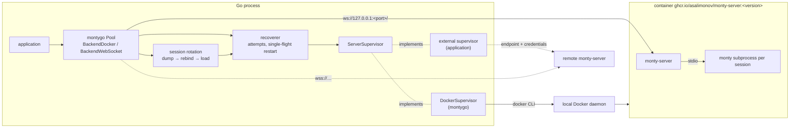

# Target architecture: Docker-managed monty-server, supervisors, session rotation

Date: 2026-09-16

Brainstorm log: `docs/brainstorms/20260916-docker-image-default.md`. Report: `docs/reports/20260916-docker-server-limits.md`.

## 1. Initial request

> montygo package should try to use monty docker image from this repo with the same verion as and this package, excep cases when version and path to docker image specified in parameters or env var ( this need to brainstrom and implement)

It is item 3 of the v0.3.0 release request. Items 1 and 2: publish the Go module as `v0.3.0`, and publish the `monty-server` image to GHCR, linked to the repository. The feature ships in v0.3.0.

## 2. High-level view



- `NewDocker` = `NewDockerSupervisor` + a WebSocket pool with that supervisor, rotation on, and ownership of the supervisor.
- `NewWebSocket` accepts either a fixed `URL` or a `Supervisor`. Rotation is opt-in there.
- Local backends (`New`, `BackendAuto`, `BackendNative`, `BackendWasm`) do not change.

## 3. Decisions

| # | Topic | Decision |
|---|---|---|
| Q1 | meaning of "use the image" | `NewDocker` starts a `monty-server` container and returns a WebSocket pool |
| Q2 | `BackendAuto` | unchanged; Docker is opt-in through `NewDocker` |
| Q3 | default tag | from `BindingVersion()`: exact version, then base release; `MontyVersion` never appears in a tag |
| Q4 | availability | per candidate: local image, else `docker pull`, else next candidate |
| Q5 | pseudo-versions | Go pseudo-versions resolve to their base release; `(devel)`, `0.0.0-unknown`, `v0.0.0-<ts>-<hash>` are an `OptionError` |
| Q6 | overrides | `DockerOptions.Image` / `MONTYGO_DOCKER_IMAGE`, `DockerOptions.Version` / `MONTYGO_DOCKER_VERSION`; option > variable > default; explicit version or pinned reference = one candidate |
| Q7 | Docker access | `docker` CLI through `os/exec`; `DockerOptions.Command` |
| Q8 | session timeout | kept; montygo rotates sessions before the deadline |
| Q9 | container server settings | session and turn timeouts kept; idle, memory, duration and per-client quota disabled; `MAX_SESSIONS = 2 × MaxProcesses`; random dump key |
| Q10 | rotation scope | always on for `NewDocker`; `WebSocketOptions.RotateSessions` opt-in |
| Q11 | failure policy | 3 attempts, 5 s each; then an optional server restart and 3 more attempts |
| Q12 | restart | opt-in (`RecoveryPolicy.RestartServer`); placement belongs to a supervisor |
| Q13 | supervisor contract | exported `ServerSupervisor` interface in `WebSocketOptions.Supervisor` |
| Q14 | recovery scope | every supervised dial: checkout and rotation |
| — | supervisors | montygo exports `DockerSupervisor`; applications MAY implement their own |
| Q15 | container lifecycle | eager start, one labelled container per supervisor, no `--rm`; `OrphanReaper` interface with a stub |
| Q16 | tests | root unit tests with fakes; `docker` root backend; `tests/network` end to end |
| I1 | transport branching | rotation keyed on `p.rotation != nil`; loss classification by `co.Kind()` |
| I2 | untrusted `/info` | rotation on only if `session > 0`, `turn > 0`, `session ≥ 2 × (turn + margin)` |
| I3 | suspension budget | rotation carries `suspensionsSeen` and `cwdSet`; `LoadSession`/`LoadSnapshot` unchanged |
| I4 | timeouts | `AttemptTimeout` bounds dial + `Configure` + `Load` per attempt; `RequestTimeout` stays per turn |
| I5 | `Close` vs `Shutdown` | `Shutdown` stops the container after closing sessions; `Close` stops it once the last session closes |
| I6 | dump key exposure | passed through the CLI's environment, `-e NAME` without a value |
| I7 | telemetry | no new names; rotation emits upstream `dump`, `load` and `session` spans |
| I8 | docs and API record | README, parity, golden, changelog updated in the same change |
| I9 | remote Docker daemons | `DockerSupervisor` supports local daemons only |

## 4. Persistent storage and caches

- No database. No table, DDL or ORM model is created or changed.
- No cache is created. The existing wasm compilation cache is untouched.
- Container state lives in Docker. montygo identifies its containers by labels:

| Label | Value |
|---|---|
| `io.montygo.supervisor` | 16 random bytes, hex, per `DockerSupervisor` |
| `io.montygo.version` | `BindingVersion()` |
| `io.montygo.pid` | `os.Getpid()` of the creating process |

In-memory state added (section 7 has the full structs): `Pool.supervisor`, `Pool.recovery`, `Pool.rotation`, `Pool.owned`; `Session.cfg`, `Session.conn`; `internal/pool.Reservation`; `recoverer.restarts`.

## 5. Components

### 5.1 Image reference resolver

`docker_image.go` turns options, environment variables and `BindingVersion()` into an ordered list of image references. It performs no I/O.

- Repository: first non-empty of `DockerOptions.Image`, `$MONTYGO_DOCKER_IMAGE`, `ghcr.io/asalimonov/monty-server`.
- Version: first non-empty of `DockerOptions.Version`, `$MONTYGO_DOCKER_VERSION`.
- A repository is pinned when it has `@` (digest) or a `:` after its last `/`. A pinned repository is the only candidate. A pinned repository with a version is an `OptionError`.
- An explicit version is the only candidate: `<repo>:<version>`.
- Otherwise candidates derive from the binding version:

| Binding version | Form | Candidates |
|---|---|---|
| `X.Y.Z`, `X.Y.Z-pre` | release | `X.Y.Z[-pre]` |
| `B-<hex7..40>`, `B-<hex7..40>-dirty`, `B-dirty` | `scripts/version.sh` dev | exact, then `B` |
| `X.Y.(Z+1)-0.<14 digits>-<12 hex>` | Go pseudo after release | `X.Y.Z` |
| `X.Y.Z-pre.0.<14 digits>-<12 hex>` | Go pseudo after prerelease | `X.Y.Z-pre` |
| `X.0.0-<14 digits>-<12 hex>` | Go pseudo, no tag | none |
| `(devel)`, `0.0.0-unknown`, empty, invalid tag text | unknown | none |

- No candidate is an `OptionError`: `cannot derive a monty-server image tag from montygo version "<v>"; set DockerOptions.Version or MONTYGO_DOCKER_VERSION, set DockerOptions.Image or MONTYGO_DOCKER_IMAGE to a pinned reference, or stamp -ldflags "-X github.com/asalimonov/montygo.buildVersion=<version>"`.
- A candidate tag MUST match `[A-Za-z0-9_][A-Za-z0-9_.-]{0,127}`. Duplicates are removed, keeping order.
- A prerelease whose last segment is 7+ hex digits (`0.4.0-deadbee`) is read as a dev form. This is accepted and documented.

### 5.2 Docker CLI runner

`docker_cli.go` wraps `os/exec` for the supervisor.

- Binary: `DockerOptions.Command`, default `docker`, resolved with `exec.LookPath` at supervisor creation. A missing binary is an `OptionError`: `docker CLI not found: <command>`.
- Environment: `os.Environ()` plus the server variables, appended so they win. Docker contexts, `DOCKER_HOST`, `DOCKER_CONFIG` and credential helpers keep working.
- Every call takes a context and captures stdout and stderr. A failure is `fmt.Errorf("%s %s: %w: %s", command, verb, err, trimmedStderr)`.
- Parsed output: the container ID from `run -d` (first line, 64 hex); the host port from `port <id> 8000/tcp` (the first line of the form `127.0.0.1:<port>`).

### 5.3 DockerSupervisor

`docker.go`. montygo's local `ServerSupervisor`.

Construction (`NewDockerSupervisor`), in order, within `DockerOptions.StartTimeout` (default 2 min):

1. Validate options; resolve the CLI.
2. Call `Reaper.Reap(ctx)`; the default is the stub (5.5). An error fails construction.
3. Resolve candidates (5.1). For each: `image inspect`; else `pull`; else record the error and try the next. All failing is an error listing each reference and its failure.
4. Build the server environment (Q9 table) and overlay `DockerOptions.Env`.
5. `docker run -d` with hardening flags, labels, `-p 127.0.0.1::8000`, `-e NAME` per server variable, `RunArgs`, and the image.
6. Read the port. Endpoint `ws://127.0.0.1:<port>/`.
7. Poll `GET /health` every 100 ms until 200.
8. `FetchServerInfo`. `ProtocolVersion` MUST equal `montygo.ProtocolVersion`. `MontyRev` is not checked: the upstream revision stays internal, and the worker compares `Configure.monty_version` itself.
9. On failure after step 5: read `docker logs --tail 20`, `docker rm -f`, return an error carrying the log tail. A health wait that fails adds: `DockerSupervisor supports local Docker daemons only`.

Server environment set by the supervisor, before `Env` overrides:

| Variable | Value |
|---|---|
| `MONTY_SERVER_DUMP_KEY` | 32 random bytes, hex; kept for the supervisor's life |
| `MONTY_SERVER_MAX_SESSIONS` | `2 × MaxProcesses` (`MaxProcesses` 0 means `runtime.NumCPU()`) |
| `MONTY_SERVER_MAX_SESSIONS_PER_CLIENT` | `0` |
| `MONTY_SERVER_IDLE_TIMEOUT` | `0` |
| `MONTY_SERVER_MAX_MEMORY_MIB` | `0` |
| `MONTY_SERVER_MAX_DURATION` | `0` |
| `MONTY_SERVER_SESSION_TIMEOUT` | not set; image default 3600 |
| `MONTY_SERVER_TURN_TIMEOUT` | not set; image default 300 |

`docker run` arguments:

```
run -d
  --read-only --cap-drop ALL --security-opt no-new-privileges
  --pids-limit <max(512, 32 × max sessions)>
  --label io.montygo.supervisor=<id> --label io.montygo.version=<BindingVersion> --label io.montygo.pid=<pid>
  -p 127.0.0.1::8000
  -e MONTY_SERVER_DUMP_KEY -e MONTY_SERVER_MAX_SESSIONS -e … (names only)
  <RunArgs…>
  <image reference>
```

`Endpoint(ctx)` returns the current endpoint under the mutex; after `Close` it returns `ErrSupervisorClosed`.

`Restart(ctx, failed)`:

- If `failed.URL` differs from the current endpoint, another caller already restarted: return nil.
- If the container exists: `docker restart -t <StopTimeout> <id>`. Otherwise run a new container with the same key, labels and environment.
- Re-read the port, wait for `/health`, re-check `/info`, replace the endpoint and `ServerInfo`.
- Bounded by `StartTimeout`. Serialized by the supervisor mutex.

`Close(ctx)`: idempotent. `docker stop -t <StopTimeout> <id>`, then `docker rm -f <id>`. Errors are joined and returned; the supervisor is closed either way.

### 5.4 ServerSupervisor contract and recoverer

`supervisor.go`.

- `ServerSupervisor.Endpoint` MUST be safe for concurrent use and SHOULD be cheap: it is called before every dial attempt.
- `ServerSupervisor.Restart` MUST be safe for concurrent use. It receives the endpoint that failed, so it can ignore a restart that already happened.
- A supervisor that replaces a server MUST keep the dump key, or rotations across the restart fail with `ValueError: invalid session dump signature`.

The `recoverer` is montygo's retry engine for supervised dials.

- Attempts per round: `RecoveryPolicy.Attempts`, 0 means 3.
- Each attempt: `Endpoint(ctx)`, then the operation under `context.WithTimeout(ctx, AttemptTimeout)`; `AttemptTimeout` 0 means 5 s.
- Retryable: `internal/pool` errors of kind spawn, disconnected, crashed, timeout; the attempt context's deadline; an `Endpoint` error.
- Not retryable: pool closed, capacity exhausted, runtime error (for example an invalid dump signature), protocol violation, the caller's context.
- After a round of failures, when `RestartServer` is true and no restart happened yet: one single-flight restart, then one more round.
- Single flight: keyed by the failed URL. A caller whose last failure happened before a completed restart of that URL does not restart again.
- Exhaustion: `SpawnError` for a checkout, `RotationError` for a rotation. The message names the attempt count and the last error.

### 5.5 OrphanReaper stub

```go
type noopReaper struct{}

func (noopReaper) Reap(context.Context) error {
	// TODO: NotImplemented: list containers labelled io.montygo.supervisor,
	// skip those whose io.montygo.pid is alive on this host, remove the rest.
	return nil
}
```

Documented manual cleanup: `docker rm -f $(docker ps -aq --filter label=io.montygo.supervisor)`.

### 5.6 Endpoint propagation in `internal/worker`

- `worker.Endpoint{URL, TLSConfig}` travels in the context, like connect headers.
- `WebSocketDialer.Spawn`, `HealthCheck` and `GetJSON` use the context endpoint when present, else `d.URL` and `d.TLSConfig`.
- Error prefixes use the URL actually dialed.
- `transport` takes the TLS config as a parameter.

### 5.7 Capacity reservation and rebind in `internal/pool`

Rotation must replace a checkout's worker without giving up its capacity, and a supervised checkout must retry spawning without re-waiting for capacity.

- `Pool.Reserve(ctx)` waits for capacity like `acquire` (honouring `CheckoutTimeout`) but does not spawn. Valid only for `SingleUse` pools. It counts as `starting`.
- `Pool.Bind(ctx, r, cfg, state, opts)` spawns a worker, sends `Configure`, and when `state` is non-nil sends `Load`, carrying the reservation's budget and `cwdSet`. On success the reservation becomes the checkout's lease (`starting → active`). On failure the new worker is killed and retired, and the reservation stays valid for another attempt.
- `Checkout.Handoff(ctx)` requires no pending suspension and no turn in flight. It closes the worker gracefully (close frame, 1 s), retires it, and returns a `Reservation` holding the capacity slot, the budget and `cwdSet`. The retiring worker is counted while it closes, so live workers MAY exceed `MaxProcesses` by one for up to 1 s.
- `Reservation.Release()` returns the capacity. It is idempotent and a no-op after a successful `Bind`.
- The old checkout's metrics outcome is `ok`. No new metric attribute value is introduced.
- `Checkout.Restore` keeps its reset semantics for `LoadSession` and `LoadSnapshot`.

### 5.8 Session rotation

`rotation.go`, package `montygo`.

- A pool rotates when `p.rotation != nil`. `newRotationPolicy(info, margin)` returns nil unless `SessionTimeout > 0`, `TurnTimeout > 0` and `SessionTimeout ≥ 2 × (TurnTimeout + margin)`. `RotationMargin` 0 means 30 s.
- Every connection records `deadline = dialStart + SessionTimeout`. `dialStart` is taken before the dial, so the client deadline is never later than the server's.
- Pre-operation check: `FeedRun`, `FeedStart`, `Go`, `LoadSession`, `LoadSnapshot`, `Dump` and `InstallDependencies` call `rotateIfDue(ctx)` first. It rotates when `time.Until(deadline) ≤ TurnTimeout + margin`.
- Idle timer: `time.AfterFunc(deadline − margin − now)` calls `rotateOnTimer`. A busy session is skipped; the pre-operation check covers it.
- Invariant: an operation admitted with more than `TurnTimeout + margin` left is ended by the server's turn timeout before `deadline − margin`, so no operation crosses the session deadline.
- Steps under a control reservation: `Dump` → stop the loss watcher → `Handoff` → recoverer-driven `Bind(state)` → `attach` the new checkout (new watcher, deadline and timer).
- Failure ends the session with `*RotationError`. `Dump` is the envelope when it was captured, nil otherwise.
- N2: a dump over the 256 MiB envelope limit fails `Dump` on the server. It ends with `RotationError{Dump: nil}`; the code comment names the case and `NotImplemented` chunked dumps.
- Host objects, the instance store, `driven`, the stop policy and futures state belong to the `Session` and survive. Rotation happens only when no execution is running, so there are no pending futures.
- Telemetry: the rotation's `Dump` and `Load` are observed as upstream `dump` and `load` housekeeping spans. The new checkout opens a new `session {script_name}` span. A timer rotation uses a context without a parent span.

### 5.9 Errors

- `RotationError{Message string, Dump []byte, Cause error}`. `Error()` renders `RuntimeError: <message>`, like `ShutdownError`. `Is(ErrSessionLost)` is true. `Unwrap()` returns `Cause`.
- `ErrSupervisorClosed`: `errors.New("montygo: server supervisor closed")`.
- The loss watcher classifies by `co.Kind() == worker.KindWebSocket` (`DisconnectError`), else `CrashedError`.

### 5.10 Pool construction and ownership

- `BackendDocker` is appended after `BackendWebSocket` and renders as `docker`. `New` with `BackendDocker` is an `OptionError`: `use NewDocker for the Docker backend`.
- `NewWebSocket` validation: `Supervisor` with `URL` or `ConnectHeaders` is an `OptionError`: `Supervisor replaces URL and ConnectHeaders`. Neither set is `OptionError`: `URL or Supervisor is required`. Negative `RecoveryPolicy.Attempts`, `AttemptTimeout` or `RotationMargin` is an `OptionError`.
- `NewWebSocket` with `RotateSessions`: `FetchServerInfo` through the supervisor's endpoint or `URL`. `ErrNoServerInfo` leaves rotation off. Other errors fail construction.
- `NewDocker`: `NewDockerSupervisor`, then the WebSocket pool with `Backend() == BackendDocker`, `RotateSessions` on, `ServerInfo` from the supervisor, and `p.owned = supervisor`. A pool construction failure closes the supervisor.
- `Pool.Shutdown(ctx, policy...)`: existing steps, then `owned.Close(ctx)`. Its error joins the result.
- `Pool.Close(ctx)`: existing steps. With `owned`: when no sessions are open, `owned.Close(ctx)` now; else the last `untrack` closes it in the background under `context.WithTimeout(context.Background(), StopTimeout + 5s)`.

### 5.11 Build, CI and release pipeline

- `Makefile`: `GHCR_IMAGE ?= ghcr.io/asalimonov/monty-server`; `docker-build` adds `-t $(GHCR_IMAGE):$(IMAGE_TAG)`; `test-docker` runs the root suite with `MONTY_TEST_BACKENDS=docker MONTYGO_DOCKER_IMAGE=$(IMAGE):$(IMAGE_TAG)` instead of its own `docker run`.
- `.gitignore`: `/monty-src/` and `/mafudge_datasets/`, the CI checkout paths, so CI versions are not `-dirty`.
- `ci.yml` `test`: replace `golang/govulncheck-action` with `go install golang.org/x/vuln/cmd/govulncheck@v1.7.0` and `govulncheck ./...` (`x/vuln v1.8.0` requires Go 1.26).
- `ci.yml` `release`: `needs: [test, docker, docker-arm64]`; no upstream checkout; `MONTY_DOCKER_SRC=pinned`; the clean-tree check; `scripts/version.sh` MUST print the tag without `v`; `changelogs/<tag>.md` MUST exist; push `ghcr.io/<owner>/monty-server:<version>`.

### 5.12 Documentation

| File | Change |
|---|---|
| `docs/architecture/supervisor.md` | CREATED: supervisor contract, `DockerSupervisor`, recoverer, rotation invariant, failure table |
| `docs/architecture/docker.md` | image tags from the binding version, `GHCR_IMAGE`, `DockerSupervisor` container flags and labels, cleanup |
| `docs/architecture/websocket.md` | `Supervisor`, `RecoveryPolicy`, `RotateSessions`, endpoint in context, `AttemptTimeout` vs `RequestTimeout` |
| `docs/architecture/session.md` | rotation within the session lifecycle |
| `docs/architecture/pool.md` | `Reserve`, `Bind`, `Handoff`; rotation carries the suspension count |
| `docs/architecture/overview.md` | `NewDocker` in the process model and backend list |
| `docs/architecture/versioning.md` | default image tag derivation |
| `docs/architecture/testing.md` | `docker` backend, fake CLI, `tests/network` supervisor tests |
| `docs/parity/api.md` | Go additions: `NewDocker`, supervisors, recovery, rotation |
| `README.md`, `example_test.go` | Docker section with a runnable `NewDocker` example |
| `changelogs/v0.3.0.md` | new section |
| `CLAUDE.md` | variables `MONTYGO_DOCKER_IMAGE`, `MONTYGO_DOCKER_VERSION`; `docker` in `MONTY_TEST_BACKENDS`; `MONTYGO_*` covers library variables |

## 6. Files and signatures

### 6.1 Package `montygo`

`docker_image.go` — CREATED

```go
const DefaultDockerImage = "ghcr.io/asalimonov/monty-server"

const (
	DockerImageEnv   = "MONTYGO_DOCKER_IMAGE"
	DockerVersionEnv = "MONTYGO_DOCKER_VERSION"
)

func dockerImageCandidates(image, version, binding string, getenv func(string) string) ([]string, error)
func pinnedReference(ref string) bool
func candidateTags(binding string) []string
func goPseudoBase(v string) (base string, isPseudo bool)
func devBase(v string) (base string, isDev bool)
func validTag(tag string) bool
```

`docker_cli.go` — CREATED

```go
type dockerCLI struct {
	path string
	env  []string
}

func newDockerCLI(command string, env map[string]string) (*dockerCLI, error)
func (c *dockerCLI) run(ctx context.Context, args ...string) (stdout string, err error)
func (c *dockerCLI) imageExists(ctx context.Context, ref string) bool
func (c *dockerCLI) pull(ctx context.Context, ref string) error
func (c *dockerCLI) runContainer(ctx context.Context, args []string) (id string, err error)
func (c *dockerCLI) hostPort(ctx context.Context, id string) (string, error)
func (c *dockerCLI) exists(ctx context.Context, id string) bool
func (c *dockerCLI) restart(ctx context.Context, id string, stop time.Duration) error
func (c *dockerCLI) stopAndRemove(ctx context.Context, id string, stop time.Duration) error
func (c *dockerCLI) logsTail(ctx context.Context, id string, lines int) string
func parseHostPort(out string) (string, error)
```

`docker.go` — CREATED

```go
type DockerOptions struct {
	// Image is a repository, or a pinned reference with :tag or @digest; "" uses MONTYGO_DOCKER_IMAGE, then DefaultDockerImage.
	Image string
	// Version is the image tag; "" uses MONTYGO_DOCKER_VERSION, then tags derived from BindingVersion.
	Version string
	// Command is the Docker-compatible CLI; "" means "docker".
	Command string
	// Env sets monty-server variables; it overrides the supervisor's values.
	Env map[string]string
	// RunArgs are appended to docker run before the image.
	RunArgs []string
	// StartTimeout bounds pull, start and health for construction and each restart: 0 means 2m.
	StartTimeout time.Duration
	// StopTimeout is docker stop's grace: 0 means 10s.
	StopTimeout time.Duration
	// Reaper removes orphaned containers before start; nil reaps nothing.
	Reaper OrphanReaper

	MaxProcesses    int
	CheckoutTimeout time.Duration
	RequestTimeout  time.Duration
	Recovery        RecoveryPolicy
	RotationMargin  time.Duration
	Telemetry       *TelemetryComponents
	Stop            StopPolicy
}

type DockerSupervisor struct {
	cli      *dockerCLI
	opts     DockerOptions
	image    string
	id       string
	key      string
	labels   map[string]string
	env      map[string]string
	runArgs  []string
	mu       sync.Mutex
	endpoint ServerEndpoint
	info     *ServerInfo
	closed   bool
}

func NewDocker(ctx context.Context, opts DockerOptions) (*Pool, error)
func NewDockerSupervisor(ctx context.Context, opts DockerOptions) (*DockerSupervisor, error)
func (d *DockerSupervisor) Endpoint(ctx context.Context) (ServerEndpoint, error)
func (d *DockerSupervisor) Restart(ctx context.Context, failed ServerEndpoint) error
func (d *DockerSupervisor) Close(ctx context.Context) error
func (d *DockerSupervisor) Image() string
func (d *DockerSupervisor) ContainerID() string
func (d *DockerSupervisor) ServerInfo() *ServerInfo

func (o DockerOptions) validate() error
func (d *DockerSupervisor) serverEnv(maxProcesses int) map[string]string
func (d *DockerSupervisor) runArgsFor(ref string) []string
func (d *DockerSupervisor) start(ctx context.Context) error
func (d *DockerSupervisor) waitReady(ctx context.Context, ep ServerEndpoint) (*ServerInfo, error)
func resolveImage(ctx context.Context, cli *dockerCLI, candidates []string) (string, error)
```

`supervisor.go` — CREATED

```go
type ServerEndpoint struct {
	// URL is a ws:// or wss:// server URL.
	URL string
	// Headers are sent with every upgrade and HTTP request to this endpoint.
	Headers map[string]string
	// TLSConfig overrides WebSocketOptions.TLSConfig when non-nil.
	TLSConfig *tls.Config
}

type ServerSupervisor interface {
	Endpoint(ctx context.Context) (ServerEndpoint, error)
	Restart(ctx context.Context, failed ServerEndpoint) error
}

type RecoveryPolicy struct {
	// Attempts per round: 0 means 3.
	Attempts int
	// AttemptTimeout bounds one attempt: 0 means 5s.
	AttemptTimeout time.Duration
	// RestartServer allows one supervisor restart after a failed round.
	RestartServer bool
}

type OrphanReaper interface {
	Reap(ctx context.Context) error
}

var ErrSupervisorClosed = errors.New("montygo: server supervisor closed")

type noopReaper struct{}

func (noopReaper) Reap(context.Context) error

type recoverer struct {
	sup      ServerSupervisor
	policy   RecoveryPolicy
	mu       sync.Mutex
	restarts map[string]*restartFlight
}

type restartFlight struct {
	done      chan struct{}
	err       error
	completed time.Time
}

func newRecoverer(sup ServerSupervisor, policy RecoveryPolicy) *recoverer
func (p RecoveryPolicy) attempts() int
func (p RecoveryPolicy) attemptTimeout() time.Duration
func (r *recoverer) do(ctx context.Context, op func(ctx context.Context, ep ServerEndpoint) (*pool.Checkout, error)) (*pool.Checkout, int, error)
func (r *recoverer) restartOnce(ctx context.Context, failed ServerEndpoint, failedAt time.Time) error
func retryable(parent context.Context, err error) bool
func withEndpoint(ctx context.Context, ep ServerEndpoint, rec *telemetry.Recorder) context.Context

type staticSupervisor struct {
	url     string
	tls     *tls.Config
	headers func(ctx context.Context) (map[string]string, error)
}

func (s staticSupervisor) Endpoint(ctx context.Context) (ServerEndpoint, error)
func (s staticSupervisor) Restart(context.Context, ServerEndpoint) error
```

`staticSupervisor` serves rotation dials of URL pools. Its `Restart` returns an error, so `RestartServer` has no effect there.

`rotation.go` — CREATED

```go
const defaultRotationMargin = 30 * time.Second

type rotationPolicy struct {
	sessionTimeout time.Duration
	turnTimeout    time.Duration
	margin         time.Duration
}

type connection struct {
	deadline  time.Time
	stopWatch func()
	timer     *time.Timer
}

func newRotationPolicy(info *ServerInfo, margin time.Duration) *rotationPolicy
func (r *rotationPolicy) due(deadline time.Time, now time.Time) bool
func (s *Session) rotateIfDue(ctx context.Context) error
func (s *Session) rotateOnTimer()
func (s *Session) rotateLocked(ctx context.Context) error
func (s *Session) armRotation(dialStart time.Time)
func (s *Session) disarmRotation()
```

`errors.go` — UPDATED

```go
type RotationError struct {
	Message string
	// Dump is the signed session envelope captured before the failure, or nil.
	Dump  []byte
	Cause error
}

func (e *RotationError) Error() string
func (e *RotationError) Exception() ExceptionInfo
func (e *RotationError) Is(target error) bool
func (e *RotationError) Unwrap() error
func (e *RotationError) Display(format DisplayFormat) string
```

`websocket.go` — UPDATED

```go
type WebSocketOptions struct {
	URL             string
	Supervisor      ServerSupervisor
	Recovery        RecoveryPolicy
	RotateSessions  bool
	// RotationMargin: 0 means 30s.
	RotationMargin  time.Duration
	MaxProcesses    int
	CheckoutTimeout time.Duration
	RequestTimeout  time.Duration
	ConnectHeaders  func(ctx context.Context) (map[string]string, error)
	TLSConfig       *tls.Config
	DialContext     func(ctx context.Context, network, addr string) (net.Conn, error)
	Telemetry       *TelemetryComponents
	Stop            StopPolicy
}

func NewWebSocket(ctx context.Context, opts WebSocketOptions) (*Pool, error)
func newWebSocketPool(ctx context.Context, opts WebSocketOptions, backend Backend, info *ServerInfo) (*Pool, error)
func (o WebSocketOptions) validate() error
func (o WebSocketOptions) supervisor() ServerSupervisor
func CheckWebSocketHealth(ctx context.Context, opts WebSocketOptions) error
```

`CheckWebSocketHealth` resolves the supervisor's endpoint when `Supervisor` is set.

`serverinfo.go` — UPDATED

- `FetchServerInfo` resolves the supervisor's endpoint when `Supervisor` is set and sends its headers.

`pool.go` — UPDATED

```go
const (
	BackendAuto Backend = iota
	BackendNative
	BackendWasm
	BackendWebSocket
	BackendDocker
)

type Pool struct {
	// existing fields …
	recovery   *recoverer
	supervised bool
	rotation   *rotationPolicy
	owned      interface{ Close(context.Context) error }
	ownedOnce  sync.Once
	ownedStop  time.Duration
}

func (b Backend) String() string
func (p *Pool) Close(ctx context.Context) error
func (p *Pool) Shutdown(ctx context.Context, policy ...StopPolicy) error
func (p *Pool) Checkout(ctx context.Context, opts CheckoutOptions) (*Session, error)
func (p *Pool) dial(ctx context.Context, cfg wire.Configure) (*pool.Checkout, time.Time, error)
func (p *Pool) rebind(ctx context.Context, r *pool.Reservation, cfg wire.Configure, state []byte) (*pool.Checkout, time.Time, error)
func (p *Pool) untrack(s *Session)
func (p *Pool) closeOwned(ctx context.Context) error
func resolveSpawner(ctx context.Context, opts Options, rec *telemetry.Recorder) (worker.Spawner, Backend, string, error)
```

`session.go` — UPDATED

```go
type Session struct {
	// existing fields …
	cfg  wire.Configure
	conn connection
}

func (s *Session) FeedRun(ctx context.Context, code string, opts *FeedOptions) (any, error)
func (s *Session) FeedStart(ctx context.Context, code string, opts *FeedOptions) (Snapshot, error)
func (s *Session) LoadSession(ctx context.Context, state []byte) error
func (s *Session) LoadSnapshot(ctx context.Context, state []byte, opts *LoadSnapshotOptions) (Snapshot, error)
func (s *Session) Dump(ctx context.Context) ([]byte, error)
func (s *Session) InstallDependencies(ctx context.Context, requirements []string) error
```

Each gains a leading `if err := s.rotateIfDue(ctx); err != nil { return …, err }`.

`run.go` — UPDATED: `Session.Go` calls `rotateIfDue` before `reserveExecution`; an error is returned through the `Run`.

`lifecycle.go` — UPDATED

```go
func newSession(p *Pool, cfg wire.Configure, limits sessionLimits) *Session
func (s *Session) attach(co *pool.Checkout, dialStart time.Time)
func (s *Session) terminateSession(err error) error
```

`attach` stores a per-attachment stop function in `s.conn.stopWatch`, classifies by `co.Kind()`, and calls `armRotation`. `terminateSession` calls `disarmRotation`.

### 6.2 `internal/worker`

`websocket.go` — UPDATED

```go
type Endpoint struct {
	URL       string
	TLSConfig *tls.Config
}

func WithEndpoint(ctx context.Context, ep Endpoint) context.Context
func EndpointFrom(ctx context.Context) (Endpoint, bool)
func (d *WebSocketDialer) target(ctx context.Context) (string, *tls.Config)
func (d *WebSocketDialer) Spawn(ctx context.Context) (Worker, error)
func (d *WebSocketDialer) HealthCheck(ctx context.Context, headers [][2]string) error
func (d *WebSocketDialer) transport(raw *atomic.Pointer[net.Conn], tlsConfig *tls.Config) *http.Transport
```

`websocket_http.go` — UPDATED: `GetJSON` uses `d.target(ctx)`.

### 6.3 `internal/pool`

`reservation.go` — CREATED

```go
type Reservation struct {
	pool     *Pool
	budget   sessionBudget
	cwdSet   bool
	carried  bool
	mu       sync.Mutex
	finished bool
}

func (p *Pool) Reserve(ctx context.Context) (*Reservation, error)
func (p *Pool) Bind(ctx context.Context, r *Reservation, cfg wire.Configure, state []byte, opts CheckoutOptions) (*Checkout, error)
func (c *Checkout) Handoff(ctx context.Context) (*Reservation, error)
func (r *Reservation) Release()
func (c *Checkout) restoreCarried(ctx context.Context, state []byte, budget sessionBudget, cwdSet bool) error
```

`pool.go` — UPDATED: `acquire` split into `reserveCapacity(ctx) error` (wait) and the spawn path; `retireWorker(w, reason, killed)` without releasing capacity.

`checkout.go` — UPDATED: `Checkout` construction shared by `Checkout` and `Bind` through `newCheckout(p, s, w, opts)`.

### 6.4 Tests

| File | State | Contents |
|---|---|---|
| `docker_image_test.go` | CREATED, package `montygo` | table tests of candidates, pinned references, precedence, pseudo-version bases, errors |
| `docker_supervisor_test.go` | CREATED, package `montygo`, `//go:build unix` | fake CLI script recording argv and printing canned IDs and ports; an `httptest` server for `/health` and `/info`; start order, env names only on argv, labels, pull fallback, cleanup on failed health, restart with a changed port, `Close` idempotence |
| `recovery_test.go` | CREATED, package `montygo` | fake supervisor; attempt count, attempt timeout, non-retryable errors, restart only when enabled, single-flight across 16 goroutines, no second restart for stale failures |
| `rotation_test.go` | CREATED, package `montygo_test` | `wsRelay` with `/info` limits (session 6 s, turn 1 s) and a connection counter; state survives rotation; suspension count carried; pre-operation and timer rotation; refused reconnect yields `RotationError` with a dump that restores into a new session |
| `websocket_relay_test.go` | UPDATED | configurable `/info`, connection counter, refuse switch |
| `testmain_test.go` | UPDATED | `docker` backend; `openPool` calls `NewDocker` with a fixed test dump key in `Env`; remote backends fail instead of skipping |
| four root test files comparing with `BackendWebSocket` | UPDATED | `remoteBackend(b)` |
| `public_api_test.go` golden | UPDATED | new exported names |
| `example_test.go` | UPDATED | `ExampleNewDocker` without output check |
| `tests/network/docker_supervisor_test.go` | CREATED | `TestDockerSupervisor_RotationKeepsState`, `TestDockerSupervisor_KilledContainerWithoutRestart`, `TestDockerSupervisor_KilledContainerRestarts`, `TestDockerSupervisor_CloseRemovesContainer` |

## 7. Configuration schema

### 7.1 Environment variables

| Variable | Read by | Effect |
|---|---|---|
| `MONTYGO_DOCKER_IMAGE` | `NewDockerSupervisor` | repository or pinned reference when `DockerOptions.Image` is empty |
| `MONTYGO_DOCKER_VERSION` | `NewDockerSupervisor` | tag when `DockerOptions.Version` is empty |
| `MONTY_TEST_BACKENDS` | root tests | gains `docker` |

### 7.2 Defaults

| Setting | Default |
|---|---|
| `DockerOptions.Image` | `ghcr.io/asalimonov/monty-server` |
| `DockerOptions.Command` | `docker` |
| `DockerOptions.StartTimeout` | 2 min |
| `DockerOptions.StopTimeout` | 10 s |
| `RecoveryPolicy.Attempts` | 3 |
| `RecoveryPolicy.AttemptTimeout` | 5 s |
| `RecoveryPolicy.RestartServer` | false |
| `RotationMargin` | 30 s |
| `WebSocketOptions.RotateSessions` | false; forced true by `NewDocker` |

## 8. Data flows

### 8.1 `NewDocker` startup

1. `validate` options.
2. `newDockerCLI` resolves the binary.
3. `Reaper.Reap`.
4. `dockerImageCandidates(opts.Image, opts.Version, BindingVersion(), os.Getenv)`.
5. `resolveImage`: per candidate, `image inspect`, else `pull`.
6. Generate the dump key and supervisor id; compute env and labels.
7. `docker run -d …`; read the port.
8. `waitReady`: `/health` 200, `/info` protocol check.
9. `newWebSocketPool(ctx, {Supervisor: d, RotateSessions: true, …}, BackendDocker, d.info)`.
10. `p.owned = d`. Return the pool.

Failure at 7–8 removes the container. Failure at 9 closes the supervisor.

### 8.2 Checkout on a supervised pool

1. `configure()` and `sessionLimits()` as today.
2. `r := p.inner.Reserve(ctx)`: capacity wait under the caller's context and `CheckoutTimeout`.
3. `p.recovery.do(ctx, op)`: `op` binds `r` with `state == nil` under the attempt context carrying the endpoint URL, TLS and headers.
4. Success: `attach(co, dialStart)`, host registration, `track`.
5. Exhaustion: `r.Release()`, `SpawnError`.

A pool without a supervisor keeps today's `p.inner.Checkout` path. With `RotateSessions` it also records `dialStart` and arms rotation.

### 8.3 Rotation before an operation

1. `rotateIfDue(ctx)`: `p.rotation == nil` or not due → return nil.
2. `reserveControl(ctx, false)`: busy or terminal → return nil; the operation's own admission reports it.
3. `rotateLocked(ctx)`:
   1. `state, err := s.co.Dump(ctx)`. Error → `RotationError{Dump: nil}`, terminate.
   2. `s.conn.stopWatch()`.
   3. `r, err := s.co.Handoff(ctx)`. Error → `RotationError{Dump: state}`, terminate.
   4. `co, dialStart, err := p.rebind(ctx, r, s.cfg, state)`. Error → `r.Release()`, `RotationError{Dump: state}`, terminate.
   5. `s.attach(co, dialStart)`.
4. Release the control reservation; the operation continues on the new connection.

### 8.4 Rotation on the idle timer

1. The timer fires at `deadline − margin`.
2. Context: `context.WithTimeout(context.Background(), turnTimeout + margin)`.
3. `reserveControl(ctx, false)`: busy → return; terminal → return.
4. `rotateLocked(ctx)`. An error terminates the session; `Session.Err()` and the next call return it.

### 8.5 Server restart

1. A recovery round fails; `RestartServer` is true; no restart yet in this `do` call.
2. `restartOnce(ctx, lastEndpoint, lastFailureAt)`:
   - a completed flight for that URL after `lastFailureAt` → nil;
   - an in-flight flight → wait for it;
   - else start one: `sup.Restart(context.WithoutCancel(ctx), failed)`.
3. `DockerSupervisor.Restart`: stale URL → nil; else `docker restart` or a new `docker run` with the same key; new port; `waitReady`; new endpoint.
4. The second round resolves the new endpoint.

### 8.6 Shutdown and close

- `Shutdown`: admission closed → sessions closed with the policy → `inner.Shutdown` → `owned.Close` → container stopped and removed.
- `Close`: admission closed → `inner.Close` → no open sessions: `owned.Close(ctx)`; otherwise the last `untrack` closes it in the background.
- `Session.Close`: `disarmRotation`, then today's close.

### 8.7 Failure modes

| Failure | Where | Result |
|---|---|---|
| `docker` not on `PATH` | `NewDockerSupervisor` | `OptionError` |
| no derivable tag | `NewDockerSupervisor` | `OptionError` naming the overrides |
| every candidate missing locally and failing to pull | `NewDockerSupervisor` | error listing each reference and failure |
| reaper error | `NewDockerSupervisor` | that error; nothing started |
| container exits at start | health wait | error with the last 20 log lines; container removed |
| health never 200 (remote daemon, port blocked) | health wait | error naming local daemons; container removed |
| protocol version mismatch | `/info` check | error; container removed |
| dial refused, 503, 429 | checkout attempt | retried; exhaustion → `SpawnError` |
| `FatalError` at `Configure` | checkout attempt | retried; exhaustion → `SpawnError` |
| `Endpoint` error | attempt | retried |
| supervisor closed | attempt | `ErrSupervisorClosed`, retried until exhaustion |
| `Dump` fails, including over 256 MiB | rotation | `RotationError{Dump: nil}`; session lost |
| reconnect fails | rotation | retried; optional restart; exhaustion → `RotationError{Dump: envelope}` |
| `Load` rejected (`invalid session dump signature`) | rotation | not retried; `RotationError{Dump: envelope}` |
| restart fails | recovery | error joined into the exhaustion error |
| container killed mid-session | loss watcher or turn | `DisconnectError`; later checkouts recover when restart is enabled |
| other sessions during a restart | server drain | `ShutdownError` with a dump on their next request within drain grace, else `DisconnectError` |
| host sleeps past the deadline | server | `DisconnectError` (N9) |
| `/info` reports unusable timeouts | pool construction | rotation off |
| `Close` or `Shutdown` stop fails | supervisor | error returned; supervisor marked closed |

## 9. NOT CONSIDERED & TODO

| # | Item | Tags | Handling |
|---|---|---|---|
| N1 | real `OrphanReaper` | postponed | stub with `TODO` and `NotImplemented` |
| N2 | dumps over the 256 MiB envelope limit | too-complex | `RotationError{Dump: nil}`; comment with `NotImplemented` |
| N3 | `Slot` restoring from `RotationError.Dump` | potential-improvement, porting:improvement-over-upstream | `Slot` re-checks out without state |
| N4 | remote Docker daemons | postponed | unsupported; external supervisor |
| N5 | `podman`, `nerdctl` | potential-improvement | accepted, untested |
| N6 | authentication on the loopback port | too-complex | none, as Full Monty |
| N7 | draining other sessions before a restart | too-complex | drain semantics of the server |
| N8 | rotation jitter | potential-improvement | none |
| N9 | host sleep past the deadline | potential-improvement | `DisconnectError` |
| N10 | `latest` and prerelease image tags | postponed | exact tag only |
| N11 | Windows hosts | postponed | untested |
| N12 | image signature and provenance checks | potential-improvement | none |
| N13 | default `--memory` and `--cpus` | potential-improvement | `RunArgs` |
| N14 | server limits that change across a restart | potential-improvement | the rotation policy from pool creation is kept |
| N15 | a `Load` slower than `AttemptTimeout` | potential-improvement | the rotation fails; raise `AttemptTimeout` |

N14 and N15 were found while writing this document.

## 10. Pseudo-code

### `dockerImageCandidates`

```go
func dockerImageCandidates(image, version, binding string, getenv func(string) string) ([]string, error) {
	repo := firstNonEmpty(image, getenv(DockerImageEnv), DefaultDockerImage)
	ver := firstNonEmpty(version, getenv(DockerVersionEnv))
	if pinnedReference(repo) {
		if ver != "" {
			return nil, &OptionError{Message: "a pinned image reference cannot be combined with a version"}
		}
		return []string{repo}, nil
	}
	if ver != "" {
		if !validTag(ver) {
			return nil, &OptionError{Message: fmt.Sprintf("invalid image tag %q", ver)}
		}
		return []string{repo + ":" + ver}, nil
	}
	tags := candidateTags(binding)
	if len(tags) == 0 {
		return nil, &OptionError{Message: noTagMessage(binding)}
	}
	refs := make([]string, 0, len(tags))
	for _, t := range tags {
		refs = append(refs, repo+":"+t)
	}
	return refs, nil
}

func pinnedReference(ref string) bool {
	if strings.Contains(ref, "@") {
		return true
	}
	return strings.Contains(ref[strings.LastIndex(ref, "/")+1:], ":")
}
```

### `candidateTags`

```go
var (
	releaseRE    = regexp.MustCompile(`^\d+\.\d+\.\d+(-[0-9A-Za-z.-]+)?$`)
	pseudoNoTag  = regexp.MustCompile(`^\d+\.0\.0-\d{14}-[0-9a-f]{12}$`)
	pseudoPre    = regexp.MustCompile(`^(\d+\.\d+\.\d+-[0-9A-Za-z.-]+)\.0\.\d{14}-[0-9a-f]{12}$`)
	pseudoPatch  = regexp.MustCompile(`^(\d+)\.(\d+)\.(\d+)-0\.\d{14}-[0-9a-f]{12}$`)
	devSuffixRE  = regexp.MustCompile(`^(.+?)(?:-[0-9a-f]{7,40})?(?:-dirty)?$`)
)

func candidateTags(v string) []string {
	switch {
	case v == "" || v == "(devel)" || v == unknownVersion:
		return nil
	case pseudoNoTag.MatchString(v):
		return nil
	}
	if m := pseudoPre.FindStringSubmatch(v); m != nil {
		return validOnly(m[1])
	}
	if m := pseudoPatch.FindStringSubmatch(v); m != nil {
		patch, _ := strconv.Atoi(m[3])
		if patch == 0 {
			return nil
		}
		return validOnly(fmt.Sprintf("%s.%s.%d", m[1], m[2], patch-1))
	}
	if base, isDev := devBase(v); isDev {
		return validOnly(v, base)
	}
	if releaseRE.MatchString(v) {
		return validOnly(v)
	}
	return nil
}

// devBase strips the scripts/version.sh "-<hash>" and "-dirty" suffixes.
func devBase(v string) (string, bool) {
	base := strings.TrimSuffix(v, "-dirty")
	dirty := base != v
	if i := strings.LastIndex(base, "-"); i > 0 && isHex(base[i+1:]) && len(base[i+1:]) >= 7 {
		base, dirty = base[:i], true
	}
	return base, dirty && releaseRE.MatchString(base)
}
```

### `NewDockerSupervisor`

```go
func NewDockerSupervisor(ctx context.Context, opts DockerOptions) (*DockerSupervisor, error) {
	if err := opts.validate(); err != nil {
		return nil, err
	}
	ctx, cancel := context.WithTimeout(ctx, durationOr(opts.StartTimeout, 2*time.Minute))
	defer cancel()
	cli, err := newDockerCLI(stringOr(opts.Command, "docker"), nil)
	if err != nil {
		return nil, err
	}
	reaper := opts.Reaper
	if reaper == nil {
		reaper = noopReaper{}
	}
	if err := reaper.Reap(ctx); err != nil {
		return nil, fmt.Errorf("reap orphaned monty-server containers: %w", err)
	}
	candidates, err := dockerImageCandidates(opts.Image, opts.Version, BindingVersion(), os.Getenv)
	if err != nil {
		return nil, err
	}
	ref, err := resolveImage(ctx, cli, candidates)
	if err != nil {
		return nil, err
	}
	d := &DockerSupervisor{cli: cli, opts: opts, image: ref, key: randomHex(32)}
	d.labels = map[string]string{
		"io.montygo.supervisor": randomHex(16),
		"io.montygo.version":    BindingVersion(),
		"io.montygo.pid":        strconv.Itoa(os.Getpid()),
	}
	d.env = d.serverEnv(opts.MaxProcesses)
	d.cli.env = envList(d.env)
	if err := d.start(ctx); err != nil {
		return nil, err
	}
	return d, nil
}
```

### `resolveImage`

```go
func resolveImage(ctx context.Context, cli *dockerCLI, candidates []string) (string, error) {
	var failures []string
	for _, ref := range candidates {
		if cli.imageExists(ctx, ref) {
			return ref, nil
		}
		if err := cli.pull(ctx, ref); err != nil {
			if ctx.Err() != nil {
				return "", ctx.Err()
			}
			failures = append(failures, fmt.Sprintf("%s: %v", ref, err))
			continue
		}
		return ref, nil
	}
	return "", fmt.Errorf("no monty-server image available:\n  %s", strings.Join(failures, "\n  "))
}
```

### `DockerSupervisor.start`

```go
func (d *DockerSupervisor) start(ctx context.Context) error {
	id, err := d.cli.runContainer(ctx, d.runArgsFor(d.image))
	if err != nil {
		return err
	}
	port, err := d.cli.hostPort(ctx, id)
	if err != nil {
		d.discard(id)
		return err
	}
	ep := ServerEndpoint{URL: "ws://127.0.0.1:" + port + "/"}
	info, err := d.waitReady(ctx, ep)
	if err != nil {
		logs := d.cli.logsTail(context.WithoutCancel(ctx), id, 20)
		d.discard(id)
		return fmt.Errorf("monty-server container %s did not become ready (DockerSupervisor supports local Docker daemons only): %w\n%s", shortID(id), err, logs)
	}
	d.mu.Lock()
	d.id, d.endpoint, d.info = id, ep, info
	d.mu.Unlock()
	return nil
}

func (d *DockerSupervisor) runArgsFor(ref string) []string {
	args := []string{"run", "-d", "--read-only", "--cap-drop", "ALL",
		"--security-opt", "no-new-privileges",
		"--pids-limit", strconv.Itoa(max(512, 32*d.maxSessions())),
		"-p", "127.0.0.1::8000"}
	for _, k := range sortedKeys(d.labels) {
		args = append(args, "--label", k+"="+d.labels[k])
	}
	for _, k := range sortedKeys(d.env) {
		args = append(args, "-e", k)
	}
	args = append(args, d.opts.RunArgs...)
	return append(args, ref)
}
```

### `DockerSupervisor.waitReady`

```go
func (d *DockerSupervisor) waitReady(ctx context.Context, ep ServerEndpoint) (*ServerInfo, error) {
	opts := WebSocketOptions{URL: ep.URL, RequestTimeout: 2 * time.Second}
	tick := time.NewTicker(100 * time.Millisecond)
	defer tick.Stop()
	for {
		if err := CheckWebSocketHealth(ctx, opts); err == nil {
			break
		} else if ctx.Err() != nil {
			return nil, fmt.Errorf("%w (last health error: %v)", ctx.Err(), err)
		}
		select {
		case <-ctx.Done():
		case <-tick.C:
		}
	}
	info, err := FetchServerInfo(ctx, opts)
	if err != nil {
		return nil, err
	}
	if info.ProtocolVersion != ProtocolVersion {
		return nil, fmt.Errorf("monty-server speaks protocol %d, montygo speaks %d", info.ProtocolVersion, ProtocolVersion)
	}
	return info, nil
}
```

### `DockerSupervisor.Restart`

```go
func (d *DockerSupervisor) Restart(ctx context.Context, failed ServerEndpoint) error {
	d.mu.Lock()
	defer d.mu.Unlock()
	if d.closed {
		return ErrSupervisorClosed
	}
	if failed.URL != d.endpoint.URL {
		return nil
	}
	ctx, cancel := context.WithTimeout(ctx, durationOr(d.opts.StartTimeout, 2*time.Minute))
	defer cancel()
	stop := durationOr(d.opts.StopTimeout, 10*time.Second)
	if d.cli.exists(ctx, d.id) {
		if err := d.cli.restart(ctx, d.id, stop); err != nil {
			return err
		}
	} else {
		id, err := d.cli.runContainer(ctx, d.runArgsFor(d.image))
		if err != nil {
			return err
		}
		d.id = id
	}
	port, err := d.cli.hostPort(ctx, d.id)
	if err != nil {
		return err
	}
	ep := ServerEndpoint{URL: "ws://127.0.0.1:" + port + "/"}
	info, err := d.waitReady(ctx, ep)
	if err != nil {
		return err
	}
	d.endpoint, d.info = ep, info
	return nil
}
```

### `recoverer.do`

```go
func (r *recoverer) do(ctx context.Context, op func(context.Context, ServerEndpoint) (*pool.Checkout, error)) (*pool.Checkout, int, error) {
	var last error
	var lastEP ServerEndpoint
	var lastAt time.Time
	tries := 0
	for round := 0; round < 2; round++ {
		for i := 0; i < r.policy.attempts(); i++ {
			if err := ctx.Err(); err != nil {
				return nil, tries, err
			}
			tries++
			ep, err := r.sup.Endpoint(ctx)
			if err != nil {
				last, lastAt = err, time.Now()
				continue
			}
			actx, cancel := context.WithTimeout(ctx, r.policy.attemptTimeout())
			co, err := op(actx, ep)
			cancel()
			if err == nil {
				return co, tries, nil
			}
			if !retryable(ctx, err) {
				return nil, tries, err
			}
			last, lastEP, lastAt = err, ep, time.Now()
		}
		if !r.policy.RestartServer || round == 1 || lastEP.URL == "" {
			break
		}
		if err := r.restartOnce(ctx, lastEP, lastAt); err != nil {
			last = errors.Join(last, fmt.Errorf("restart server: %w", err))
			break
		}
	}
	return nil, tries, last
}

func retryable(parent context.Context, err error) bool {
	if parent.Err() != nil {
		return false
	}
	if errors.Is(err, context.DeadlineExceeded) || errors.Is(err, ErrSupervisorClosed) {
		return true
	}
	var perr *pool.Error
	if !errors.As(err, &perr) {
		return false
	}
	switch perr.Kind {
	case pool.KindSpawn, pool.KindDisconnected, pool.KindCrashed, pool.KindTimeout:
		return true
	}
	return false
}
```

### `recoverer.restartOnce`

```go
func (r *recoverer) restartOnce(ctx context.Context, failed ServerEndpoint, failedAt time.Time) error {
	r.mu.Lock()
	f := r.restarts[failed.URL]
	switch {
	case f != nil && !f.completed.IsZero() && f.completed.After(failedAt):
		r.mu.Unlock()
		return f.err
	case f != nil && f.completed.IsZero():
		r.mu.Unlock()
	default:
		f = &restartFlight{done: make(chan struct{})}
		r.restarts[failed.URL] = f
		r.mu.Unlock()
		go func() {
			err := r.sup.Restart(context.WithoutCancel(ctx), failed)
			r.mu.Lock()
			f.err, f.completed = err, time.Now()
			r.mu.Unlock()
			close(f.done)
		}()
	}
	select {
	case <-f.done:
		return f.err
	case <-ctx.Done():
		return ctx.Err()
	}
}
```

### `Pool.dial` (supervised checkout)

```go
func (p *Pool) dial(ctx context.Context, cfg wire.Configure) (*pool.Checkout, time.Time, error) {
	res, err := p.inner.Reserve(ctx)
	if err != nil {
		return nil, time.Time{}, checkoutError(err)
	}
	var dialStart time.Time
	co, tries, err := p.recovery.do(ctx, func(actx context.Context, ep ServerEndpoint) (*pool.Checkout, error) {
		dialStart = time.Now()
		return p.inner.Bind(withEndpoint(actx, ep, p.rec), res, cfg, nil, pool.CheckoutOptions{Observe: p.observe(ctx)})
	})
	if err != nil {
		res.Release()
		if ctx.Err() != nil {
			return nil, time.Time{}, ctx.Err()
		}
		return nil, time.Time{}, &SpawnError{Message: fmt.Sprintf("monty-server unreachable after %d attempts: %v", tries, err)}
	}
	return co, dialStart, nil
}
```

### `withEndpoint`

```go
func withEndpoint(ctx context.Context, ep ServerEndpoint, rec *telemetry.Recorder) context.Context {
	ctx = worker.WithEndpoint(ctx, worker.Endpoint{URL: ep.URL, TLSConfig: ep.TLSConfig})
	headers := traceContextHeaders(rec, ctx)
	headers = append(headers[:len(headers):len(headers)], sortedHeaders(ep.Headers)...)
	if len(headers) > 0 {
		ctx = pool.WithConnectHeaders(ctx, headers)
	}
	return ctx
}
```

### `Pool.Bind` (internal)

```go
func (p *Pool) Bind(ctx context.Context, r *Reservation, cfg wire.Configure, state []byte, opts CheckoutOptions) (*Checkout, error) {
	r.mu.Lock()
	defer r.mu.Unlock()
	if r.finished {
		return nil, protocolError("reservation already used")
	}
	w, err := p.cfg.Spawner.Spawn(ctx)
	if err != nil {
		return nil, &Error{Kind: KindSpawn, Message: err.Error(), Cause: err}
	}
	s := &slot{w: w}
	c := p.newCheckout(s, w, opts)
	cfg.MontyVersion, cfg.ProtocolVersion = p.cfg.MontyVersion, p.cfg.ProtocolVersion
	c.applyLimits(cfg)
	ev, err := c.turn(ctx, cfg, true, nil)
	if err == nil && ev.Kind != wire.EventOk {
		err = protocolError("unexpected reply to Configure: %s", ev.Kind)
	}
	if err == nil && state != nil {
		err = c.restoreCarried(ctx, state, r.budget, r.cwdSet)
	}
	if err != nil {
		w.Kill()
		p.retireWorker(w, "discarded", true)
		c.obs.close()
		return nil, err
	}
	p.mu.Lock()
	p.starting--
	p.active++
	p.mu.Unlock()
	r.finished = true
	return c, nil
}
```

### `Checkout.restoreCarried` (internal)

```go
func (c *Checkout) restoreCarried(ctx context.Context, state []byte, budget sessionBudget, cwdSet bool) error {
	c.mu.Lock()
	defer c.mu.Unlock()
	limit := c.budget.suspensionLimit
	c.budget = budget
	if limit < c.budget.suspensionLimit {
		c.budget.suspensionLimit = limit
	}
	ev, err := c.turn(ctx, wire.Load{State: state}, true, nil)
	if err != nil {
		return err
	}
	if ev.Kind != wire.EventOk {
		return protocolError("unexpected reply to rotation Load: %s", ev.Kind)
	}
	c.cwdSet = cwdSet
	return nil
}
```

### `Checkout.Handoff` (internal)

```go
func (c *Checkout) Handoff(ctx context.Context) (*Reservation, error) {
	c.mu.Lock()
	defer c.mu.Unlock()
	if err := c.ensureReady(); err != nil {
		return nil, err
	}
	if c.pending.kind != pendingNone || c.inFlight {
		return nil, protocolError("handoff while a turn or suspension is open")
	}
	s, won := c.lease.finish()
	if !won {
		return nil, &Error{Kind: KindClosed}
	}
	r := &Reservation{pool: c.pool, budget: c.budget, cwdSet: c.cwdSet, carried: true}
	c.pool.mu.Lock()
	c.pool.active--
	c.pool.starting++
	c.pool.mu.Unlock()
	s.w.Close()
	c.pool.retireWorker(s.w, "ok", false)
	c.finishMetrics("ok")
	c.obs.close()
	return r, nil
}
```

### `newRotationPolicy`

```go
func newRotationPolicy(info *ServerInfo, margin time.Duration) *rotationPolicy {
	if info == nil {
		return nil
	}
	if margin == 0 {
		margin = defaultRotationMargin
	}
	l := info.Limits
	if l.SessionTimeout <= 0 || l.TurnTimeout <= 0 || l.SessionTimeout < 2*(l.TurnTimeout+margin) {
		return nil
	}
	return &rotationPolicy{sessionTimeout: l.SessionTimeout, turnTimeout: l.TurnTimeout, margin: margin}
}

func (r *rotationPolicy) due(deadline, now time.Time) bool {
	return deadline.Sub(now) <= r.turnTimeout+r.margin
}
```

### `Session.rotateIfDue`

```go
func (s *Session) rotateIfDue(ctx context.Context) error {
	r := s.pool.rotation
	if r == nil || !r.due(s.connDeadline(), time.Now()) {
		return nil
	}
	release, err := s.reserveControl(ctx, false)
	if err != nil {
		return nil
	}
	defer release()
	if !r.due(s.connDeadline(), time.Now()) {
		return nil
	}
	return s.rotateLocked(ctx)
}
```

### `Session.rotateOnTimer`

```go
func (s *Session) rotateOnTimer() {
	r := s.pool.rotation
	ctx, cancel := context.WithTimeout(context.Background(), r.turnTimeout+r.margin)
	defer cancel()
	release, err := s.reserveControl(ctx, false)
	if err != nil {
		return
	}
	defer release()
	if s.Err() != nil {
		return
	}
	_ = s.rotateLocked(ctx)
}
```

### `Session.rotateLocked`

```go
func (s *Session) rotateLocked(ctx context.Context) error {
	old := s.co
	state, err := old.Dump(ctx)
	if err != nil {
		// NotImplemented: a session whose signed dump exceeds the 256 MiB frame limit cannot rotate.
		return s.failRotation(nil, "dump before rotation failed", err)
	}
	s.conn.stopWatch()
	res, err := old.Handoff(ctx)
	if err != nil {
		return s.failRotation(state, "handoff before rotation failed", err)
	}
	co, dialStart, err := s.pool.rebind(ctx, res, s.cfg, state)
	if err != nil {
		res.Release()
		return s.failRotation(state, "reconnect during rotation failed", err)
	}
	s.attach(co, dialStart)
	return nil
}

func (s *Session) failRotation(dump []byte, msg string, cause error) error {
	re := &RotationError{Message: msg + ": " + cause.Error(), Dump: dump, Cause: cause}
	_ = s.terminateSession(re)
	return re
}
```

### `Pool.rebind`

```go
func (p *Pool) rebind(ctx context.Context, res *pool.Reservation, cfg wire.Configure, state []byte) (*pool.Checkout, time.Time, error) {
	var dialStart time.Time
	co, tries, err := p.recovery.do(ctx, func(actx context.Context, ep ServerEndpoint) (*pool.Checkout, error) {
		dialStart = time.Now()
		return p.inner.Bind(withEndpoint(actx, ep, p.rec), res, cfg, state, pool.CheckoutOptions{Observe: p.observe(ctx)})
	})
	if err != nil {
		return nil, time.Time{}, fmt.Errorf("after %d attempts: %w", tries, err)
	}
	return co, dialStart, nil
}
```

### `Session.attach`

```go
func (s *Session) attach(co *pool.Checkout, dialStart time.Time) {
	s.co = co
	stop := make(chan struct{})
	var once sync.Once
	s.conn.stopWatch = func() { once.Do(func() { close(stop) }) }
	go func() {
		select {
		case <-co.Done():
		case <-stop:
			return
		case <-s.Done():
			return
		}
		// existing wait for the protocol owner …
		var err error
		if co.Kind() == worker.KindWebSocket {
			err = disconnectWhileIdle(co)
		} else {
			err = &CrashedError{Message: "monty worker crashed while idle"}
		}
		_ = s.terminateSession(err)
	}()
	s.armRotation(dialStart)
}

func (s *Session) armRotation(dialStart time.Time) {
	r := s.pool.rotation
	if r == nil {
		return
	}
	s.conn.deadline = dialStart.Add(r.sessionTimeout)
	if s.conn.timer != nil {
		s.conn.timer.Stop()
	}
	s.conn.timer = time.AfterFunc(time.Until(s.conn.deadline.Add(-r.margin)), s.rotateOnTimer)
}
```

### `NewWebSocket`

```go
func NewWebSocket(ctx context.Context, opts WebSocketOptions) (*Pool, error) {
	if err := opts.validate(); err != nil {
		return nil, err
	}
	var info *ServerInfo
	if opts.RotateSessions {
		fetched, err := FetchServerInfo(ctx, opts)
		switch {
		case errors.Is(err, ErrNoServerInfo):
		case err != nil:
			return nil, err
		default:
			info = fetched
		}
	}
	return newWebSocketPool(ctx, opts, BackendWebSocket, info)
}

func newWebSocketPool(ctx context.Context, opts WebSocketOptions, backend Backend, info *ServerInfo) (*Pool, error) {
	timeout := requestTimeout(opts.RequestTimeout)
	p, err := newPool(ctx, Options{MaxProcesses: opts.MaxProcesses, CheckoutTimeout: opts.CheckoutTimeout,
		RequestTimeout: timeout, Stop: opts.Stop}, opts.dialer(timeout), backend, "", true, resolveRecorder(opts.Telemetry))
	if err != nil {
		return nil, err
	}
	p.connectHeaders = opts.ConnectHeaders
	p.supervised = opts.Supervisor != nil
	p.recovery = newRecoverer(opts.supervisor(), opts.Recovery)
	if opts.RotateSessions {
		p.rotation = newRotationPolicy(info, opts.RotationMargin)
	}
	return p, nil
}
```

### `NewDocker`

```go
func NewDocker(ctx context.Context, opts DockerOptions) (*Pool, error) {
	sup, err := NewDockerSupervisor(ctx, opts)
	if err != nil {
		return nil, err
	}
	p, err := newWebSocketPool(ctx, WebSocketOptions{
		Supervisor:      sup,
		Recovery:        opts.Recovery,
		RotateSessions:  true,
		RotationMargin:  opts.RotationMargin,
		MaxProcesses:    opts.MaxProcesses,
		CheckoutTimeout: opts.CheckoutTimeout,
		RequestTimeout:  opts.RequestTimeout,
		Telemetry:       opts.Telemetry,
		Stop:            opts.Stop,
	}, BackendDocker, sup.ServerInfo())
	if err != nil {
		_ = sup.Close(context.WithoutCancel(ctx))
		return nil, err
	}
	p.owned = sup
	p.ownedStop = durationOr(opts.StopTimeout, 10*time.Second)
	return p, nil
}
```

### `Pool.Close` and `Pool.untrack` with an owned supervisor

```go
func (p *Pool) Close(ctx context.Context) error {
	p.sessionsMu.Lock()
	alreadyClosed := p.closed.Swap(true)
	open := len(p.sessions)
	p.sessionsMu.Unlock()
	if alreadyClosed {
		return nil
	}
	err := p.inner.Close(ctx)
	if p.owned != nil && open == 0 {
		err = errors.Join(err, p.closeOwned(ctx))
	}
	return err
}

func (p *Pool) untrack(s *Session) {
	p.sessionsMu.Lock()
	delete(p.sessions, s)
	last := p.closed.Load() && len(p.sessions) == 0
	p.sessionsMu.Unlock()
	if last && p.owned != nil {
		go func() {
			ctx, cancel := context.WithTimeout(context.Background(), p.ownedStop+5*time.Second)
			defer cancel()
			_ = p.closeOwned(ctx)
		}()
	}
}

func (p *Pool) closeOwned(ctx context.Context) error {
	var err error
	p.ownedOnce.Do(func() { err = p.owned.Close(ctx) })
	return err
}
```

### `OptionError` validation of `WebSocketOptions`

```go
func (o WebSocketOptions) validate() error {
	switch {
	case o.Supervisor != nil && (o.URL != "" || o.ConnectHeaders != nil):
		return &OptionError{Message: "Supervisor replaces URL and ConnectHeaders"}
	case o.Supervisor == nil && o.URL == "":
		return &OptionError{Message: "URL or Supervisor is required"}
	case o.Recovery.Attempts < 0:
		return &OptionError{Message: "Recovery.Attempts must not be negative"}
	case o.Recovery.AttemptTimeout < 0:
		return &OptionError{Message: "Recovery.AttemptTimeout must not be negative"}
	case o.RotationMargin < 0:
		return &OptionError{Message: "RotationMargin must not be negative"}
	}
	return nil
}
```
