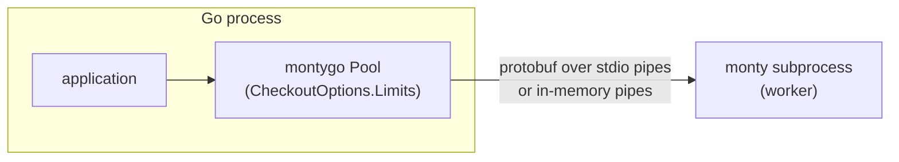
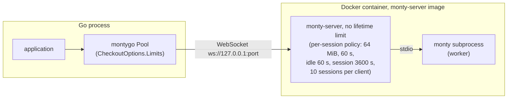
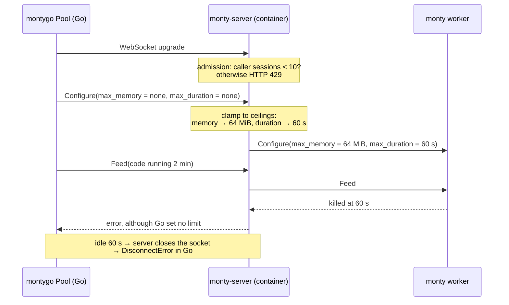
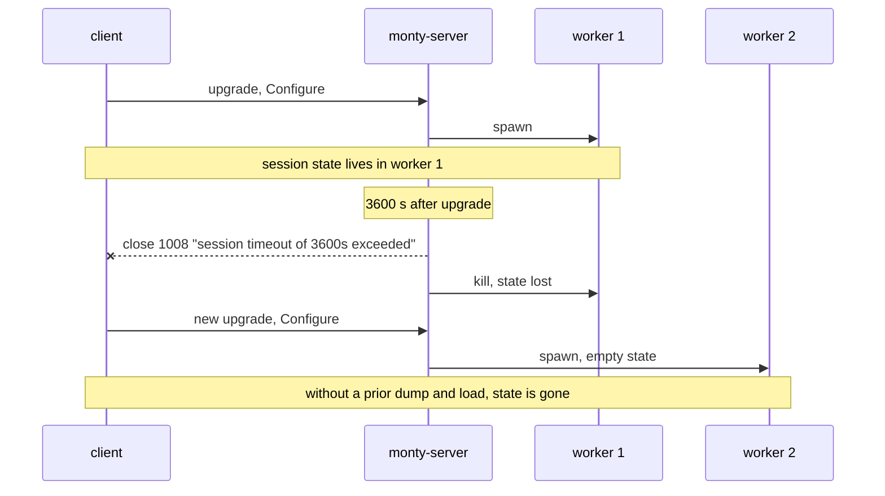
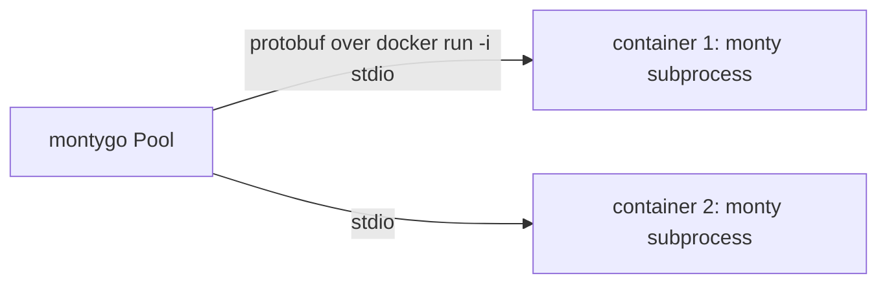

# NewDocker and monty-server limits

Date: 2026-09-16

Context: brainstorm `docs/brainstorms/20260916-docker-image-default.md`, Q1.

## Origin

In Q1 the managed server option was chosen: `NewDocker` starts one `monty-server` container and returns the existing WebSocket pool.

The published image is a server image. Its entrypoint is `monty-server`, not the worker. Reusing it as-is places the server between montygo and the worker.

## Native and wasm: the pool talks to the worker directly

One party sets limits: the Go caller.

## Managed server: monty-server sits in the middle

## Root problem: two sets of limits, the lower wins

The server clamps client limits to its own ceilings. A lower client value wins. A higher or absent client value is cut down to the ceiling. See `docs/architecture/server.md`, "Limit ceilings".

On native the same `Feed` runs for the full 2 minutes.

## Effect of each server setting

The image defaults apply when `NewDocker` passes no server variables.

| Server setting | Image default | Effect without an override |
|---|---|---|
| dump key | none, required | the container does not start |
| sessions per client | 10 | every connection comes from one IP; with `MaxProcesses: 16` the 11th checkout fails with HTTP 429 |
| max sessions | 64 | caps `MaxProcesses` above 64 |
| max memory | 64 MiB | code needing 100 MiB works on native, raises `MemoryError` on Docker |
| max duration | 60 s | a 2-minute computation works on native, is killed on Docker |
| idle timeout | 60 s | a `Slot` or REPL session idle for a minute is disconnected with `DisconnectError` |
| session timeout | 3600 s | a WebSocket session closes 1 h after its upgrade; the server keeps running |
| turn timeout | 300 s | a feed whose host callbacks take over 5 minutes is closed |

Sources of the defaults, which agree:

| Setting | `server/src/config.rs` | upstream `docs/server.md` at `f8acf4fa` | `GET /info` of the local image |
|---|---|---|---|
| max sessions | 64, line 45 | 64, line 147 | 64 |
| sessions per client | 10, line 48 | 10, line 148 | 10 |
| idle timeout | 60 s, line 51 | 60, line 149 | 60 |
| session timeout | 3600 s, line 57 | 3600, line 151 | 3600 |
| turn timeout | 300 s, line 60 | 300, line 152 | 300 |
| max memory | 64 MiB, line 66 | 64, line 154 | 67108864 bytes |
| max duration | 60 s, line 69 | 60, line 155 | 60 |

The defaults are upstream Full Monty's. `monty-server` keeps them, so `docs/parity/server.md` lists no deviation.

`../monty` contains no server code. Its `docs/server.md` specifies Full Monty, which is closed-source and distributed as an image. `server/` in this repository is an open reimplementation of that specification.

- The per-client quota counts connections per peer IP. Seen from the container, the whole Go process is one client.
- The first three rows are mandatory. `NewDocker` MUST set the dump key, disable the per-client quota and set max sessions to `MaxProcesses`, or pooling breaks.
- The last five rows are a product decision: behave like native and wasm, or like a deployed `monty-server` with its safety caps.

## Session lifetime versus server lifetime

- `monty-server` has no lifetime limit. It runs until SIGTERM.
- `--idle-timeout`, `--session-timeout` and `--turn-timeout` apply to one WebSocket session: one connection and its one worker.
- On expiry the server closes the connection with 1008 and kills the worker. It sends no dump. Only a SIGTERM drain sends `ShutdownDump`.
- Upstream Python client: `MontyDisconnectError`, "the server may have dropped the session by policy — an idle, session, or turn timeout … Retry on a fresh session." `crates/monty-python/python/pydantic_monty/_monty.pyi`, lines 442–451 and 866–869.
- montygo: `*DisconnectError`, which matches `ErrSessionLost`. `Pool.Slot` checks out a new session on its next call. Sandbox state is not restored (`docs/architecture/session.md`).
- No upstream or montygo client re-establishes a session with its state. A client MAY carry state across by dumping the session before the timeout and restoring the dump on a new session (`load_session` in Python). The server signs the dump, and the same server or a replica with the same dump key accepts it.

## Alternative that avoids the server

The Q1 option "container per worker" runs `docker run -i … --entrypoint /usr/local/bin/monty IMAGE subprocess`. Same image, different entrypoint, no server.

- No server ceilings, no dump key, no port.
- Costs: a new `worker.Worker` transport, about 290 ms per worker start, `docker kill` by container name, exit code 137 instead of a signal, orphaned busy containers when the host process dies.

## Decision needed

1. Keep the managed server. `NewDocker` disables the five optional server limits, so only Go limits apply, as on native and wasm.
2. Revisit Q1 and use a container per worker. The server limit problem disappears; the costs above replace it.
