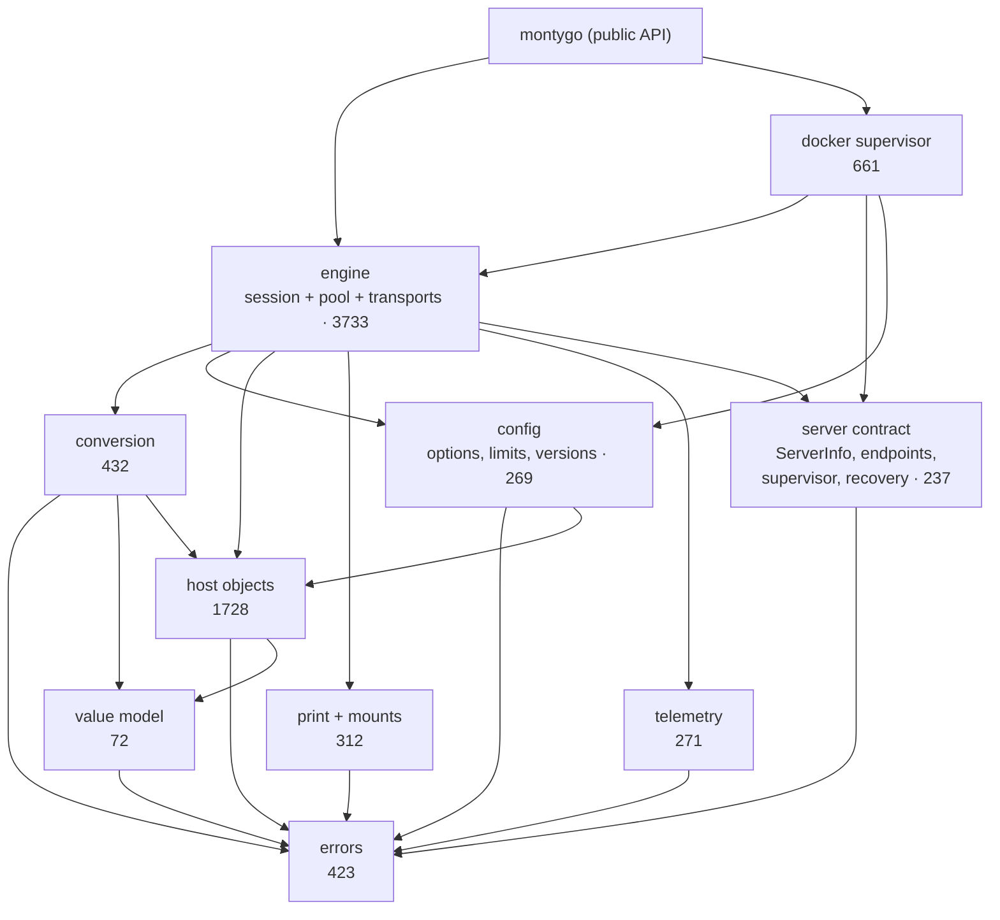

# Package layout of montygo: measurement and target design

Date: 2026-09-16. Status: research, nothing implemented.

## Question

The root package holds the value model, host objects, the session engine, the worker pool, three transports, telemetry, rotation and the Docker supervisor. Which of those are separable packages, and which dependencies must be inverted first?

## Method

Package-level tools cannot answer this, because everything is one package. A file-level graph was built instead: load `github.com/asalimonov/montygo` with `go/packages` including type information, then for every identifier resolve the object it refers to and record an edge from the file that uses it to the file that declares it. Struct fields and methods count as edges, so the graph reflects real coupling, not imports.

The analyzer lives outside the repository for now (`scratchpad/depgraph`). It takes named clusters of files and prints their sizes, a cluster-by-cluster matrix of distinct crossing symbols, and every mutual pair with the symbols that cause it.

Build-tagged files are resolved for the host platform, so `pool_other.go` is not in the graph.

## Measured state

Root: 33 non-test files, 8163 lines, 221 exported package-level declarations (358 entries in `testdata/public_api.golden`, which also counts methods).

| Cluster | Files | Lines |
|---|---|---|
| errors | `errors.go` | 423 |
| value model | `values.go` | 72 |
| conversion | `convert.go` | 432 |
| host objects | `host.go`, `classinstance.go`, `function.go`, `future.go` | 1728 |
| session | `session.go`, `lifecycle.go`, `session_control.go`, `stop.go`, `run.go`, `snapshot.go`, `slot.go`, `answer.go`, `rotation.go` | 2814 |
| pool | `pool.go`, `binary.go`, `pool_unix.go` | 615 |
| transport | `websocket.go`, `serverinfo.go` | 304 |
| telemetry | `telemetry.go`, `telemetry_hooks.go` | 271 |
| server contract | `supervisor.go` | 237 |
| docker | `docker.go`, `docker_cli.go`, `docker_image.go` | 661 |
| config | `options.go`, `montygo.go`, `version.go` | 269 |
| print and mounts | `print.go`, `mount.go` | 312 |

Dependency matrix, rows use columns, cells are distinct symbols:

```
              errsvalmodel convert    host    sess    pooltransport   telem  server  docker  config      io
errs             .       .       .       .       .       .       .       .       .       .       .       .
valmodel         2       .       .       .       .       .       .       .       .       .       .       .
convert          3       2       .      21       .       .       .       .       .       .       .       .
host             8       1       .       .       2       .       .       .       .       .       1       .
sess            38       .       3      30       .       5       4       .       .       .       6      10
pool            12       .       .       1      17       .       .       5       3       .       7       .
transport        2       .       .       .       2      14       .       2      13       .       1       .
telem            1       .       .       .       .       3       .       .       .       .       1       .
server           .       .       .       .       .       1       .       1       .       .       .       .
docker           2       .       .       .       1       4      16       1       9       .       4       .
config           2       .       .       1       2       .       .       .       .       .       .       .
io               5       .       .       .       .       .       .       .       .       .       .       .
```

`errors` and `print`/`mounts` already depend on nothing. `values` depends only on errors. Conversion depends on host objects one way. The rest is entangled by seven mutual pairs.

## Finding: six of seven cycles are misplaced symbols

| Cycle | Symbols going the wrong way | Size | Fix |
|---|---|---|---|
| host ↔ session | `hostTypeName` (a type switch over `ClassInstance`, `ClassType`, `ClassProxy`), `panicError` | 5 and 12 lines, both in `answer.go` | move into the host package, where their types live |
| host ↔ config | `Unlimited` | one const in `options.go` | move to the leaf that owns limits |
| session ↔ config | `StopPolicy`, `effectivePolicy` used by `CheckoutOptions` | one type plus one function | `StopPolicy` is configuration: move it to config |
| session ↔ transport | session reads `ServerInfo`, `ServerLimits`; transport calls `newRotationPolicy` | data types plus one constructor | `ServerInfo` belongs to the server contract; the policy is built by the pool |
| pool ↔ telemetry | `telemetry_hooks.go` declares methods on `Pool` (`observe`) and reads `metered`, `rec` | 53 lines | the `Pool` methods belong in pool; telemetry keeps recorder and metrics |
| pool ↔ server | `sortedHeaders` | 6 lines, `pool.go:463` | move into the server contract, which is its only other user |
| **session ↔ pool** | 5 symbols one way (`Checkout`, `Pool`, `bind`, `rotation`, `untrack`), **17** the other (`Session`, `FeedRun`, `Close`, `attach`, `effectivePolicy`, …) | ~3400 lines | **irreducible**: `Pool.Checkout` constructs sessions and sessions drive their checkout. One package. |

Everything except the last row is a move of fewer than 100 lines in total.

## Target design



Layers, bottom-up: errors; value model, print and mounts, telemetry, server contract; host objects; config; conversion; engine; docker; the public facade.

The engine keeps session, pool and transports together, which the measurement says is not negotiable. It is still the largest package at 3733 lines, down from 8163.

## Two ways to package it

The difference is only whether the layers are public.

| | A: public subpackages | B: internal layers plus a facade |
|---|---|---|
| Import path of `ClassInstance` | `montygo/host` | stays `montygo` |
| Public API today | breaks; every type gets a new home | unchanged, byte for byte in the golden file |
| App implements `ServerSupervisor` | imports `montygo/server` | imports `montygo` |
| Root package | small, mostly documentation | ~221 aliases and thin wrappers |
| Two names for one type | yes, if the facade is kept too | no |
| Effort | migration guide, changelog, v0.4.0 | mechanical, no user-visible change |

Both need the same seven inversions first. B can be done now without a breaking release; A is a deliberate v0.4.0 API change that can follow later by promoting an internal package to public.

Mechanics that make B work:

- `type ClassInstance = host.ClassInstance` keeps methods, struct literals and type identity. Generic aliases (`type ClassType[T any] = host.ClassType[T]`) need Go 1.24 or newer, and the module is on 1.25.
- Functions cannot be aliased; the facade declares one-line wrappers.
- A type from an internal package can appear in a public API. Users can name it through the alias; they simply cannot import the internal package.
- `internal/` is enforced by import path, not by module, so `examples/` and `tests/network/` can still import `github.com/asalimonov/montygo/internal/...`.
- Direction matters: a package the root **depends on** can move down and be aliased. A package that **depends on** the root, as the Docker supervisor does today, cannot be aliased from the root without a cycle. Moving the engine into `internal/` removes that problem, because the Docker package then depends on the engine rather than on the facade.

## Staged plan

Each stage ends with `go build ./...`, the root suite on both backends, and an unchanged `testdata/public_api.golden`. Stages 1 to 5 are invisible to users.

1. **Relocate the seven glue symbols** inside the root package, no new packages: `hostTypeName`, `panicError`, `Unlimited`, `StopPolicy` with `effectivePolicy`, `sortedHeaders`, the `Pool` methods in `telemetry_hooks.go`, `newRotationPolicy`. Re-run the analyzer: the matrix must show only `session ↔ pool`.
2. **Extract the leaves**: `internal/monterr` (errors), `internal/pyvalue` (value model), `internal/io` (print, mounts), `internal/telemetryhooks`. Root aliases them.
3. **Extract host objects and conversion** into `internal/host` and `internal/convert`.
4. **Extract config** into `internal/config`.
5. **Extract the engine** into `internal/engine`, and the Docker supervisor into `internal/dockersup`. Root becomes the facade.
6. **Optional, v0.4.0**: promote `host`, `value`, `server` and `docker` to public packages, keeping the facade as deprecated aliases for one release.

Stage 1 alone is worth doing: it is under 100 lines of moves and it proves the DAG.

## Risks

- The facade must be generated or reviewed carefully: 221 declarations, and a missed one is an API break. The golden file is the guard.
- Test files in the root package (`docker_image_test.go`, `recovery_test.go`, `docker_supervisor_test.go`) move with their code; the ported upstream suites stay against the public API.
- `docs/parity/api.md`, `README.md` and the architecture documents reference `montygo.X` throughout. Under B they stay correct; under A they all change.
- The analyzer is not in the repository. It should live in `scripts/depgraph/` if this becomes routine.

## Not considered

| Item | Tag |
|---|---|
| splitting the engine further by inverting `Pool.Checkout` behind an interface | potential-improvement |
| whether `internal/value` (wire model) and the public value model should merge | postponed |
| moving the `osaccess` helpers under the new layering | postponed |
| a generated facade instead of a hand-written one | potential-improvement |
